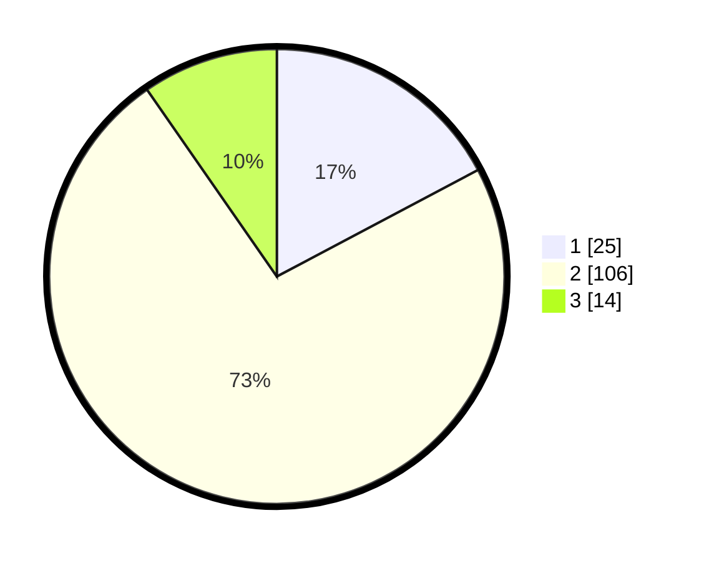

# Hasil

## Grafik

## Tabel

| No. | Nama Paslon    | Suara | Suara (raw) | Persentase |
|:--- |:-------------- | -----:| -----------:| ----------:|
| 1   | ANIES MUHAIMIN | 25    | [25][p-1]   | 17,24      |
| 2   | PRABOWO GIBRAN | 106   | [106][p-2]  | 73,10      |
| 3   | GANJAR MAHFUD  | 14    | [14][p-3]   | 9,66       |

[p-1]: https://github.com/gigit-pemilu/pemilu-2024/blob/main/pilpres/hitung-suara/sub/35-jawa-timur/sub/09-jember/sub/09-bangsalsari/sub/2002-gambirono/sub/029-tps/sub/paslon-1.txt
[p-2]: https://github.com/gigit-pemilu/pemilu-2024/blob/main/pilpres/hitung-suara/sub/35-jawa-timur/sub/09-jember/sub/09-bangsalsari/sub/2002-gambirono/sub/029-tps/sub/paslon-2.txt
[p-3]: https://github.com/gigit-pemilu/pemilu-2024/blob/main/pilpres/hitung-suara/sub/35-jawa-timur/sub/09-jember/sub/09-bangsalsari/sub/2002-gambirono/sub/029-tps/sub/paslon-3.txt

## Foto C Plano

https://sirekap-obj-formc.kpu.go.id/f261/pemilu/ppwp/35/09/09/20/02/3509092002029-20240215-000723--8d5f1301-40ef-49dc-96b8-9b3ac8b75c3b.jpg

https://sirekap-obj-formc.kpu.go.id/f261/pemilu/ppwp/35/09/09/20/02/3509092002029-20240215-000849--9c0d11e0-c316-4b79-b8fd-2ea83e5041b4.jpg

https://sirekap-obj-formc.kpu.go.id/f261/pemilu/ppwp/35/09/09/20/02/3509092002029-20240215-001001--5f4c2fde-798c-4573-b58d-efc57990bd3e.jpg

## Metadata

| Key        | Value               |
| ---------- | ------------------- |
| Time Stamp | 2024-02-15 23:29:50 |

