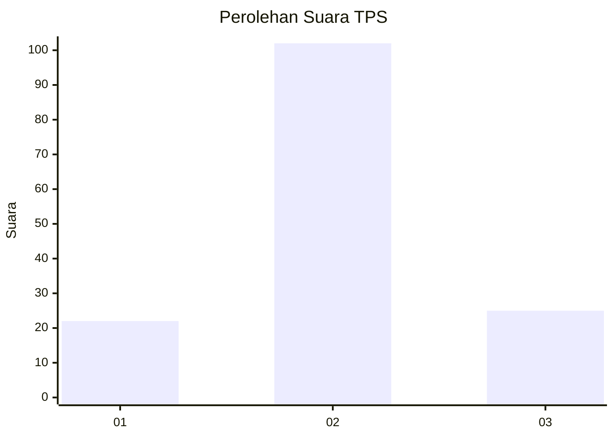
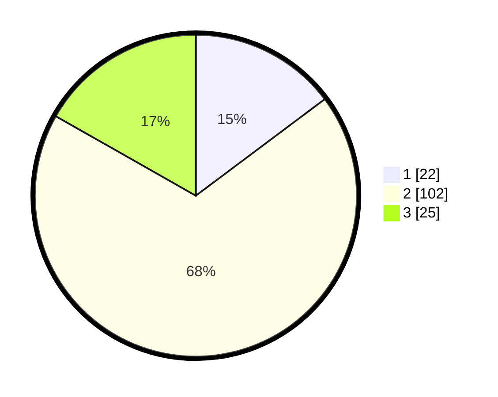

# Hasil

## Grafik

## Tabel

| No. | Nama Paslon    | Suara | Suara (raw) | Persentase |
|:--- |:-------------- | -----:| -----------:| ----------:|
| 1   | ANIES MUHAIMIN | 22    | [22][p-1]   | 14,77      |
| 2   | PRABOWO GIBRAN | 102   | [102][p-2]  | 68,46      |
| 3   | GANJAR MAHFUD  | 25    | [25][p-3]   | 16,78      |

[p-1]: https://github.com/gigit-pemilu/pemilu-2024/blob/main/pilpres/hitung-suara/sub/35-jawa-timur/sub/09-jember/sub/09-bangsalsari/sub/2002-gambirono/sub/035-tps/sub/paslon-1.txt
[p-2]: https://github.com/gigit-pemilu/pemilu-2024/blob/main/pilpres/hitung-suara/sub/35-jawa-timur/sub/09-jember/sub/09-bangsalsari/sub/2002-gambirono/sub/035-tps/sub/paslon-2.txt
[p-3]: https://github.com/gigit-pemilu/pemilu-2024/blob/main/pilpres/hitung-suara/sub/35-jawa-timur/sub/09-jember/sub/09-bangsalsari/sub/2002-gambirono/sub/035-tps/sub/paslon-3.txt

## Foto C Plano

https://sirekap-obj-formc.kpu.go.id/f149/pemilu/ppwp/35/09/09/20/02/3509092002035-20240214-204419--95e54fdf-58c5-43d0-a03f-27448a6420ea.jpg

https://sirekap-obj-formc.kpu.go.id/f149/pemilu/ppwp/35/09/09/20/02/3509092002035-20240214-204431--142b8e45-85c9-46a9-b020-9131fc910f0d.jpg

https://sirekap-obj-formc.kpu.go.id/f149/pemilu/ppwp/35/09/09/20/02/3509092002035-20240214-204439--2450ddd0-ae2c-4649-9efc-0801c2a14971.jpg

## Metadata

| Key        | Value               |
| ---------- | ------------------- |
| Time Stamp | 2024-02-15 00:41:44 |

