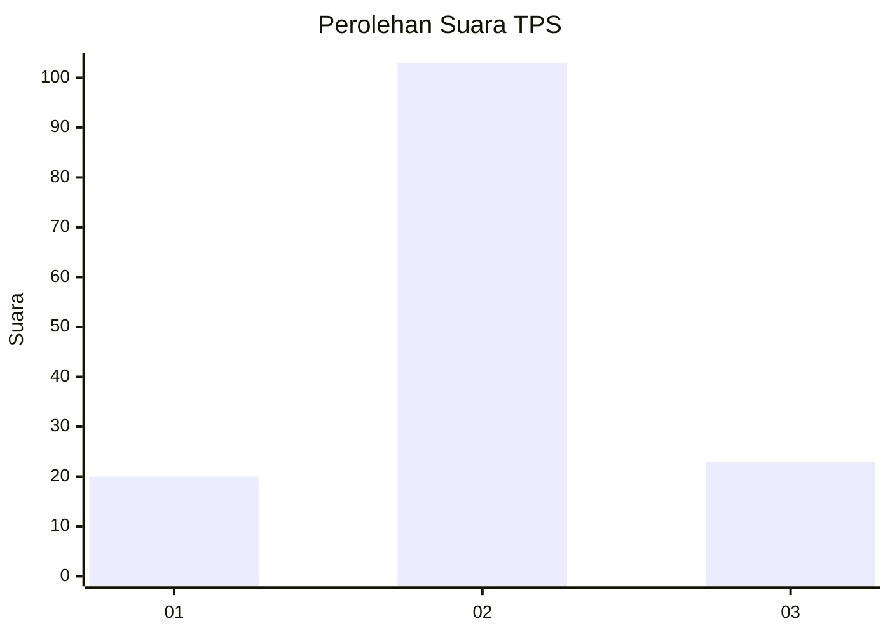

# Hasil

## Grafik

## Tabel

| No. | Nama Paslon    | Suara | Suara (raw) | Persentase |
|:--- |:-------------- | -----:| -----------:| ----------:|
| 1   | ANIES MUHAIMIN | 20    | [20][p-1]   | 13,70      |
| 2   | PRABOWO GIBRAN | 103   | [103][p-2]  | 70,55      |
| 3   | GANJAR MAHFUD  | 23    | [23][p-3]   | 15,75      |

[p-1]: https://github.com/gigit-pemilu/pemilu-2024-35-jawa-timur/blob/main/pilpres/hitung-suara/sub/35-jawa-timur/sub/09-jember/sub/09-bangsalsari/sub/2002-gambirono/sub/037-tps/sub/paslon-1.txt
[p-2]: https://github.com/gigit-pemilu/pemilu-2024-35-jawa-timur/blob/main/pilpres/hitung-suara/sub/35-jawa-timur/sub/09-jember/sub/09-bangsalsari/sub/2002-gambirono/sub/037-tps/sub/paslon-2.txt
[p-3]: https://github.com/gigit-pemilu/pemilu-2024-35-jawa-timur/blob/main/pilpres/hitung-suara/sub/35-jawa-timur/sub/09-jember/sub/09-bangsalsari/sub/2002-gambirono/sub/037-tps/sub/paslon-3.txt

## Foto C Plano

https://sirekap-obj-formc.kpu.go.id/52d4/pemilu/ppwp/35/09/09/20/02/3509092002037-20240214-200710--e4f7d558-a422-46f3-88b5-e0b289bb0d0e.jpg

https://sirekap-obj-formc.kpu.go.id/52d4/pemilu/ppwp/35/09/09/20/02/3509092002037-20240214-224718--9d0d714e-0502-4e73-a3fb-b20292163de0.jpg

https://sirekap-obj-formc.kpu.go.id/52d4/pemilu/ppwp/35/09/09/20/02/3509092002037-20240214-223558--58e56676-7c2a-4662-b505-b0c86da326d2.jpg

## Metadata

| Key        | Value               |
| ---------- | ------------------- |
| Time Stamp | 2024-02-15 23:30:25 |

