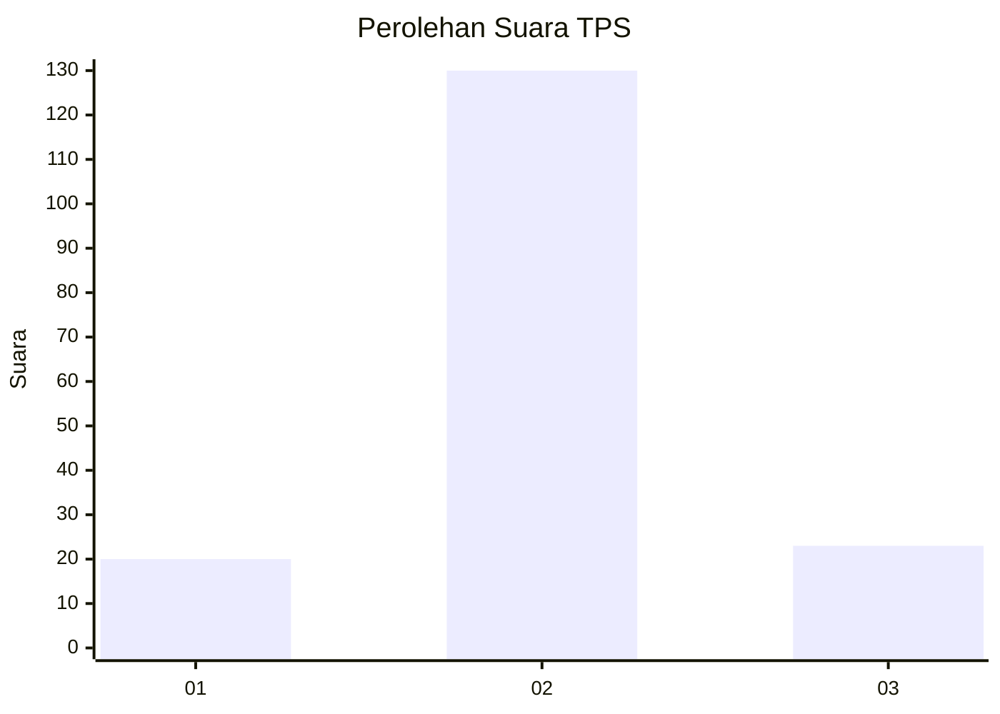
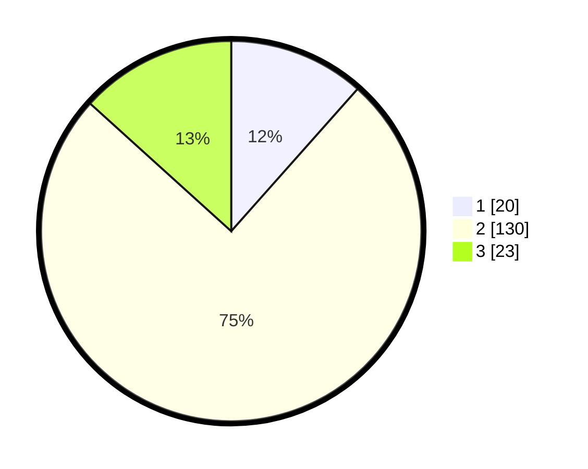

# Hasil

## Grafik

## Tabel

| No. | Nama Paslon    | Suara | Suara (raw) | Persentase |
|:--- |:-------------- | -----:| -----------:| ----------:|
| 1   | ANIES MUHAIMIN | 20    | [20][p-1]   | 11,56      |
| 2   | PRABOWO GIBRAN | 130   | [130][p-2]  | 75,14      |
| 3   | GANJAR MAHFUD  | 23    | [23][p-3]   | 13,29      |

[p-1]: https://github.com/gigit-pemilu/pemilu-2024-35-jawa-timur/blob/main/pilpres/hitung-suara/sub/35-jawa-timur/sub/09-jember/sub/09-bangsalsari/sub/2002-gambirono/sub/038-tps/sub/paslon-1.txt
[p-2]: https://github.com/gigit-pemilu/pemilu-2024-35-jawa-timur/blob/main/pilpres/hitung-suara/sub/35-jawa-timur/sub/09-jember/sub/09-bangsalsari/sub/2002-gambirono/sub/038-tps/sub/paslon-2.txt
[p-3]: https://github.com/gigit-pemilu/pemilu-2024-35-jawa-timur/blob/main/pilpres/hitung-suara/sub/35-jawa-timur/sub/09-jember/sub/09-bangsalsari/sub/2002-gambirono/sub/038-tps/sub/paslon-3.txt

## Foto C Plano

https://sirekap-obj-formc.kpu.go.id/4b57/pemilu/ppwp/35/09/09/20/02/3509092002038-20240214-220511--5c0e1476-ca39-42b5-aa44-81625b824d0f.jpg

https://sirekap-obj-formc.kpu.go.id/4b57/pemilu/ppwp/35/09/09/20/02/3509092002038-20240214-204917--501d05b5-7f86-4d22-bd43-b707f1e974a9.jpg

https://sirekap-obj-formc.kpu.go.id/4b57/pemilu/ppwp/35/09/09/20/02/3509092002038-20240214-204931--8dc59c2f-1c0b-482b-8970-a08954ff1ac1.jpg

## Metadata

| Key        | Value               |
| ---------- | ------------------- |
| Time Stamp | 2024-02-15 12:00:28 |

