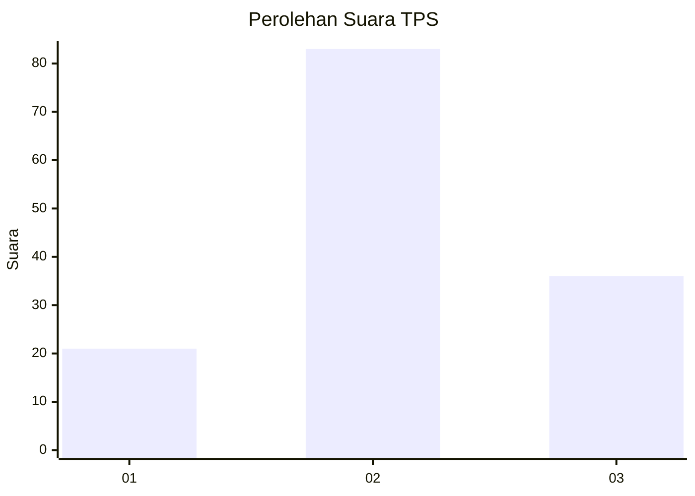
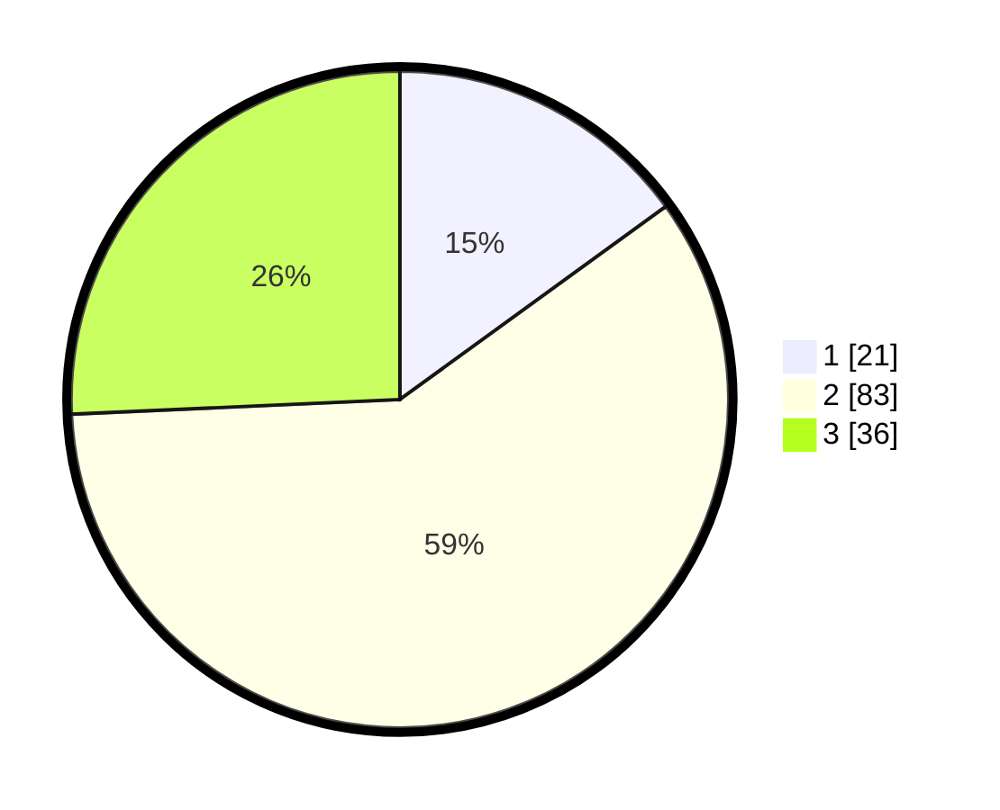

# Hasil

## Grafik

## Tabel

| No. | Nama Paslon    | Suara | Suara (raw) | Persentase |
|:--- |:-------------- | -----:| -----------:| ----------:|
| 1   | ANIES MUHAIMIN | 21    | [21][p-1]   | 15,00      |
| 2   | PRABOWO GIBRAN | 83    | [83][p-2]   | 59,29      |
| 3   | GANJAR MAHFUD  | 36    | [36][p-3]   | 25,71      |

[p-1]: https://github.com/gigit-pemilu/pemilu-2024/blob/main/pilpres/hitung-suara/sub/35-jawa-timur/sub/09-jember/sub/09-bangsalsari/sub/2002-gambirono/sub/040-tps/sub/paslon-1.txt
[p-2]: https://github.com/gigit-pemilu/pemilu-2024/blob/main/pilpres/hitung-suara/sub/35-jawa-timur/sub/09-jember/sub/09-bangsalsari/sub/2002-gambirono/sub/040-tps/sub/paslon-2.txt
[p-3]: https://github.com/gigit-pemilu/pemilu-2024/blob/main/pilpres/hitung-suara/sub/35-jawa-timur/sub/09-jember/sub/09-bangsalsari/sub/2002-gambirono/sub/040-tps/sub/paslon-3.txt

## Foto C Plano

https://sirekap-obj-formc.kpu.go.id/a91b/pemilu/ppwp/35/09/09/20/02/3509092002040-20240214-223246--b9a756e5-70b3-41da-b832-8532daf8935b.jpg

https://sirekap-obj-formc.kpu.go.id/a91b/pemilu/ppwp/35/09/09/20/02/3509092002040-20240214-212918--87183de0-e907-4d41-ad46-6019d2fd98d3.jpg

https://sirekap-obj-formc.kpu.go.id/a91b/pemilu/ppwp/35/09/09/20/02/3509092002040-20240214-213024--854f3402-bfd6-4662-8fc0-3e46973de2c5.jpg

## Metadata

| Key        | Value               |
| ---------- | ------------------- |
| Time Stamp | 2024-02-15 20:00:44 |

