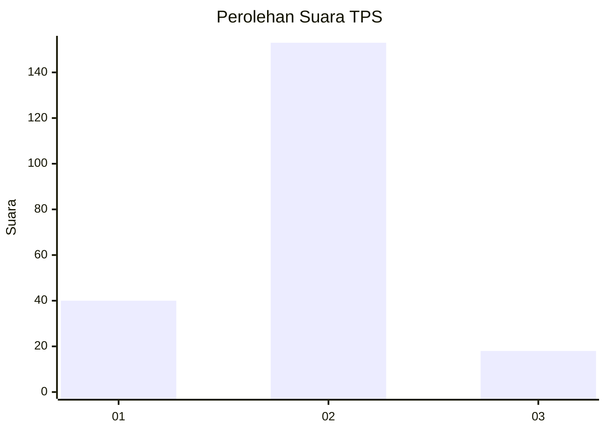
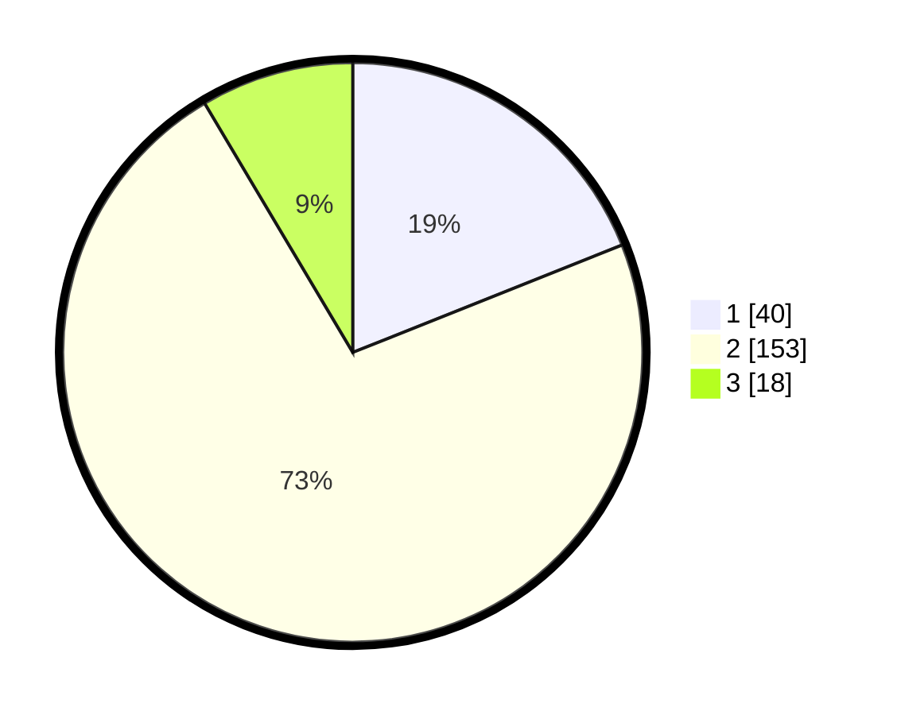

# Hasil

## Grafik

## Tabel

| No. | Nama Paslon    | Suara | Suara (raw) | Persentase |
|:--- |:-------------- | -----:| -----------:| ----------:|
| 1   | ANIES MUHAIMIN | 40    | [40][p-1]   | 18,96      |
| 2   | PRABOWO GIBRAN | 153   | [153][p-2]  | 72,51      |
| 3   | GANJAR MAHFUD  | 18    | [18][p-3]   | 8,53       |

[p-1]: https://github.com/gigit-pemilu/pemilu-2024/blob/main/pilpres/hitung-suara/sub/35-jawa-timur/sub/09-jember/sub/09-bangsalsari/sub/2003-bangsalsari/sub/002-tps/sub/paslon-1.txt
[p-2]: https://github.com/gigit-pemilu/pemilu-2024/blob/main/pilpres/hitung-suara/sub/35-jawa-timur/sub/09-jember/sub/09-bangsalsari/sub/2003-bangsalsari/sub/002-tps/sub/paslon-2.txt
[p-3]: https://github.com/gigit-pemilu/pemilu-2024/blob/main/pilpres/hitung-suara/sub/35-jawa-timur/sub/09-jember/sub/09-bangsalsari/sub/2003-bangsalsari/sub/002-tps/sub/paslon-3.txt

## Foto C Plano

https://sirekap-obj-formc.kpu.go.id/12ba/pemilu/ppwp/35/09/09/20/03/3509092003002-20240214-224102--6f6178dd-3de7-4925-88e2-344f59e9535c.jpg

https://sirekap-obj-formc.kpu.go.id/12ba/pemilu/ppwp/35/09/09/20/03/3509092003002-20240214-224240--f106411c-bd04-47c6-8d76-93c2b7d02ffe.jpg

https://sirekap-obj-formc.kpu.go.id/12ba/pemilu/ppwp/35/09/09/20/03/3509092003002-20240214-224508--d477be99-9cca-4f89-9f37-0684953c5128.jpg

## Metadata

| Key        | Value               |
| ---------- | ------------------- |
| Time Stamp | 2024-02-16 00:00:26 |

