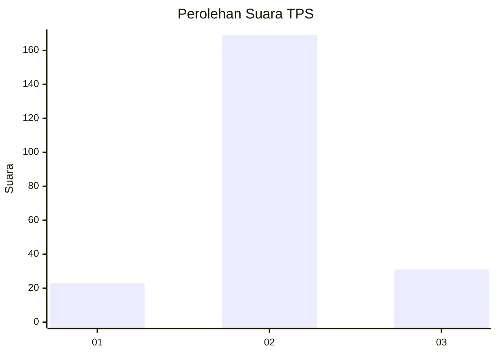
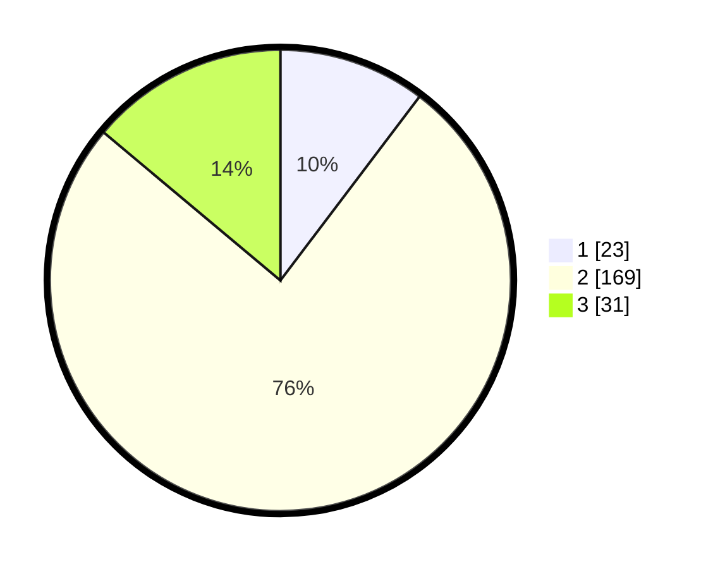

# Hasil

## Grafik

## Tabel

| No. | Nama Paslon    | Suara | Suara (raw) | Persentase |
|:--- |:-------------- | -----:| -----------:| ----------:|
| 1   | ANIES MUHAIMIN | 23    | [23][p-1]   | 10,31      |
| 2   | PRABOWO GIBRAN | 169   | [169][p-2]  | 75,78      |
| 3   | GANJAR MAHFUD  | 31    | [31][p-3]   | 13,90      |

[p-1]: https://github.com/gigit-pemilu/pemilu-2024-35-jawa-timur/blob/main/pilpres/hitung-suara/sub/35-jawa-timur/sub/09-jember/sub/09-bangsalsari/sub/2003-bangsalsari/sub/003-tps/sub/paslon-1.txt
[p-2]: https://github.com/gigit-pemilu/pemilu-2024-35-jawa-timur/blob/main/pilpres/hitung-suara/sub/35-jawa-timur/sub/09-jember/sub/09-bangsalsari/sub/2003-bangsalsari/sub/003-tps/sub/paslon-2.txt
[p-3]: https://github.com/gigit-pemilu/pemilu-2024-35-jawa-timur/blob/main/pilpres/hitung-suara/sub/35-jawa-timur/sub/09-jember/sub/09-bangsalsari/sub/2003-bangsalsari/sub/003-tps/sub/paslon-3.txt

## Foto C Plano

https://sirekap-obj-formc.kpu.go.id/d807/pemilu/ppwp/35/09/09/20/03/3509092003003-20240214-224800--8c038d30-2841-411e-8d1f-78ab3e17ad3c.jpg

https://sirekap-obj-formc.kpu.go.id/d807/pemilu/ppwp/35/09/09/20/03/3509092003003-20240214-225018--baef166f-7707-4796-b3c0-88caa7b88a47.jpg

https://sirekap-obj-formc.kpu.go.id/d807/pemilu/ppwp/35/09/09/20/03/3509092003003-20240214-225851--898a1fd4-790f-4160-8b8e-2f3a8d405cb3.jpg

## Metadata

| Key        | Value               |
| ---------- | ------------------- |
| Time Stamp | 2024-02-16 00:30:27 |

