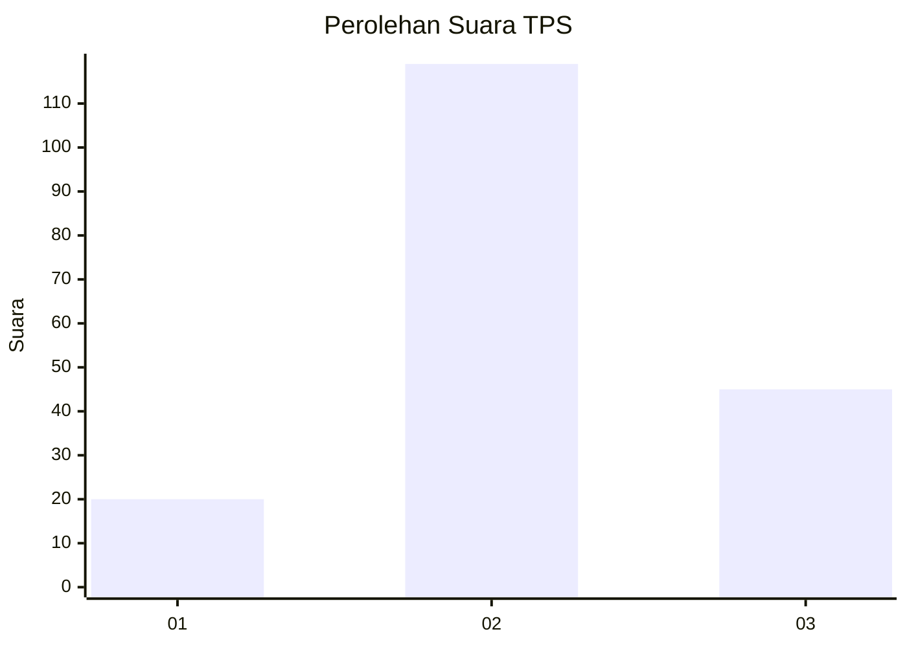
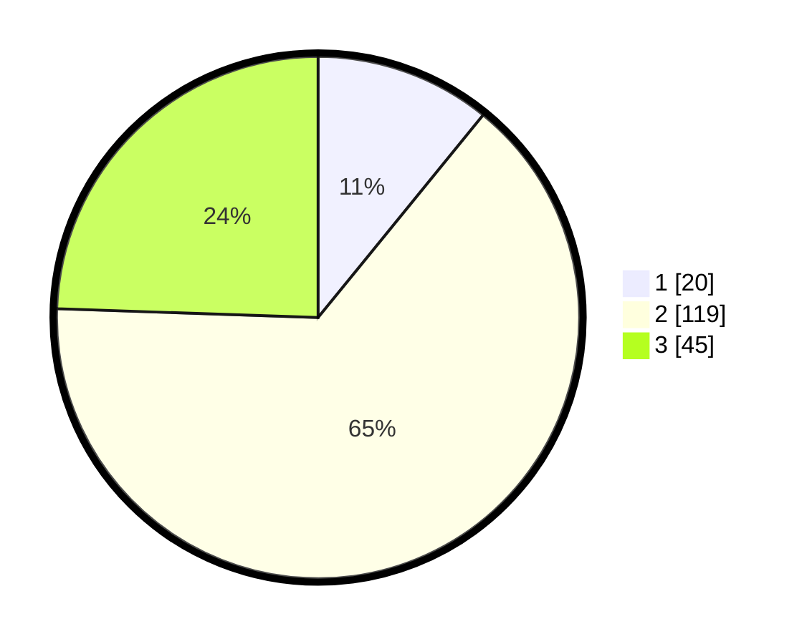

# Hasil

## Grafik

## Tabel

| No. | Nama Paslon    | Suara | Suara (raw) | Persentase |
|:--- |:-------------- | -----:| -----------:| ----------:|
| 1   | ANIES MUHAIMIN | 20    | [20][p-1]   | 10,87      |
| 2   | PRABOWO GIBRAN | 119   | [119][p-2]  | 64,67      |
| 3   | GANJAR MAHFUD  | 45    | [45][p-3]   | 24,46      |

[p-1]: https://github.com/gigit-pemilu/pemilu-2024-35-jawa-timur/blob/main/pilpres/hitung-suara/sub/35-jawa-timur/sub/09-jember/sub/09-bangsalsari/sub/2003-bangsalsari/sub/006-tps/sub/paslon-1.txt
[p-2]: https://github.com/gigit-pemilu/pemilu-2024-35-jawa-timur/blob/main/pilpres/hitung-suara/sub/35-jawa-timur/sub/09-jember/sub/09-bangsalsari/sub/2003-bangsalsari/sub/006-tps/sub/paslon-2.txt
[p-3]: https://github.com/gigit-pemilu/pemilu-2024-35-jawa-timur/blob/main/pilpres/hitung-suara/sub/35-jawa-timur/sub/09-jember/sub/09-bangsalsari/sub/2003-bangsalsari/sub/006-tps/sub/paslon-3.txt

## Foto C Plano

https://sirekap-obj-formc.kpu.go.id/0ea8/pemilu/ppwp/35/09/09/20/03/3509092003006-20240214-233803--0a4df277-b4ff-4629-acac-4b629fc69cb2.jpg

https://sirekap-obj-formc.kpu.go.id/0ea8/pemilu/ppwp/35/09/09/20/03/3509092003006-20240215-001239--e9e1b38c-be14-4c1c-8c44-34c91aaca10c.jpg

https://sirekap-obj-formc.kpu.go.id/0ea8/pemilu/ppwp/35/09/09/20/03/3509092003006-20240215-001320--47a3d22b-5cb0-4079-bf76-6e39346f0ea3.jpg

## Metadata

| Key        | Value               |
| ---------- | ------------------- |
| Time Stamp | 2024-02-16 23:30:00 |

