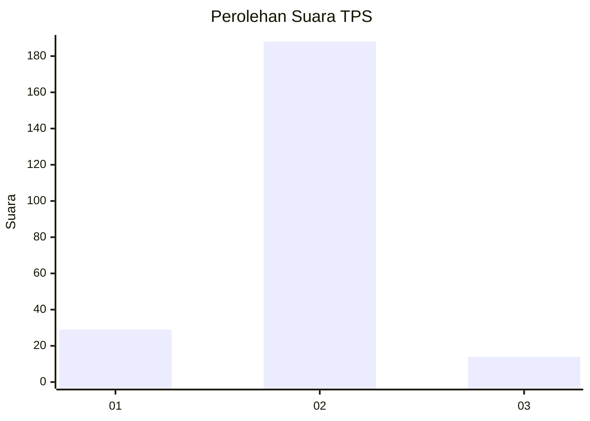
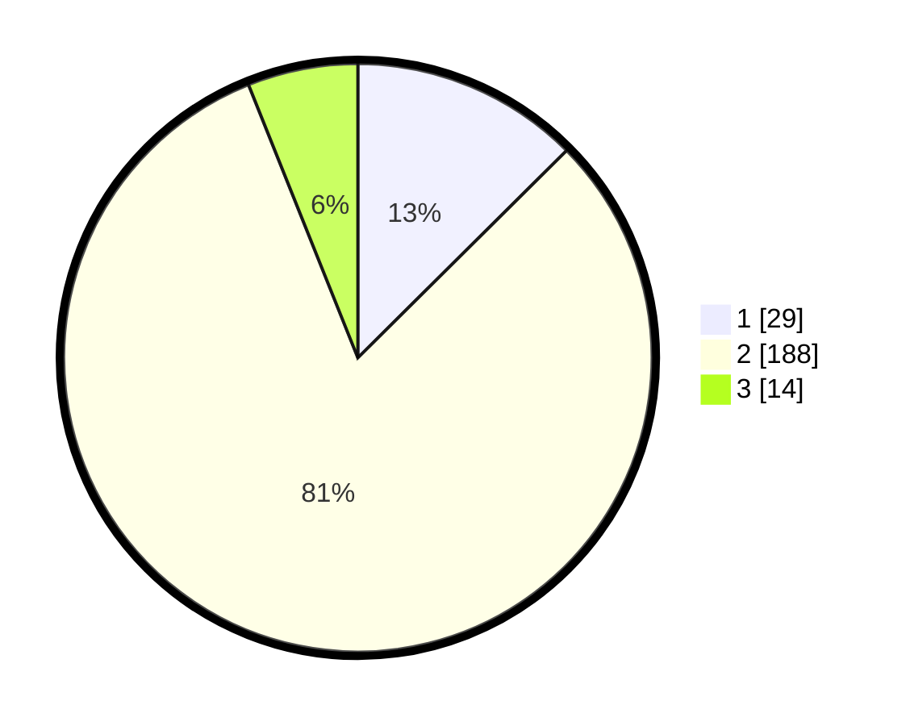

# Hasil

## Grafik

## Tabel

| No. | Nama Paslon    | Suara | Suara (raw) | Persentase |
|:--- |:-------------- | -----:| -----------:| ----------:|
| 1   | ANIES MUHAIMIN | 29    | [29][p-1]   | 12,55      |
| 2   | PRABOWO GIBRAN | 188   | [188][p-2]  | 81,39      |
| 3   | GANJAR MAHFUD  | 14    | [14][p-3]   | 6,06       |

[p-1]: https://github.com/gigit-pemilu/pemilu-2024/blob/main/pilpres/hitung-suara/sub/35-jawa-timur/sub/09-jember/sub/09-bangsalsari/sub/2003-bangsalsari/sub/007-tps/sub/paslon-1.txt
[p-2]: https://github.com/gigit-pemilu/pemilu-2024/blob/main/pilpres/hitung-suara/sub/35-jawa-timur/sub/09-jember/sub/09-bangsalsari/sub/2003-bangsalsari/sub/007-tps/sub/paslon-2.txt
[p-3]: https://github.com/gigit-pemilu/pemilu-2024/blob/main/pilpres/hitung-suara/sub/35-jawa-timur/sub/09-jember/sub/09-bangsalsari/sub/2003-bangsalsari/sub/007-tps/sub/paslon-3.txt

## Foto C Plano

https://sirekap-obj-formc.kpu.go.id/e2f0/pemilu/ppwp/35/09/09/20/03/3509092003007-20240214-234757--7b58e061-5c94-49ab-9134-8e7aa76463d2.jpg

https://sirekap-obj-formc.kpu.go.id/e2f0/pemilu/ppwp/35/09/09/20/03/3509092003007-20240214-235020--d63628de-b849-499b-88a9-67669e591d6c.jpg

https://sirekap-obj-formc.kpu.go.id/e2f0/pemilu/ppwp/35/09/09/20/03/3509092003007-20240215-012112--d6536967-ee3c-478e-a1b8-0b052f31dcf1.jpg

## Metadata

| Key        | Value               |
| ---------- | ------------------- |
| Time Stamp | 2024-02-15 12:00:28 |

