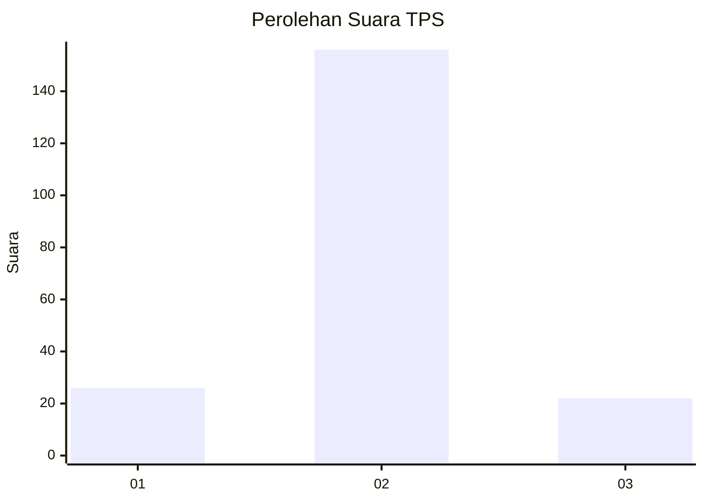
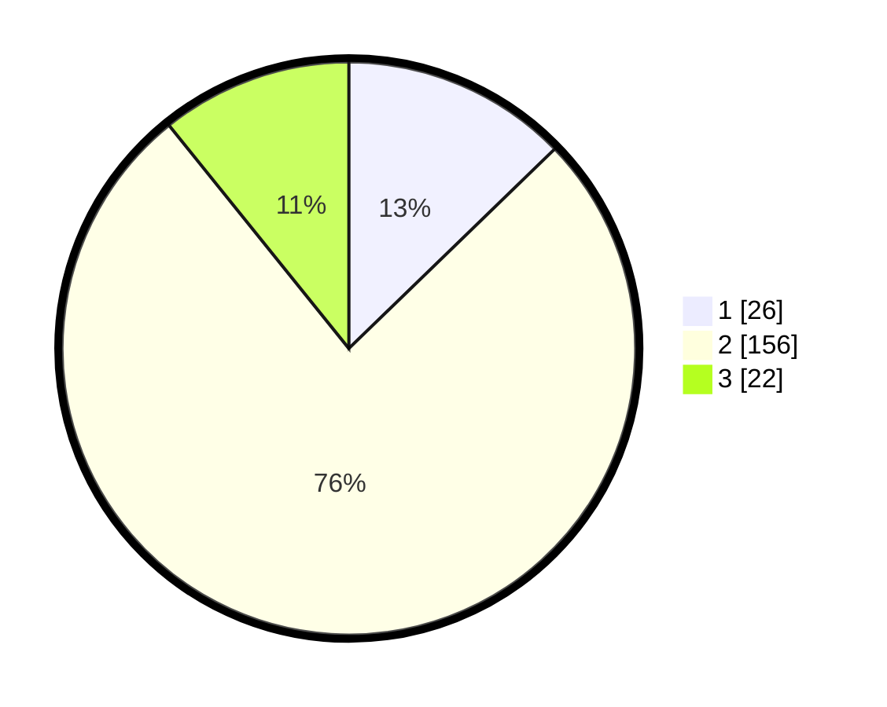

# Hasil

## Grafik

## Tabel

| No. | Nama Paslon    | Suara | Suara (raw) | Persentase |
|:--- |:-------------- | -----:| -----------:| ----------:|
| 1   | ANIES MUHAIMIN | 26    | [26][p-1]   | 12,75      |
| 2   | PRABOWO GIBRAN | 156   | [156][p-2]  | 76,47      |
| 3   | GANJAR MAHFUD  | 22    | [22][p-3]   | 10,78      |

[p-1]: https://github.com/gigit-pemilu/pemilu-2024-35-jawa-timur/blob/main/pilpres/hitung-suara/sub/35-jawa-timur/sub/09-jember/sub/09-bangsalsari/sub/2003-bangsalsari/sub/015-tps/sub/paslon-1.txt
[p-2]: https://github.com/gigit-pemilu/pemilu-2024-35-jawa-timur/blob/main/pilpres/hitung-suara/sub/35-jawa-timur/sub/09-jember/sub/09-bangsalsari/sub/2003-bangsalsari/sub/015-tps/sub/paslon-2.txt
[p-3]: https://github.com/gigit-pemilu/pemilu-2024-35-jawa-timur/blob/main/pilpres/hitung-suara/sub/35-jawa-timur/sub/09-jember/sub/09-bangsalsari/sub/2003-bangsalsari/sub/015-tps/sub/paslon-3.txt

## Foto C Plano

https://sirekap-obj-formc.kpu.go.id/2a4e/pemilu/ppwp/35/09/09/20/03/3509092003015-20240214-200410--b685d6c5-9071-4581-b959-9d6400a9b780.jpg

https://sirekap-obj-formc.kpu.go.id/2a4e/pemilu/ppwp/35/09/09/20/03/3509092003015-20240214-200615--fb275d44-3568-4429-be5c-ba514f884d9f.jpg

https://sirekap-obj-formc.kpu.go.id/2a4e/pemilu/ppwp/35/09/09/20/03/3509092003015-20240214-200848--d8fe5360-7a8f-4420-93b3-eedefb05c34b.jpg

## Metadata

| Key        | Value               |
| ---------- | ------------------- |
| Time Stamp | 2024-02-14 21:46:01 |

