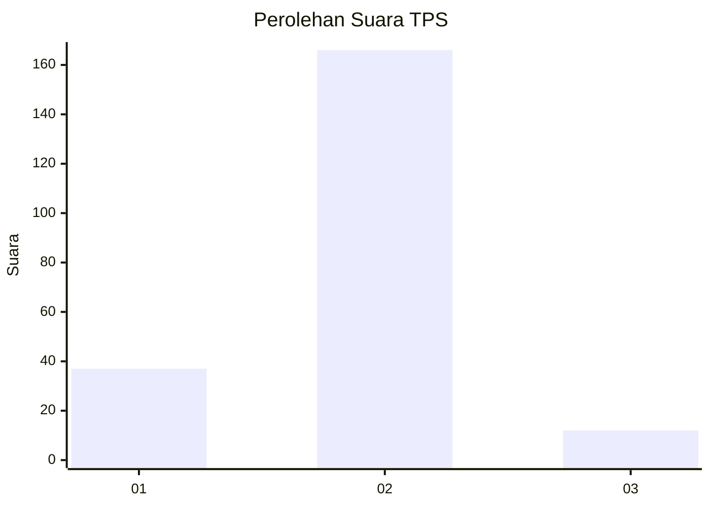
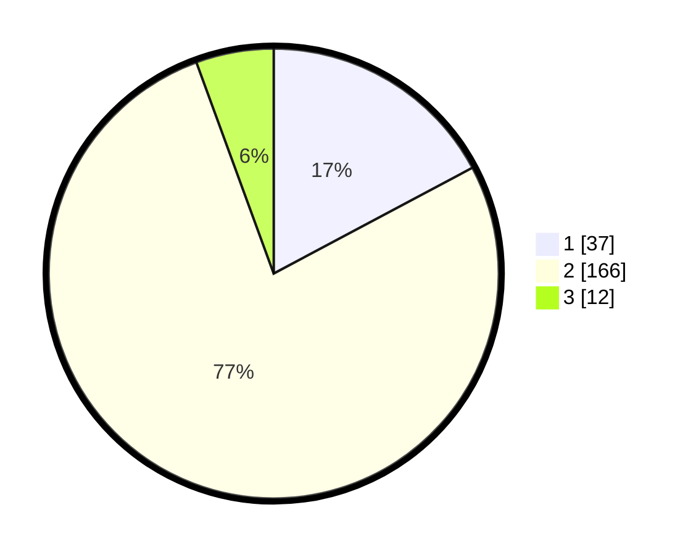

# Hasil

## Grafik

## Tabel

| No. | Nama Paslon    | Suara | Suara (raw) | Persentase |
|:--- |:-------------- | -----:| -----------:| ----------:|
| 1   | ANIES MUHAIMIN | 37    | [37][p-1]   | 17,21      |
| 2   | PRABOWO GIBRAN | 166   | [166][p-2]  | 77,21      |
| 3   | GANJAR MAHFUD  | 12    | [12][p-3]   | 5,58       |

[p-1]: https://github.com/gigit-pemilu/pemilu-2024/blob/main/pilpres/hitung-suara/sub/35-jawa-timur/sub/09-jember/sub/09-bangsalsari/sub/2003-bangsalsari/sub/023-tps/sub/paslon-1.txt
[p-2]: https://github.com/gigit-pemilu/pemilu-2024/blob/main/pilpres/hitung-suara/sub/35-jawa-timur/sub/09-jember/sub/09-bangsalsari/sub/2003-bangsalsari/sub/023-tps/sub/paslon-2.txt
[p-3]: https://github.com/gigit-pemilu/pemilu-2024/blob/main/pilpres/hitung-suara/sub/35-jawa-timur/sub/09-jember/sub/09-bangsalsari/sub/2003-bangsalsari/sub/023-tps/sub/paslon-3.txt

## Foto C Plano

https://sirekap-obj-formc.kpu.go.id/4b8d/pemilu/ppwp/35/09/09/20/03/3509092003023-20240214-213034--6e591bb5-4ad9-4e1d-92c0-2f6154160102.jpg

https://sirekap-obj-formc.kpu.go.id/4b8d/pemilu/ppwp/35/09/09/20/03/3509092003023-20240214-213037--598df98d-fd79-4769-8441-05464c08d985.jpg

https://sirekap-obj-formc.kpu.go.id/4b8d/pemilu/ppwp/35/09/09/20/03/3509092003023-20240214-213040--4b7668bc-6e23-464a-82a9-5341da8af54b.jpg

## Metadata

| Key        | Value               |
| ---------- | ------------------- |
| Time Stamp | 2024-02-15 12:00:28 |

