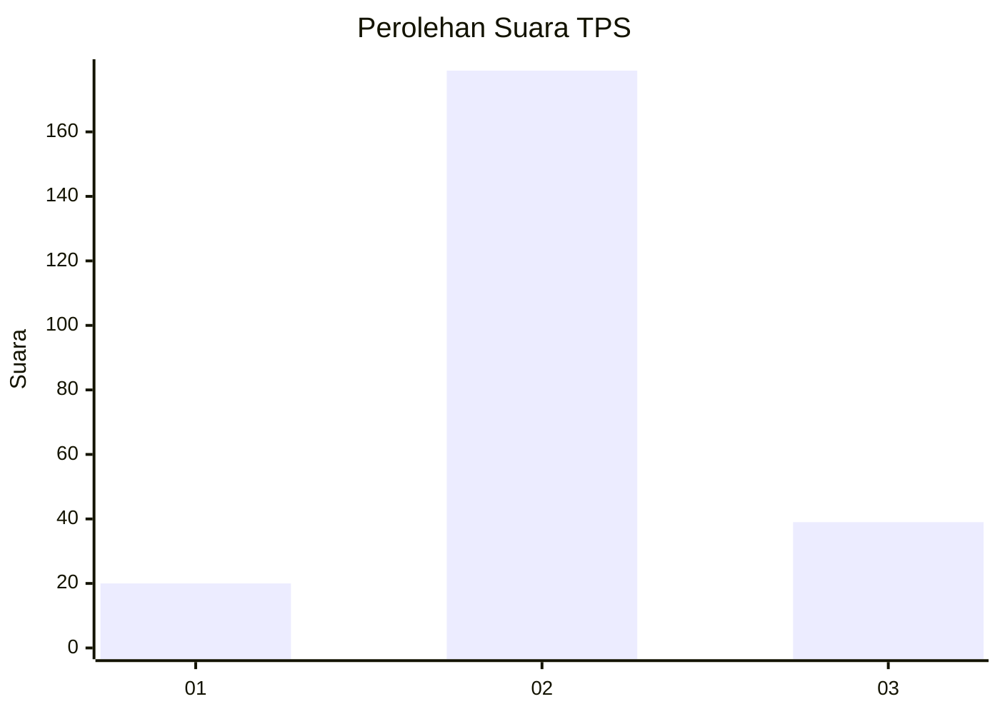
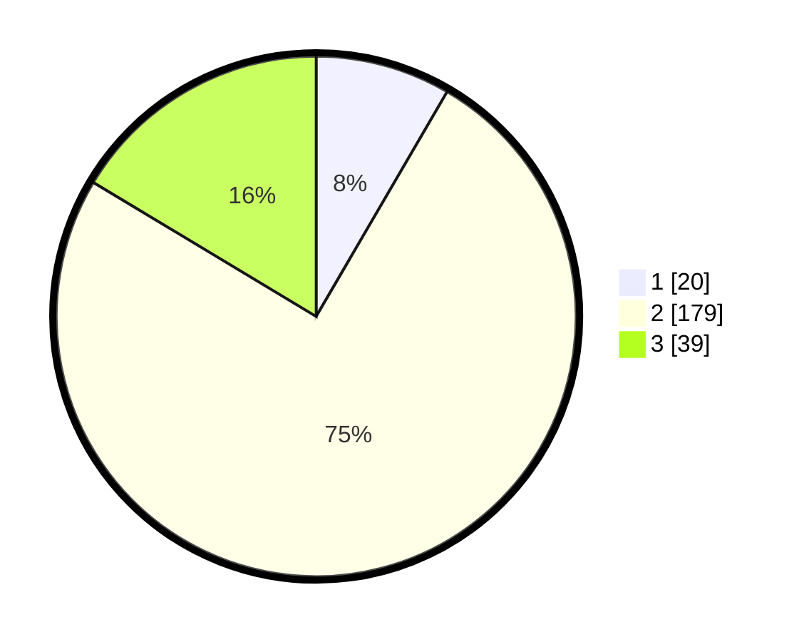

# Hasil

## Grafik

## Tabel

| No. | Nama Paslon    | Suara | Suara (raw) | Persentase |
|:--- |:-------------- | -----:| -----------:| ----------:|
| 1   | ANIES MUHAIMIN | 20    | [20][p-1]   | 8,40       |
| 2   | PRABOWO GIBRAN | 179   | [179][p-2]  | 75,21      |
| 3   | GANJAR MAHFUD  | 39    | [39][p-3]   | 16,39      |

[p-1]: https://github.com/gigit-pemilu/pemilu-2024/blob/main/pilpres/hitung-suara/sub/35-jawa-timur/sub/09-jember/sub/09-bangsalsari/sub/2003-bangsalsari/sub/027-tps/sub/paslon-1.txt
[p-2]: https://github.com/gigit-pemilu/pemilu-2024/blob/main/pilpres/hitung-suara/sub/35-jawa-timur/sub/09-jember/sub/09-bangsalsari/sub/2003-bangsalsari/sub/027-tps/sub/paslon-2.txt
[p-3]: https://github.com/gigit-pemilu/pemilu-2024/blob/main/pilpres/hitung-suara/sub/35-jawa-timur/sub/09-jember/sub/09-bangsalsari/sub/2003-bangsalsari/sub/027-tps/sub/paslon-3.txt

## Foto C Plano

https://sirekap-obj-formc.kpu.go.id/94b8/pemilu/ppwp/35/09/09/20/03/3509092003027-20240214-213748--56eb327c-c84d-4036-8d42-4786b9ef0026.jpg

https://sirekap-obj-formc.kpu.go.id/94b8/pemilu/ppwp/35/09/09/20/03/3509092003027-20240214-213927--334b9484-6b4c-46eb-b83e-ad1b83442ab0.jpg

https://sirekap-obj-formc.kpu.go.id/94b8/pemilu/ppwp/35/09/09/20/03/3509092003027-20240214-214104--225e12fd-d8be-4bdb-971b-1f9efc757ec3.jpg

## Metadata

| Key        | Value               |
| ---------- | ------------------- |
| Time Stamp | 2024-02-16 00:30:27 |

