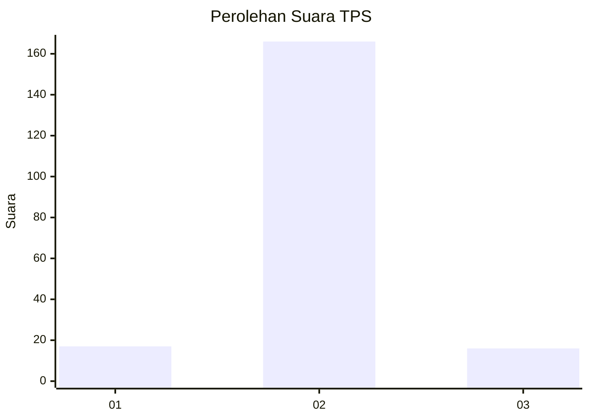
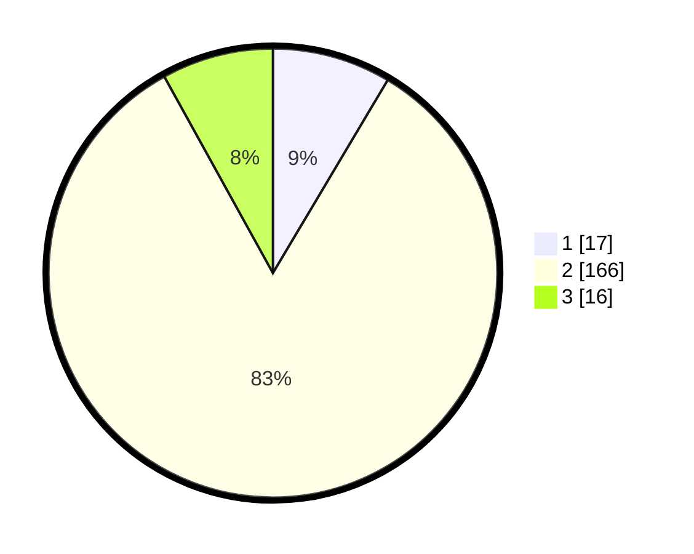

# Hasil

## Grafik

## Tabel

| No. | Nama Paslon    | Suara | Suara (raw) | Persentase |
|:--- |:-------------- | -----:| -----------:| ----------:|
| 1   | ANIES MUHAIMIN | 17    | [17][p-1]   | 8,54       |
| 2   | PRABOWO GIBRAN | 166   | [166][p-2]  | 83,42      |
| 3   | GANJAR MAHFUD  | 16    | [16][p-3]   | 8,04       |

[p-1]: https://github.com/gigit-pemilu/pemilu-2024-35-jawa-timur/blob/main/pilpres/hitung-suara/sub/35-jawa-timur/sub/09-jember/sub/09-bangsalsari/sub/2003-bangsalsari/sub/028-tps/sub/paslon-1.txt
[p-2]: https://github.com/gigit-pemilu/pemilu-2024-35-jawa-timur/blob/main/pilpres/hitung-suara/sub/35-jawa-timur/sub/09-jember/sub/09-bangsalsari/sub/2003-bangsalsari/sub/028-tps/sub/paslon-2.txt
[p-3]: https://github.com/gigit-pemilu/pemilu-2024-35-jawa-timur/blob/main/pilpres/hitung-suara/sub/35-jawa-timur/sub/09-jember/sub/09-bangsalsari/sub/2003-bangsalsari/sub/028-tps/sub/paslon-3.txt

## Foto C Plano

https://sirekap-obj-formc.kpu.go.id/70f6/pemilu/ppwp/35/09/09/20/03/3509092003028-20240214-200846--af986280-13a1-45cf-b7af-4257f314005c.jpg

https://sirekap-obj-formc.kpu.go.id/70f6/pemilu/ppwp/35/09/09/20/03/3509092003028-20240214-201046--dd0c8de0-cb51-4706-9d0b-d3e6e1f289da.jpg

https://sirekap-obj-formc.kpu.go.id/70f6/pemilu/ppwp/35/09/09/20/03/3509092003028-20240214-201235--31a7d927-d44a-4082-8d5b-e7efe30812ad.jpg

## Metadata

| Key        | Value               |
| ---------- | ------------------- |
| Time Stamp | 2024-02-15 12:00:28 |

