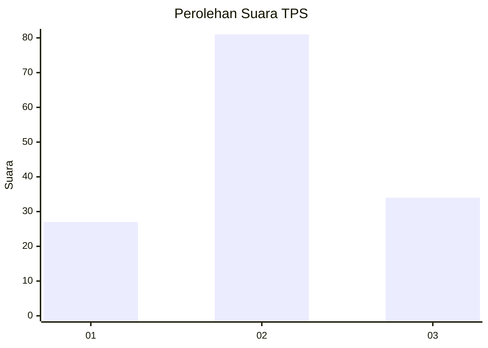
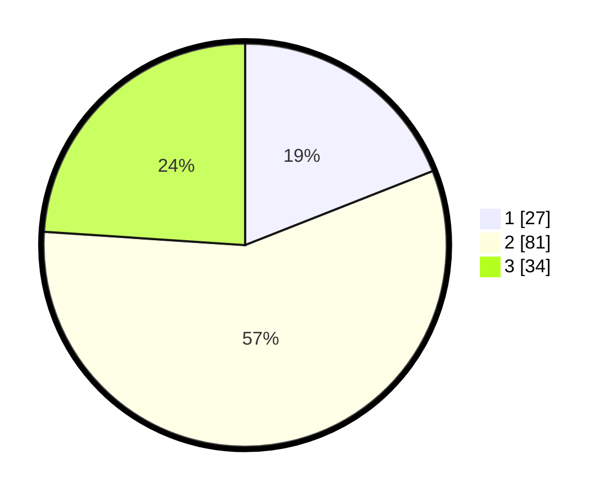

# Hasil

## Grafik

## Tabel

| No. | Nama Paslon    | Suara | Suara (raw) | Persentase |
|:--- |:-------------- | -----:| -----------:| ----------:|
| 1   | ANIES MUHAIMIN | 27    | [27][p-1]   | 19,01      |
| 2   | PRABOWO GIBRAN | 81    | [81][p-2]   | 57,04      |
| 3   | GANJAR MAHFUD  | 34    | [34][p-3]   | 23,94      |

[p-1]: https://github.com/gigit-pemilu/pemilu-2024-35-jawa-timur/blob/main/pilpres/hitung-suara/sub/35-jawa-timur/sub/09-jember/sub/09-bangsalsari/sub/2003-bangsalsari/sub/032-tps/sub/paslon-1.txt
[p-2]: https://github.com/gigit-pemilu/pemilu-2024-35-jawa-timur/blob/main/pilpres/hitung-suara/sub/35-jawa-timur/sub/09-jember/sub/09-bangsalsari/sub/2003-bangsalsari/sub/032-tps/sub/paslon-2.txt
[p-3]: https://github.com/gigit-pemilu/pemilu-2024-35-jawa-timur/blob/main/pilpres/hitung-suara/sub/35-jawa-timur/sub/09-jember/sub/09-bangsalsari/sub/2003-bangsalsari/sub/032-tps/sub/paslon-3.txt

## Foto C Plano

https://sirekap-obj-formc.kpu.go.id/876b/pemilu/ppwp/35/09/09/20/03/3509092003032-20240214-211855--9cce3a7a-54f9-4c46-a0eb-2edc1d168af0.jpg

https://sirekap-obj-formc.kpu.go.id/876b/pemilu/ppwp/35/09/09/20/03/3509092003032-20240214-211732--b74cb17b-3553-435d-bdc6-4b316778dd05.jpg

https://sirekap-obj-formc.kpu.go.id/876b/pemilu/ppwp/35/09/09/20/03/3509092003032-20240214-223233--1cdd29aa-179c-4078-a01f-b5583baaa86c.jpg

## Metadata

| Key        | Value               |
| ---------- | ------------------- |
| Time Stamp | 2024-02-15 03:06:03 |

