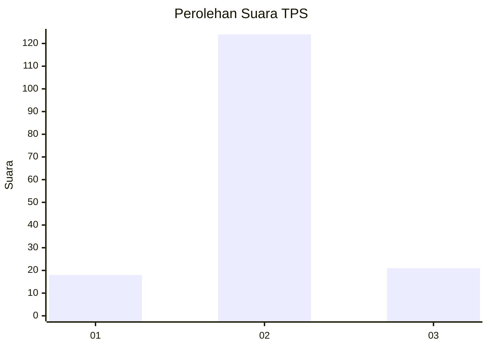
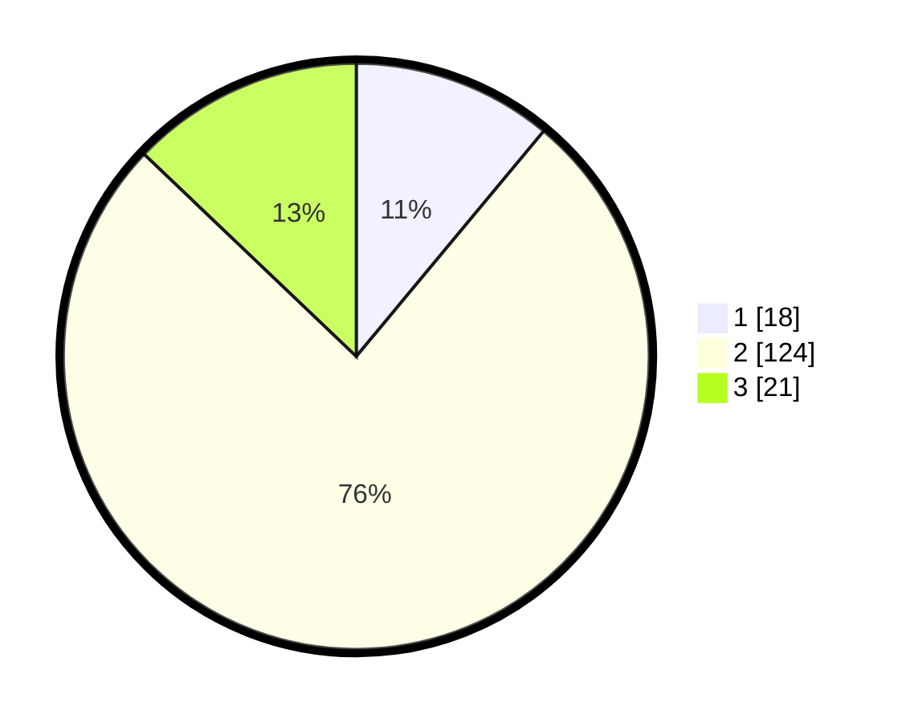

# Hasil

## Grafik

## Tabel

| No. | Nama Paslon    | Suara | Suara (raw) | Persentase |
|:--- |:-------------- | -----:| -----------:| ----------:|
| 1   | ANIES MUHAIMIN | 18    | [18][p-1]   | 11,04      |
| 2   | PRABOWO GIBRAN | 124   | [124][p-2]  | 76,07      |
| 3   | GANJAR MAHFUD  | 21    | [21][p-3]   | 12,88      |

[p-1]: https://github.com/gigit-pemilu/pemilu-2024-35-jawa-timur/blob/main/pilpres/hitung-suara/sub/35-jawa-timur/sub/09-jember/sub/09-bangsalsari/sub/2003-bangsalsari/sub/035-tps/sub/paslon-1.txt
[p-2]: https://github.com/gigit-pemilu/pemilu-2024-35-jawa-timur/blob/main/pilpres/hitung-suara/sub/35-jawa-timur/sub/09-jember/sub/09-bangsalsari/sub/2003-bangsalsari/sub/035-tps/sub/paslon-2.txt
[p-3]: https://github.com/gigit-pemilu/pemilu-2024-35-jawa-timur/blob/main/pilpres/hitung-suara/sub/35-jawa-timur/sub/09-jember/sub/09-bangsalsari/sub/2003-bangsalsari/sub/035-tps/sub/paslon-3.txt

## Foto C Plano

https://sirekap-obj-formc.kpu.go.id/3efe/pemilu/ppwp/35/09/09/20/03/3509092003035-20240215-015008--44a0f27e-e063-46ff-ba11-4ced97ba5e37.jpg

https://sirekap-obj-formc.kpu.go.id/3efe/pemilu/ppwp/35/09/09/20/03/3509092003035-20240215-014155--6904fa4f-9c97-48f6-881b-8aaacc4bb74c.jpg

https://sirekap-obj-formc.kpu.go.id/3efe/pemilu/ppwp/35/09/09/20/03/3509092003035-20240215-014603--674e70e6-cbc9-4bae-8a92-147fcd046378.jpg

## Metadata

| Key        | Value               |
| ---------- | ------------------- |
| Time Stamp | 2024-02-16 16:25:10 |

