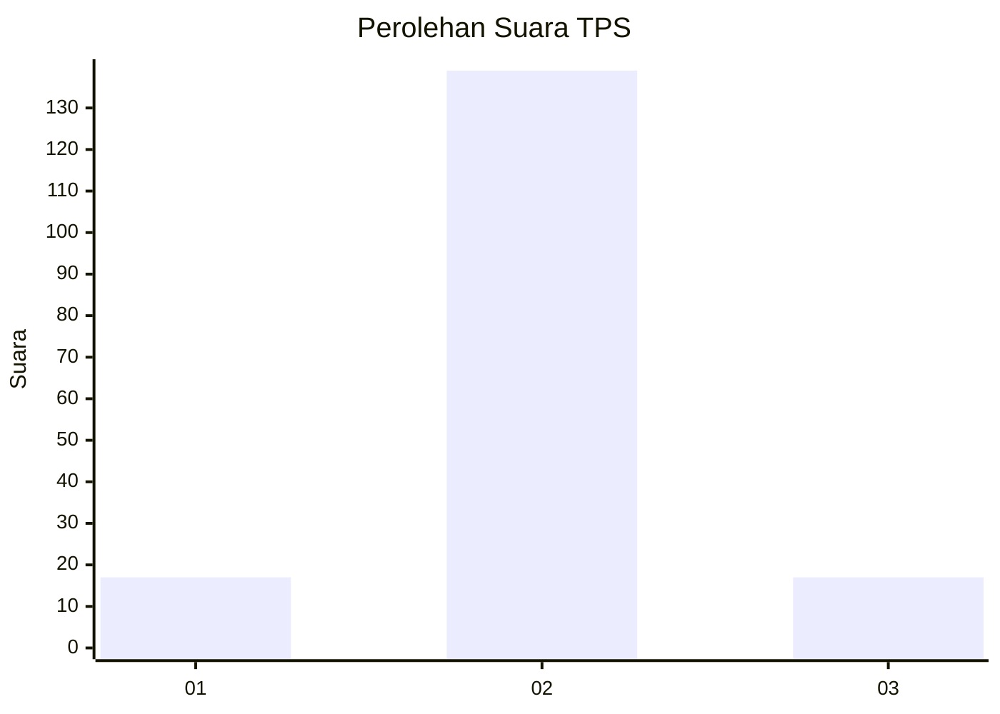
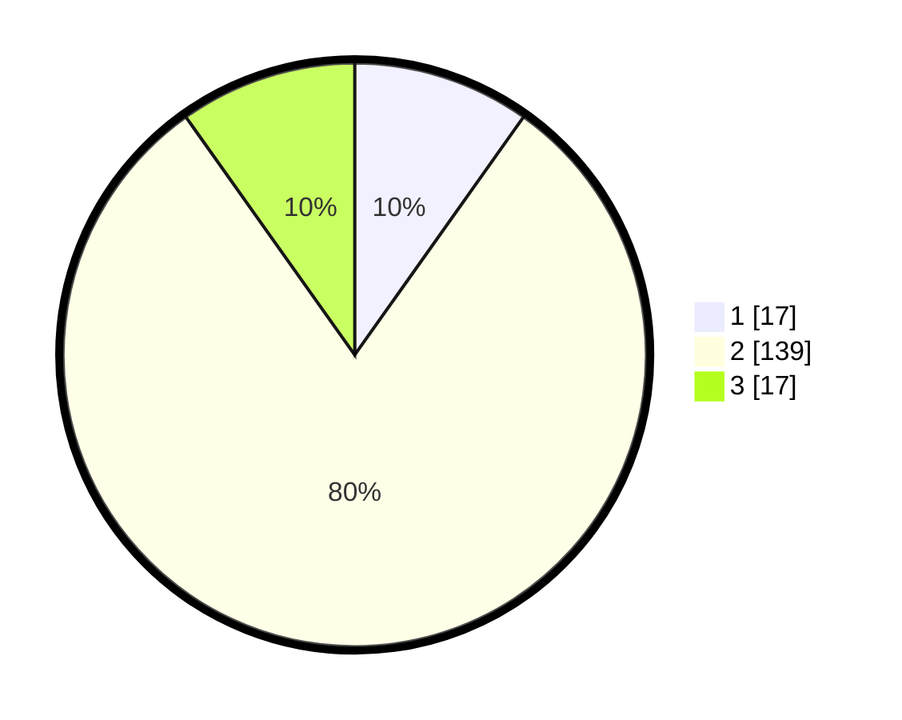

# Hasil

## Grafik

## Tabel

| No. | Nama Paslon    | Suara | Suara (raw) | Persentase |
|:--- |:-------------- | -----:| -----------:| ----------:|
| 1   | ANIES MUHAIMIN | 17    | [17][p-1]   | 9,83       |
| 2   | PRABOWO GIBRAN | 139   | [139][p-2]  | 80,35      |
| 3   | GANJAR MAHFUD  | 17    | [17][p-3]   | 9,83       |

[p-1]: https://github.com/gigit-pemilu/pemilu-2024/blob/main/pilpres/hitung-suara/sub/35-jawa-timur/sub/09-jember/sub/09-bangsalsari/sub/2003-bangsalsari/sub/038-tps/sub/paslon-1.txt
[p-2]: https://github.com/gigit-pemilu/pemilu-2024/blob/main/pilpres/hitung-suara/sub/35-jawa-timur/sub/09-jember/sub/09-bangsalsari/sub/2003-bangsalsari/sub/038-tps/sub/paslon-2.txt
[p-3]: https://github.com/gigit-pemilu/pemilu-2024/blob/main/pilpres/hitung-suara/sub/35-jawa-timur/sub/09-jember/sub/09-bangsalsari/sub/2003-bangsalsari/sub/038-tps/sub/paslon-3.txt

## Foto C Plano

https://sirekap-obj-formc.kpu.go.id/f70a/pemilu/ppwp/35/09/09/20/03/3509092003038-20240214-232434--ec2c6cf9-1244-4a7d-be54-122106a39f0d.jpg

https://sirekap-obj-formc.kpu.go.id/f70a/pemilu/ppwp/35/09/09/20/03/3509092003038-20240214-230637--285f6724-291e-46cf-ab28-dd1252036730.jpg

https://sirekap-obj-formc.kpu.go.id/f70a/pemilu/ppwp/35/09/09/20/03/3509092003038-20240214-232319--cff3fd16-8ef7-456c-824a-acf054aff2a6.jpg

## Metadata

| Key        | Value               |
| ---------- | ------------------- |
| Time Stamp | 2024-02-16 16:25:10 |

