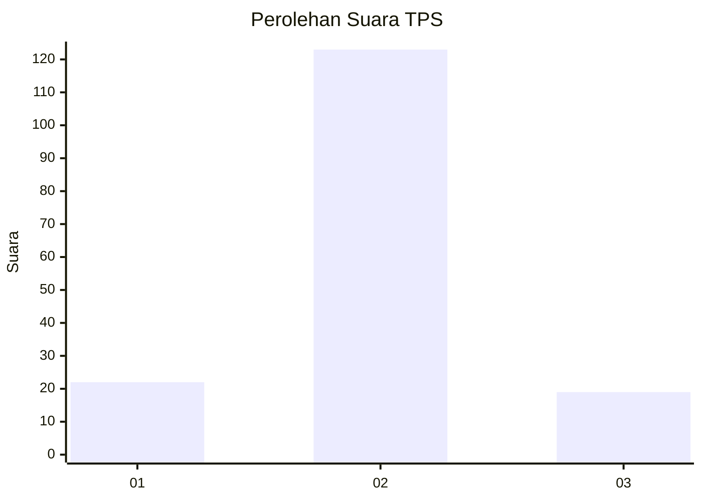
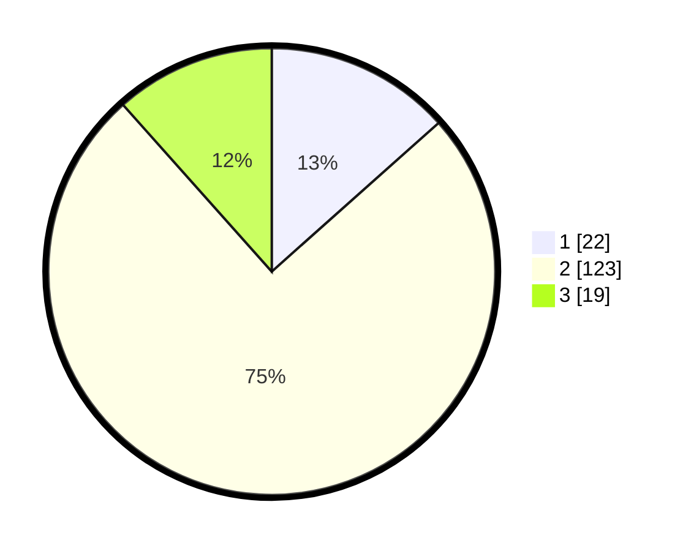

# Hasil

## Grafik

## Tabel

| No. | Nama Paslon    | Suara | Suara (raw) | Persentase |
|:--- |:-------------- | -----:| -----------:| ----------:|
| 1   | ANIES MUHAIMIN | 22    | [22][p-1]   | 13,41      |
| 2   | PRABOWO GIBRAN | 123   | [123][p-2]  | 75,00      |
| 3   | GANJAR MAHFUD  | 19    | [19][p-3]   | 11,59      |

[p-1]: https://github.com/gigit-pemilu/pemilu-2024/blob/main/pilpres/hitung-suara/sub/35-jawa-timur/sub/09-jember/sub/09-bangsalsari/sub/2003-bangsalsari/sub/039-tps/sub/paslon-1.txt
[p-2]: https://github.com/gigit-pemilu/pemilu-2024/blob/main/pilpres/hitung-suara/sub/35-jawa-timur/sub/09-jember/sub/09-bangsalsari/sub/2003-bangsalsari/sub/039-tps/sub/paslon-2.txt
[p-3]: https://github.com/gigit-pemilu/pemilu-2024/blob/main/pilpres/hitung-suara/sub/35-jawa-timur/sub/09-jember/sub/09-bangsalsari/sub/2003-bangsalsari/sub/039-tps/sub/paslon-3.txt

## Foto C Plano

https://sirekap-obj-formc.kpu.go.id/670d/pemilu/ppwp/35/09/09/20/03/3509092003039-20240214-192314--1eddf1e9-6755-40c5-8612-9502aa9e91f1.jpg

https://sirekap-obj-formc.kpu.go.id/670d/pemilu/ppwp/35/09/09/20/03/3509092003039-20240214-192555--d5e8ff4b-06f8-4c23-839c-b1ca06d66181.jpg

https://sirekap-obj-formc.kpu.go.id/670d/pemilu/ppwp/35/09/09/20/03/3509092003039-20240214-192839--65e8defb-7d22-445d-82e5-8bab52cf1f35.jpg

## Metadata

| Key        | Value               |
| ---------- | ------------------- |
| Time Stamp | 2024-02-16 16:25:10 |

