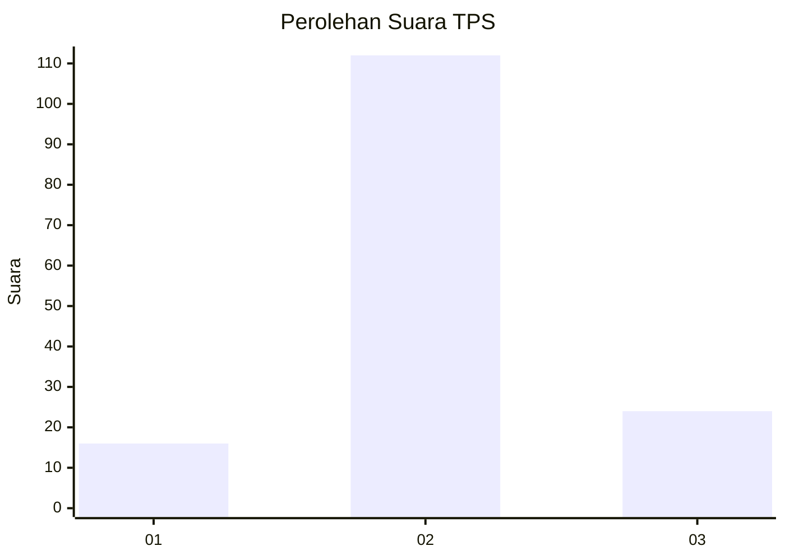
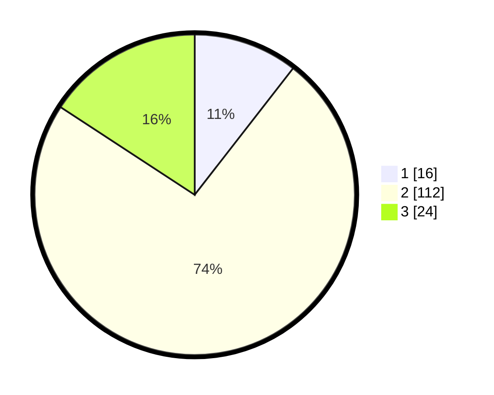

# Hasil

## Grafik

## Tabel

| No. | Nama Paslon    | Suara | Suara (raw) | Persentase |
|:--- |:-------------- | -----:| -----------:| ----------:|
| 1   | ANIES MUHAIMIN | 16    | [16][p-1]   | 10,53      |
| 2   | PRABOWO GIBRAN | 112   | [112][p-2]  | 73,68      |
| 3   | GANJAR MAHFUD  | 24    | [24][p-3]   | 15,79      |

[p-1]: https://github.com/gigit-pemilu/pemilu-2024-35-jawa-timur/blob/main/pilpres/hitung-suara/sub/35-jawa-timur/sub/09-jember/sub/09-bangsalsari/sub/2003-bangsalsari/sub/046-tps/sub/paslon-1.txt
[p-2]: https://github.com/gigit-pemilu/pemilu-2024-35-jawa-timur/blob/main/pilpres/hitung-suara/sub/35-jawa-timur/sub/09-jember/sub/09-bangsalsari/sub/2003-bangsalsari/sub/046-tps/sub/paslon-2.txt
[p-3]: https://github.com/gigit-pemilu/pemilu-2024-35-jawa-timur/blob/main/pilpres/hitung-suara/sub/35-jawa-timur/sub/09-jember/sub/09-bangsalsari/sub/2003-bangsalsari/sub/046-tps/sub/paslon-3.txt

## Foto C Plano

https://sirekap-obj-formc.kpu.go.id/5b20/pemilu/ppwp/35/09/09/20/03/3509092003046-20240214-203131--f1778639-7005-4379-8e9e-f1ec6877f850.jpg

https://sirekap-obj-formc.kpu.go.id/5b20/pemilu/ppwp/35/09/09/20/03/3509092003046-20240214-203146--bd6349d7-f85f-4212-8592-b9bb2c31cd4e.jpg

https://sirekap-obj-formc.kpu.go.id/5b20/pemilu/ppwp/35/09/09/20/03/3509092003046-20240214-203206--18de9734-0309-4815-9b39-83f9f8dae0f7.jpg

## Metadata

| Key        | Value               |
| ---------- | ------------------- |
| Time Stamp | 2024-02-15 12:00:28 |

