# Hasil

## Grafik

```mermaid
xychart-beta
    title "Perolehan Suara TPS"
    x-axis [01, 02, 03]
    y-axis "Suara" 0 --> 191
    bar [5, 191, 8]
```

## Tabel

| No. | Nama Paslon    | Suara | Suara (raw) | Persentase |
|:--- |:-------------- | -----:| -----------:| ----------:|
| 1   | ANIES MUHAIMIN | 5     | [5][p-1]    | 2,45       |
| 2   | PRABOWO GIBRAN | 191   | [191][p-2]  | 93,63      |
| 3   | GANJAR MAHFUD  | 8     | [8][p-3]    | 3,92       |

[p-1]: https://github.com/gigit-pemilu/pemilu-2024-35-jawa-timur/blob/main/pilpres/hitung-suara/sub/35-jawa-timur/sub/09-jember/sub/09-bangsalsari/sub/2004-tugusari/sub/002-tps/sub/paslon-1.txt
[p-2]: https://github.com/gigit-pemilu/pemilu-2024-35-jawa-timur/blob/main/pilpres/hitung-suara/sub/35-jawa-timur/sub/09-jember/sub/09-bangsalsari/sub/2004-tugusari/sub/002-tps/sub/paslon-2.txt
[p-3]: https://github.com/gigit-pemilu/pemilu-2024-35-jawa-timur/blob/main/pilpres/hitung-suara/sub/35-jawa-timur/sub/09-jember/sub/09-bangsalsari/sub/2004-tugusari/sub/002-tps/sub/paslon-3.txt

## Foto C Plano

https://sirekap-obj-formc.kpu.go.id/6b82/pemilu/ppwp/35/09/09/20/04/3509092004002-20240215-122105--096c0fe6-19a7-4f39-95a1-ca75d8df1741.jpg

https://sirekap-obj-formc.kpu.go.id/6b82/pemilu/ppwp/35/09/09/20/04/3509092004002-20240215-122626--cb13071b-3637-4ac7-9d9b-b81a2d54072e.jpg

https://sirekap-obj-formc.kpu.go.id/6b82/pemilu/ppwp/35/09/09/20/04/3509092004002-20240215-122721--2f0612f0-96c2-43d1-b7c0-15357d2d01bb.jpg

## Metadata

| Key        | Value               |
| ---------- | ------------------- |
| Time Stamp | 2024-02-16 16:25:10 |

