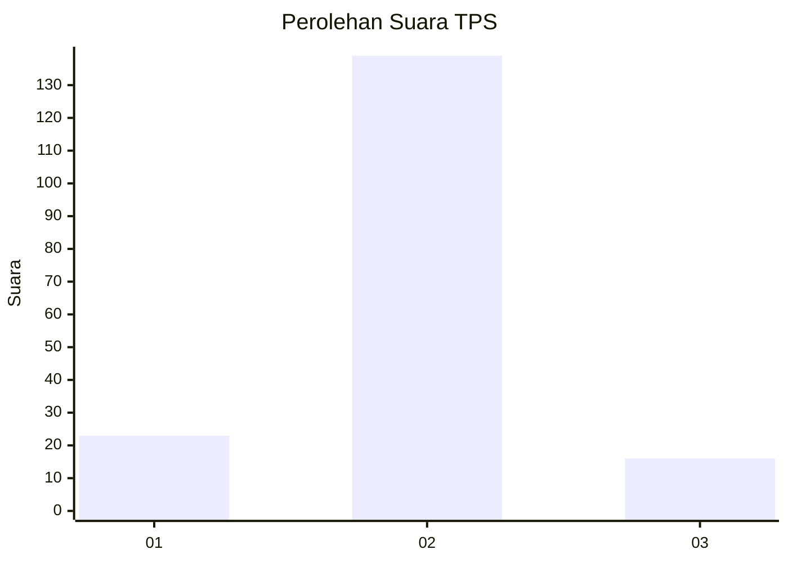
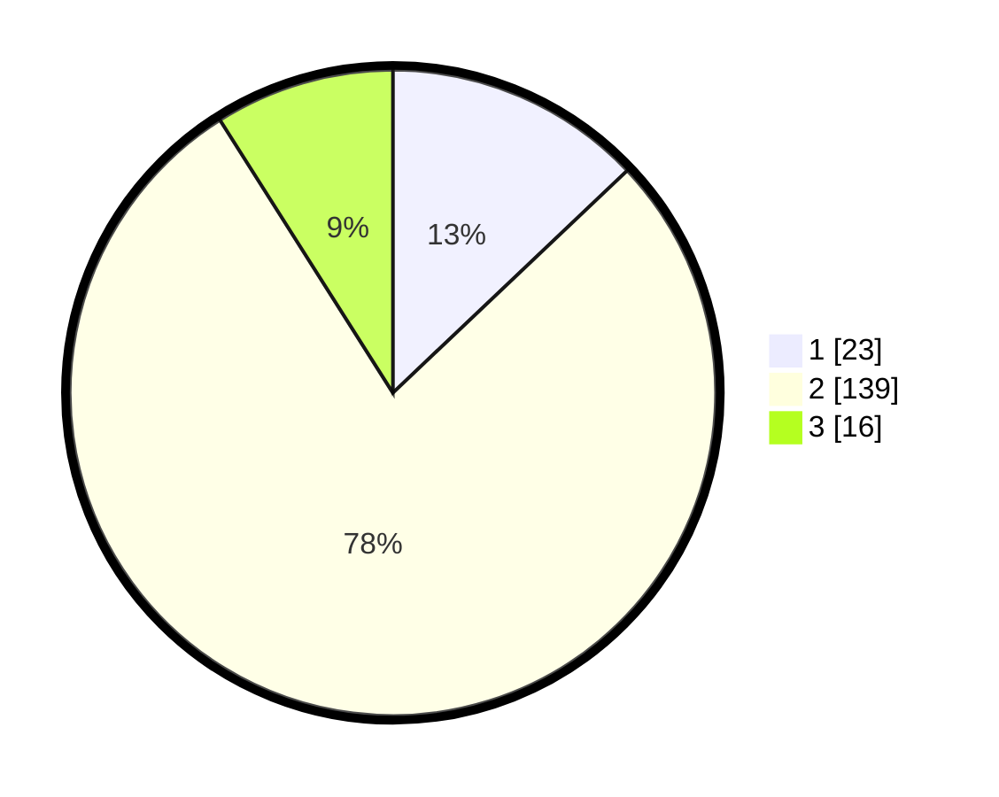

# Hasil

## Grafik

## Tabel

| No. | Nama Paslon    | Suara | Suara (raw) | Persentase |
|:--- |:-------------- | -----:| -----------:| ----------:|
| 1   | ANIES MUHAIMIN | 23    | [23][p-1]   | 12,92      |
| 2   | PRABOWO GIBRAN | 139   | [139][p-2]  | 78,09      |
| 3   | GANJAR MAHFUD  | 16    | [16][p-3]   | 8,99       |

[p-1]: https://github.com/gigit-pemilu/pemilu-2024-35-jawa-timur/blob/main/pilpres/hitung-suara/sub/35-jawa-timur/sub/09-jember/sub/09-bangsalsari/sub/2004-tugusari/sub/003-tps/sub/paslon-1.txt
[p-2]: https://github.com/gigit-pemilu/pemilu-2024-35-jawa-timur/blob/main/pilpres/hitung-suara/sub/35-jawa-timur/sub/09-jember/sub/09-bangsalsari/sub/2004-tugusari/sub/003-tps/sub/paslon-2.txt
[p-3]: https://github.com/gigit-pemilu/pemilu-2024-35-jawa-timur/blob/main/pilpres/hitung-suara/sub/35-jawa-timur/sub/09-jember/sub/09-bangsalsari/sub/2004-tugusari/sub/003-tps/sub/paslon-3.txt

## Foto C Plano

https://sirekap-obj-formc.kpu.go.id/8ba0/pemilu/ppwp/35/09/09/20/04/3509092004003-20240214-211741--e012da54-2785-494b-944c-23eb3f74e273.jpg

https://sirekap-obj-formc.kpu.go.id/8ba0/pemilu/ppwp/35/09/09/20/04/3509092004003-20240214-211617--c346bbb5-2dba-4cc8-b12c-60f087ed9525.jpg

https://sirekap-obj-formc.kpu.go.id/8ba0/pemilu/ppwp/35/09/09/20/04/3509092004003-20240214-211827--2a8e1aa0-7398-44ee-8c11-370b1b833b6c.jpg

## Metadata

| Key        | Value               |
| ---------- | ------------------- |
| Time Stamp | 2024-02-16 16:25:10 |

