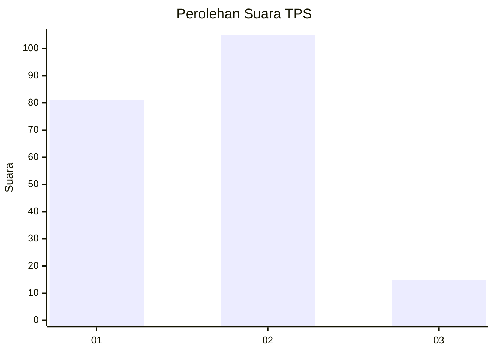

# Hasil

## Grafik

## Tabel

| No. | Nama Paslon    | Suara | Suara (raw) | Persentase |
|:--- |:-------------- | -----:| -----------:| ----------:|
| 1   | ANIES MUHAIMIN | 81    | [81][p-1]   | 40,30      |
| 2   | PRABOWO GIBRAN | 105   | [105][p-2]  | 52,24      |
| 3   | GANJAR MAHFUD  | 15    | [15][p-3]   | 7,46       |

[p-1]: https://github.com/gigit-pemilu/pemilu-2024-35-jawa-timur/blob/main/pilpres/hitung-suara/sub/35-jawa-timur/sub/09-jember/sub/09-bangsalsari/sub/2004-tugusari/sub/005-tps/sub/paslon-1.txt
[p-2]: https://github.com/gigit-pemilu/pemilu-2024-35-jawa-timur/blob/main/pilpres/hitung-suara/sub/35-jawa-timur/sub/09-jember/sub/09-bangsalsari/sub/2004-tugusari/sub/005-tps/sub/paslon-2.txt
[p-3]: https://github.com/gigit-pemilu/pemilu-2024-35-jawa-timur/blob/main/pilpres/hitung-suara/sub/35-jawa-timur/sub/09-jember/sub/09-bangsalsari/sub/2004-tugusari/sub/005-tps/sub/paslon-3.txt

## Foto C Plano

https://sirekap-obj-formc.kpu.go.id/62bd/pemilu/ppwp/35/09/09/20/04/3509092004005-20240215-035255--3d714481-6973-48f3-bb61-0a0b3bc515e4.jpg

https://sirekap-obj-formc.kpu.go.id/62bd/pemilu/ppwp/35/09/09/20/04/3509092004005-20240215-123009--8ea603b9-d480-4c81-a691-5e5af791d60e.jpg

https://sirekap-obj-formc.kpu.go.id/62bd/pemilu/ppwp/35/09/09/20/04/3509092004005-20240215-123113--be24857c-161b-4f93-9a8e-d1f05973baa5.jpg

## Metadata

| Key        | Value               |
| ---------- | ------------------- |
| Time Stamp | 2024-02-16 16:25:10 |

