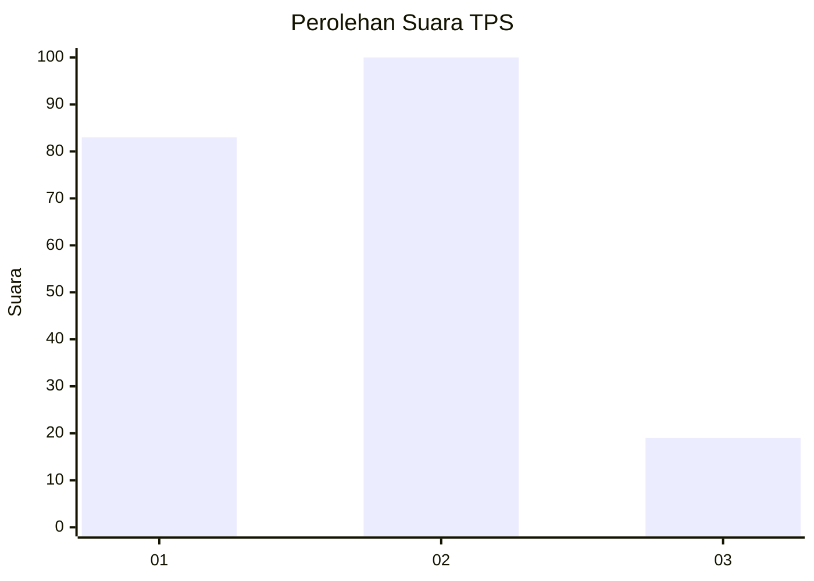
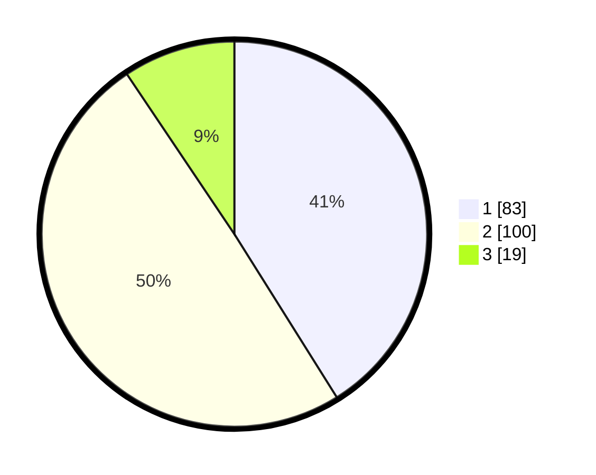

# Hasil

## Grafik

## Tabel

| No. | Nama Paslon    | Suara | Suara (raw) | Persentase |
|:--- |:-------------- | -----:| -----------:| ----------:|
| 1   | ANIES MUHAIMIN | 83    | [83][p-1]   | 41,09      |
| 2   | PRABOWO GIBRAN | 100   | [100][p-2]  | 49,50      |
| 3   | GANJAR MAHFUD  | 19    | [19][p-3]   | 9,41       |

[p-1]: https://github.com/gigit-pemilu/pemilu-2024-35-jawa-timur/blob/main/pilpres/hitung-suara/sub/35-jawa-timur/sub/09-jember/sub/09-bangsalsari/sub/2004-tugusari/sub/006-tps/sub/paslon-1.txt
[p-2]: https://github.com/gigit-pemilu/pemilu-2024-35-jawa-timur/blob/main/pilpres/hitung-suara/sub/35-jawa-timur/sub/09-jember/sub/09-bangsalsari/sub/2004-tugusari/sub/006-tps/sub/paslon-2.txt
[p-3]: https://github.com/gigit-pemilu/pemilu-2024-35-jawa-timur/blob/main/pilpres/hitung-suara/sub/35-jawa-timur/sub/09-jember/sub/09-bangsalsari/sub/2004-tugusari/sub/006-tps/sub/paslon-3.txt

## Foto C Plano

https://sirekap-obj-formc.kpu.go.id/4b4c/pemilu/ppwp/35/09/09/20/04/3509092004006-20240215-031711--8c9c511e-3af3-43f5-a252-f0c8aa5566d3.jpg

https://sirekap-obj-formc.kpu.go.id/4b4c/pemilu/ppwp/35/09/09/20/04/3509092004006-20240215-032147--6bdb75e0-3531-418a-af57-15cec88ea767.jpg

https://sirekap-obj-formc.kpu.go.id/4b4c/pemilu/ppwp/35/09/09/20/04/3509092004006-20240215-032338--cb958c71-2c1f-41f1-bf81-f4ba7fb32f90.jpg

## Metadata

| Key        | Value               |
| ---------- | ------------------- |
| Time Stamp | 2024-02-15 12:00:28 |

