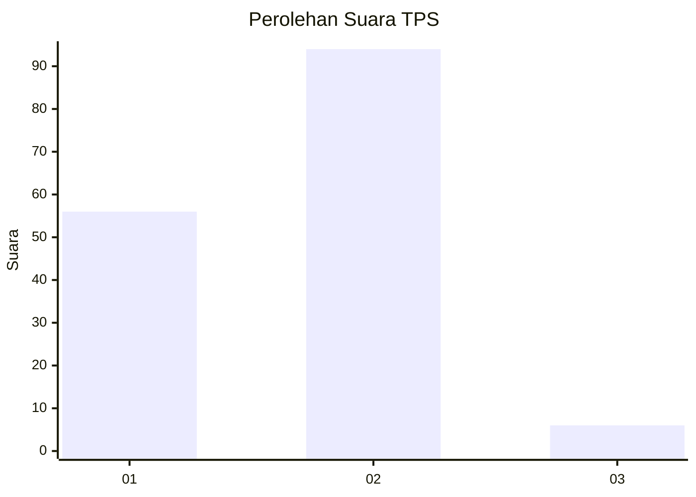
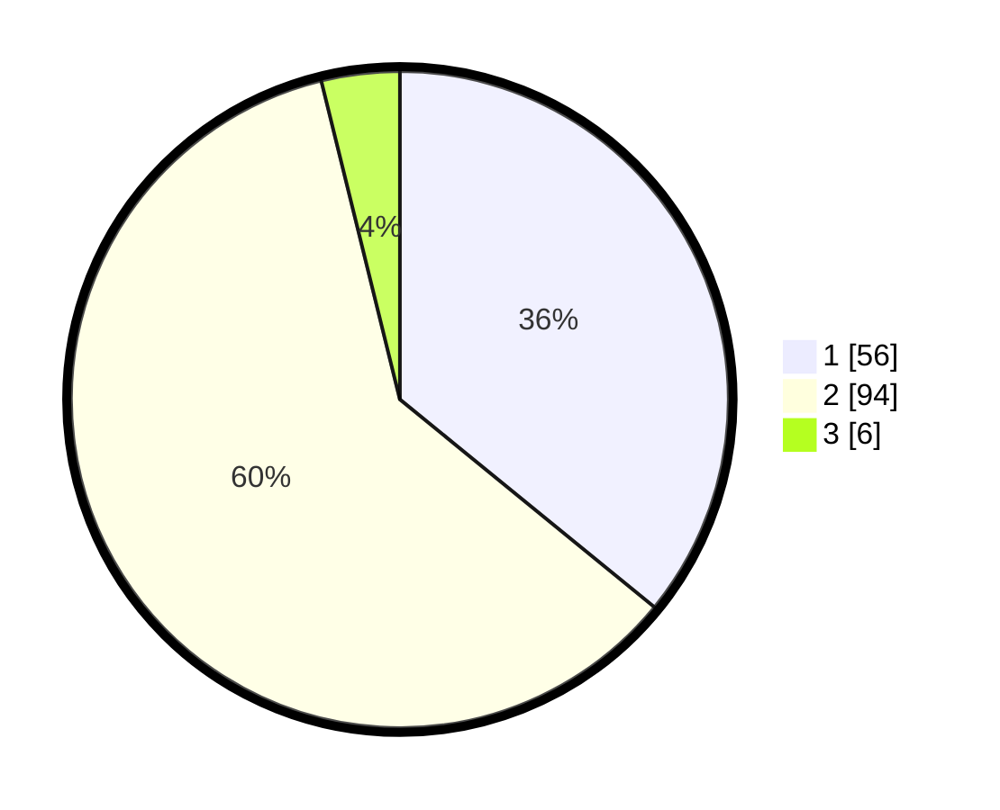

# Hasil

## Grafik

## Tabel

| No. | Nama Paslon    | Suara | Suara (raw) | Persentase |
|:--- |:-------------- | -----:| -----------:| ----------:|
| 1   | ANIES MUHAIMIN | 56    | [56][p-1]   | 35,90      |
| 2   | PRABOWO GIBRAN | 94    | [94][p-2]   | 60,26      |
| 3   | GANJAR MAHFUD  | 6     | [6][p-3]    | 3,85       |

[p-1]: https://github.com/gigit-pemilu/pemilu-2024/blob/main/pilpres/hitung-suara/sub/35-jawa-timur/sub/09-jember/sub/09-bangsalsari/sub/2004-tugusari/sub/007-tps/sub/paslon-1.txt
[p-2]: https://github.com/gigit-pemilu/pemilu-2024/blob/main/pilpres/hitung-suara/sub/35-jawa-timur/sub/09-jember/sub/09-bangsalsari/sub/2004-tugusari/sub/007-tps/sub/paslon-2.txt
[p-3]: https://github.com/gigit-pemilu/pemilu-2024/blob/main/pilpres/hitung-suara/sub/35-jawa-timur/sub/09-jember/sub/09-bangsalsari/sub/2004-tugusari/sub/007-tps/sub/paslon-3.txt

## Foto C Plano

https://sirekap-obj-formc.kpu.go.id/ee6a/pemilu/ppwp/35/09/09/20/04/3509092004007-20240214-232304--dbd962d2-9892-410e-b6e9-ac77fcc83bd7.jpg

https://sirekap-obj-formc.kpu.go.id/ee6a/pemilu/ppwp/35/09/09/20/04/3509092004007-20240214-232131--94e98fef-dde1-4983-903e-37c403d60797.jpg

https://sirekap-obj-formc.kpu.go.id/ee6a/pemilu/ppwp/35/09/09/20/04/3509092004007-20240214-232633--826bb299-9177-4bca-965e-0507ec715aac.jpg

## Metadata

| Key        | Value               |
| ---------- | ------------------- |
| Time Stamp | 2024-02-16 16:25:10 |

