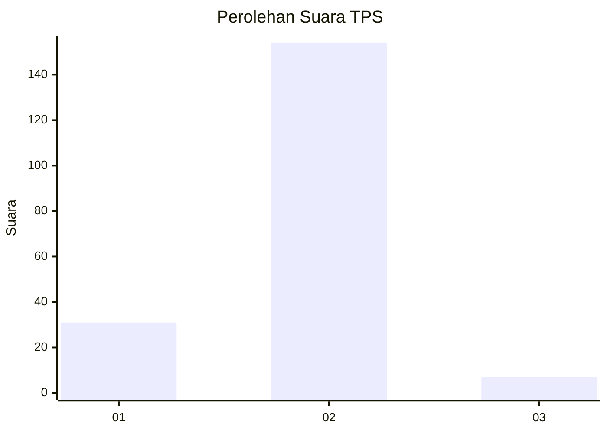
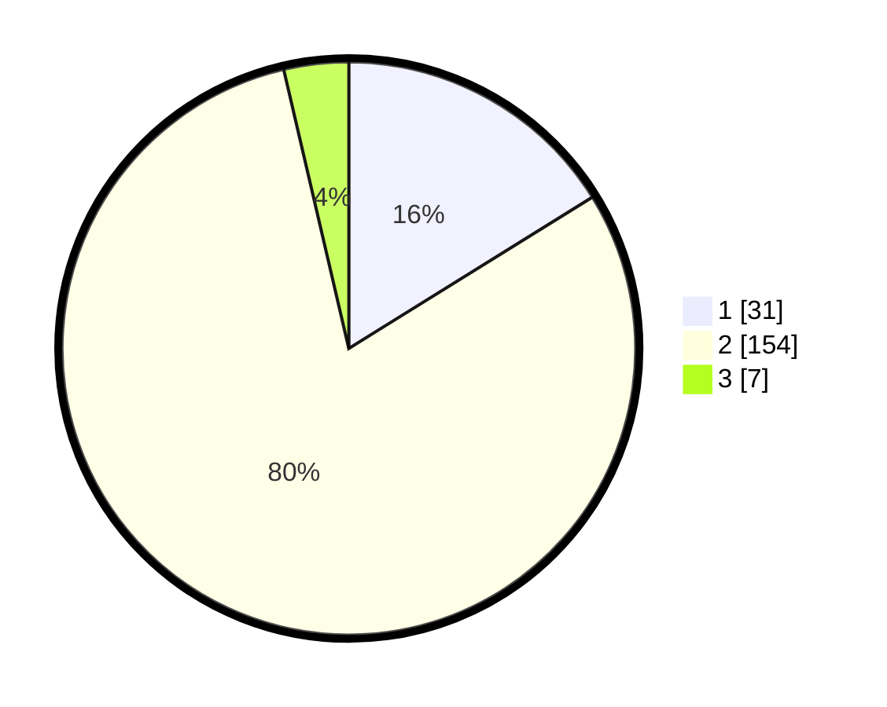

# Hasil

## Grafik

## Tabel

| No. | Nama Paslon    | Suara | Suara (raw) | Persentase |
|:--- |:-------------- | -----:| -----------:| ----------:|
| 1   | ANIES MUHAIMIN | 31    | [31][p-1]   | 16,15      |
| 2   | PRABOWO GIBRAN | 154   | [154][p-2]  | 80,21      |
| 3   | GANJAR MAHFUD  | 7     | [7][p-3]    | 3,65       |

[p-1]: https://github.com/gigit-pemilu/pemilu-2024-35-jawa-timur/blob/main/pilpres/hitung-suara/sub/35-jawa-timur/sub/09-jember/sub/09-bangsalsari/sub/2004-tugusari/sub/009-tps/sub/paslon-1.txt
[p-2]: https://github.com/gigit-pemilu/pemilu-2024-35-jawa-timur/blob/main/pilpres/hitung-suara/sub/35-jawa-timur/sub/09-jember/sub/09-bangsalsari/sub/2004-tugusari/sub/009-tps/sub/paslon-2.txt
[p-3]: https://github.com/gigit-pemilu/pemilu-2024-35-jawa-timur/blob/main/pilpres/hitung-suara/sub/35-jawa-timur/sub/09-jember/sub/09-bangsalsari/sub/2004-tugusari/sub/009-tps/sub/paslon-3.txt

## Foto C Plano

https://sirekap-obj-formc.kpu.go.id/962b/pemilu/ppwp/35/09/09/20/04/3509092004009-20240215-025423--fde2283e-0c27-4a52-8164-c551d240f295.jpg

https://sirekap-obj-formc.kpu.go.id/962b/pemilu/ppwp/35/09/09/20/04/3509092004009-20240215-025638--8e871d26-4360-4b8a-baeb-3ac595346ee2.jpg

https://sirekap-obj-formc.kpu.go.id/962b/pemilu/ppwp/35/09/09/20/04/3509092004009-20240215-025720--f3c08c61-c3f8-4649-a154-47b06fa79899.jpg

## Metadata

| Key        | Value               |
| ---------- | ------------------- |
| Time Stamp | 2024-02-16 16:25:10 |

