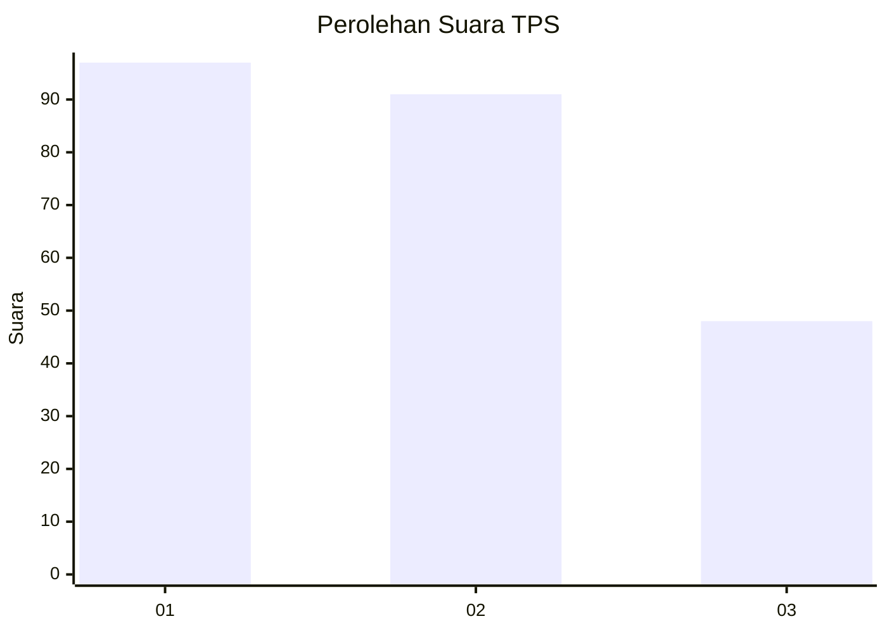
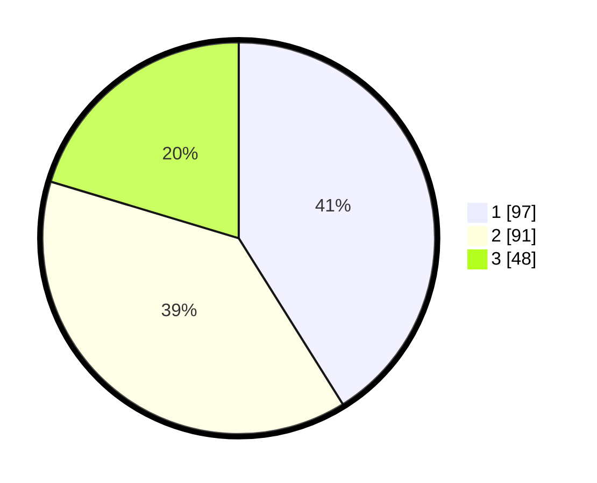

# Hasil

## Grafik

## Tabel

| No. | Nama Paslon    | Suara | Suara (raw) | Persentase |
|:--- |:-------------- | -----:| -----------:| ----------:|
| 1   | ANIES MUHAIMIN | 97    | [97][p-1]   | 41,10      |
| 2   | PRABOWO GIBRAN | 91    | [91][p-2]   | 38,56      |
| 3   | GANJAR MAHFUD  | 48    | [48][p-3]   | 20,34      |

[p-1]: https://github.com/gigit-pemilu/pemilu-2024-35-jawa-timur/blob/main/pilpres/hitung-suara/sub/35-jawa-timur/sub/09-jember/sub/09-bangsalsari/sub/2004-tugusari/sub/012-tps/sub/paslon-1.txt
[p-2]: https://github.com/gigit-pemilu/pemilu-2024-35-jawa-timur/blob/main/pilpres/hitung-suara/sub/35-jawa-timur/sub/09-jember/sub/09-bangsalsari/sub/2004-tugusari/sub/012-tps/sub/paslon-2.txt
[p-3]: https://github.com/gigit-pemilu/pemilu-2024-35-jawa-timur/blob/main/pilpres/hitung-suara/sub/35-jawa-timur/sub/09-jember/sub/09-bangsalsari/sub/2004-tugusari/sub/012-tps/sub/paslon-3.txt

## Foto C Plano

https://sirekap-obj-formc.kpu.go.id/29d7/pemilu/ppwp/35/09/09/20/04/3509092004012-20240215-133458--52947076-6a93-43ce-bfc9-2bf2ef300034.jpg

https://sirekap-obj-formc.kpu.go.id/29d7/pemilu/ppwp/35/09/09/20/04/3509092004012-20240215-085701--8c7f78e5-af05-4c25-abdb-097c660f0ffa.jpg

https://sirekap-obj-formc.kpu.go.id/29d7/pemilu/ppwp/35/09/09/20/04/3509092004012-20240215-085746--51a14f26-78ae-431e-a0ca-5d0cdf62d497.jpg

## Metadata

| Key        | Value               |
| ---------- | ------------------- |
| Time Stamp | 2024-02-16 16:25:10 |

