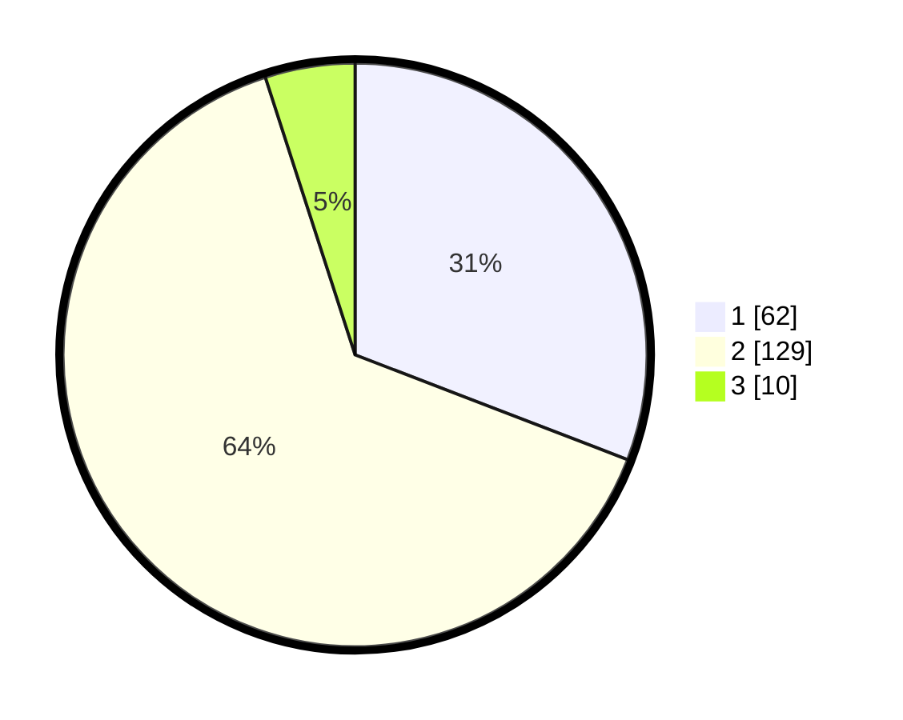

# Hasil

## Grafik

## Tabel

| No. | Nama Paslon    | Suara | Suara (raw) | Persentase |
|:--- |:-------------- | -----:| -----------:| ----------:|
| 1   | ANIES MUHAIMIN | 62    | [62][p-1]   | 30,85      |
| 2   | PRABOWO GIBRAN | 129   | [129][p-2]  | 64,18      |
| 3   | GANJAR MAHFUD  | 10    | [10][p-3]   | 4,98       |

[p-1]: https://github.com/gigit-pemilu/pemilu-2024-35-jawa-timur/blob/main/pilpres/hitung-suara/sub/35-jawa-timur/sub/09-jember/sub/09-bangsalsari/sub/2004-tugusari/sub/015-tps/sub/paslon-1.txt
[p-2]: https://github.com/gigit-pemilu/pemilu-2024-35-jawa-timur/blob/main/pilpres/hitung-suara/sub/35-jawa-timur/sub/09-jember/sub/09-bangsalsari/sub/2004-tugusari/sub/015-tps/sub/paslon-2.txt
[p-3]: https://github.com/gigit-pemilu/pemilu-2024-35-jawa-timur/blob/main/pilpres/hitung-suara/sub/35-jawa-timur/sub/09-jember/sub/09-bangsalsari/sub/2004-tugusari/sub/015-tps/sub/paslon-3.txt

## Foto C Plano

https://sirekap-obj-formc.kpu.go.id/126a/pemilu/ppwp/35/09/09/20/04/3509092004015-20240214-204220--fbcb806a-82e3-46b7-9b7f-be87e91a04b1.jpg

https://sirekap-obj-formc.kpu.go.id/126a/pemilu/ppwp/35/09/09/20/04/3509092004015-20240214-141518--0ea7a5e7-fde3-4bc9-95a9-709cb3e070fe.jpg

https://sirekap-obj-formc.kpu.go.id/126a/pemilu/ppwp/35/09/09/20/04/3509092004015-20240214-141627--0527e692-b9b1-4398-93af-4c74f36b0fe2.jpg

## Metadata

| Key        | Value               |
| ---------- | ------------------- |
| Time Stamp | 2024-02-16 23:30:00 |

