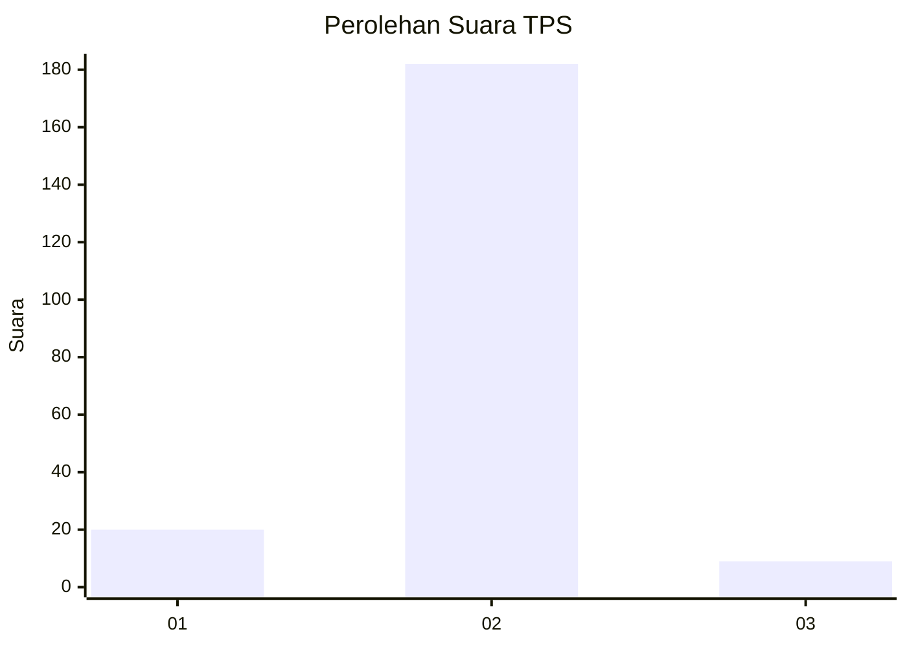
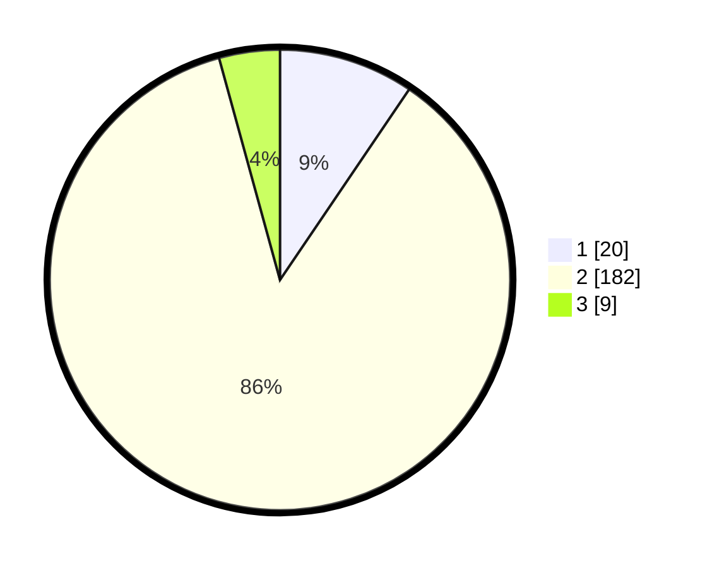

# Hasil

## Grafik

## Tabel

| No. | Nama Paslon    | Suara | Suara (raw) | Persentase |
|:--- |:-------------- | -----:| -----------:| ----------:|
| 1   | ANIES MUHAIMIN | 20    | [20][p-1]   | 9,48       |
| 2   | PRABOWO GIBRAN | 182   | [182][p-2]  | 86,26      |
| 3   | GANJAR MAHFUD  | 9     | [9][p-3]    | 4,27       |

[p-1]: https://github.com/gigit-pemilu/pemilu-2024/blob/main/pilpres/hitung-suara/sub/35-jawa-timur/sub/09-jember/sub/09-bangsalsari/sub/2004-tugusari/sub/018-tps/sub/paslon-1.txt
[p-2]: https://github.com/gigit-pemilu/pemilu-2024/blob/main/pilpres/hitung-suara/sub/35-jawa-timur/sub/09-jember/sub/09-bangsalsari/sub/2004-tugusari/sub/018-tps/sub/paslon-2.txt
[p-3]: https://github.com/gigit-pemilu/pemilu-2024/blob/main/pilpres/hitung-suara/sub/35-jawa-timur/sub/09-jember/sub/09-bangsalsari/sub/2004-tugusari/sub/018-tps/sub/paslon-3.txt

## Foto C Plano

https://sirekap-obj-formc.kpu.go.id/d76a/pemilu/ppwp/35/09/09/20/04/3509092004018-20240214-233252--acfa1626-3160-40cd-874d-a7f644b207a5.jpg

https://sirekap-obj-formc.kpu.go.id/d76a/pemilu/ppwp/35/09/09/20/04/3509092004018-20240214-233444--1750b86d-05f1-4178-ac9c-cfab53bcff97.jpg

https://sirekap-obj-formc.kpu.go.id/d76a/pemilu/ppwp/35/09/09/20/04/3509092004018-20240214-233716--5fae3c0d-ab55-4493-aa85-3c6ebebc3130.jpg

## Metadata

| Key        | Value               |
| ---------- | ------------------- |
| Time Stamp | 2024-02-15 12:00:28 |

