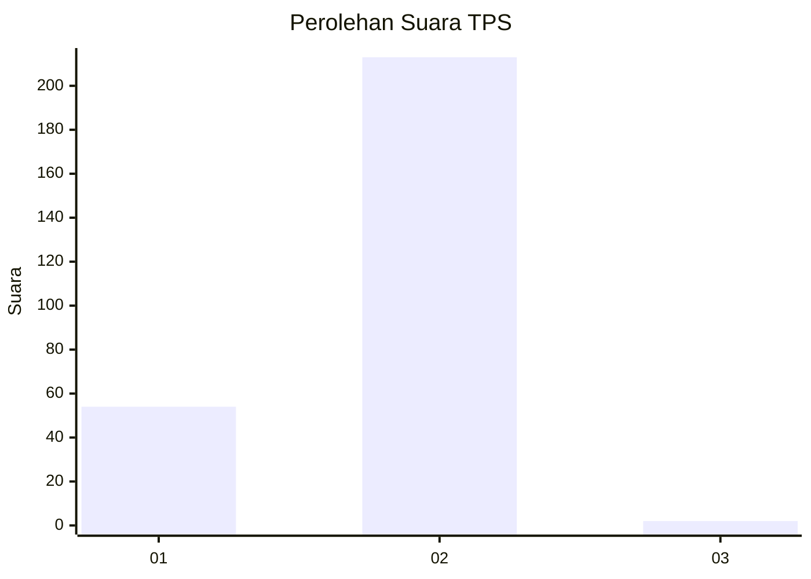
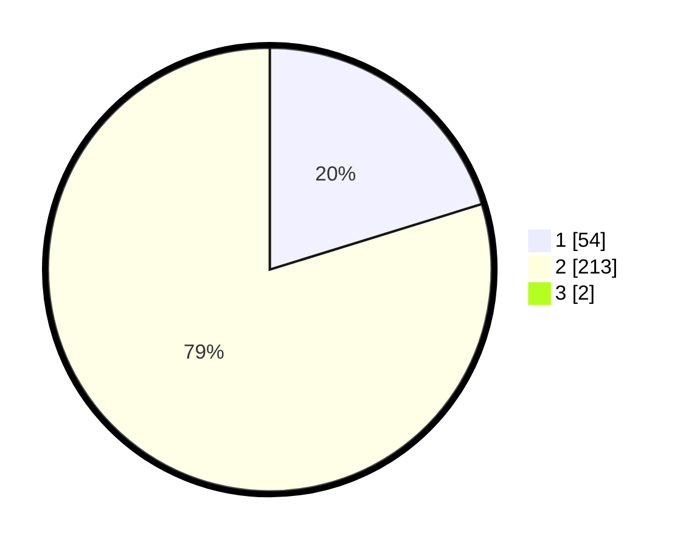

# Hasil

## Grafik

## Tabel

| No. | Nama Paslon    | Suara | Suara (raw) | Persentase |
|:--- |:-------------- | -----:| -----------:| ----------:|
| 1   | ANIES MUHAIMIN | 54    | [54][p-1]   | 20,07      |
| 2   | PRABOWO GIBRAN | 213   | [213][p-2]  | 79,18      |
| 3   | GANJAR MAHFUD  | 2     | [2][p-3]    | 0,74       |

[p-1]: https://github.com/gigit-pemilu/pemilu-2024/blob/main/pilpres/hitung-suara/sub/35-jawa-timur/sub/09-jember/sub/09-bangsalsari/sub/2004-tugusari/sub/019-tps/sub/paslon-1.txt
[p-2]: https://github.com/gigit-pemilu/pemilu-2024/blob/main/pilpres/hitung-suara/sub/35-jawa-timur/sub/09-jember/sub/09-bangsalsari/sub/2004-tugusari/sub/019-tps/sub/paslon-2.txt
[p-3]: https://github.com/gigit-pemilu/pemilu-2024/blob/main/pilpres/hitung-suara/sub/35-jawa-timur/sub/09-jember/sub/09-bangsalsari/sub/2004-tugusari/sub/019-tps/sub/paslon-3.txt

## Foto C Plano

https://sirekap-obj-formc.kpu.go.id/ca33/pemilu/ppwp/35/09/09/20/04/3509092004019-20240215-014655--f6413d7a-5f89-42c7-a151-e64593023271.jpg

https://sirekap-obj-formc.kpu.go.id/ca33/pemilu/ppwp/35/09/09/20/04/3509092004019-20240214-212603--1163037e-b79b-4146-bfe5-a4f046591b81.jpg

https://sirekap-obj-formc.kpu.go.id/ca33/pemilu/ppwp/35/09/09/20/04/3509092004019-20240214-212924--1c0c7bb9-b0b9-4b38-b639-6f0fcc6b89d2.jpg

## Metadata

| Key        | Value               |
| ---------- | ------------------- |
| Time Stamp | 2024-02-16 16:25:10 |

