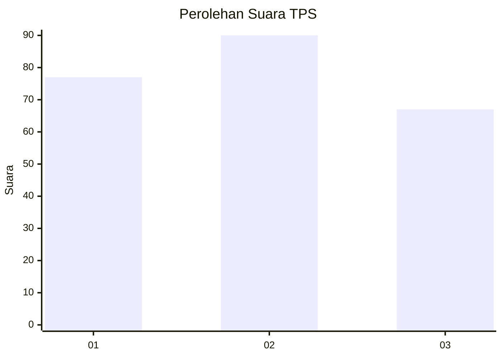
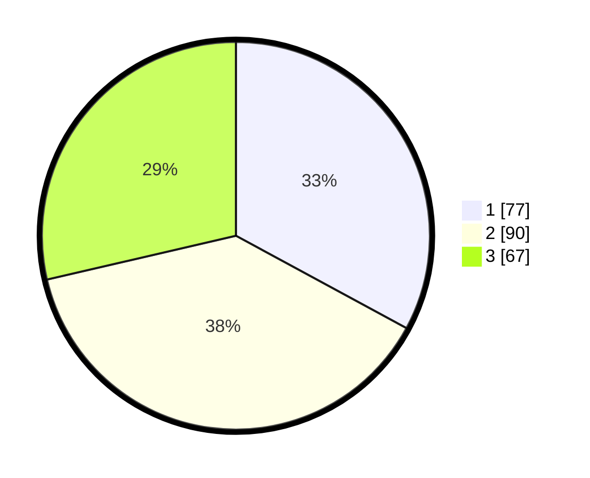

# Hasil

## Grafik

## Tabel

| No. | Nama Paslon    | Suara | Suara (raw) | Persentase |
|:--- |:-------------- | -----:| -----------:| ----------:|
| 1   | ANIES MUHAIMIN | 77    | [77][p-1]   | 32,91      |
| 2   | PRABOWO GIBRAN | 90    | [90][p-2]   | 38,46      |
| 3   | GANJAR MAHFUD  | 67    | [67][p-3]   | 28,63      |

[p-1]: https://github.com/gigit-pemilu/pemilu-2024/blob/main/pilpres/hitung-suara/sub/35-jawa-timur/sub/09-jember/sub/09-bangsalsari/sub/2004-tugusari/sub/020-tps/sub/paslon-1.txt
[p-2]: https://github.com/gigit-pemilu/pemilu-2024/blob/main/pilpres/hitung-suara/sub/35-jawa-timur/sub/09-jember/sub/09-bangsalsari/sub/2004-tugusari/sub/020-tps/sub/paslon-2.txt
[p-3]: https://github.com/gigit-pemilu/pemilu-2024/blob/main/pilpres/hitung-suara/sub/35-jawa-timur/sub/09-jember/sub/09-bangsalsari/sub/2004-tugusari/sub/020-tps/sub/paslon-3.txt

## Foto C Plano

https://sirekap-obj-formc.kpu.go.id/e577/pemilu/ppwp/35/09/09/20/04/3509092004020-20240214-231303--0451f390-5c58-48e8-bf68-f9edb30c83fc.jpg

https://sirekap-obj-formc.kpu.go.id/e577/pemilu/ppwp/35/09/09/20/04/3509092004020-20240214-231419--9b6b7e5f-6caf-4aa6-99fe-ae3a9cf2b3f2.jpg

https://sirekap-obj-formc.kpu.go.id/e577/pemilu/ppwp/35/09/09/20/04/3509092004020-20240214-231624--1a80766b-35fe-4b43-91bf-5646e21011ee.jpg

## Metadata

| Key        | Value               |
| ---------- | ------------------- |
| Time Stamp | 2024-02-16 16:25:10 |

