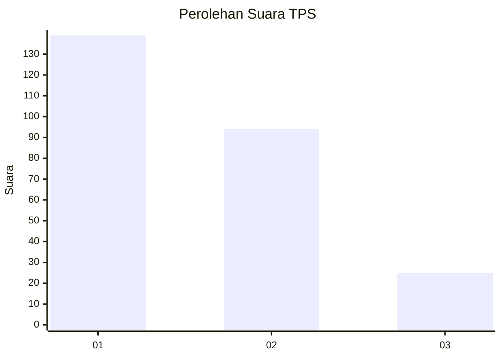
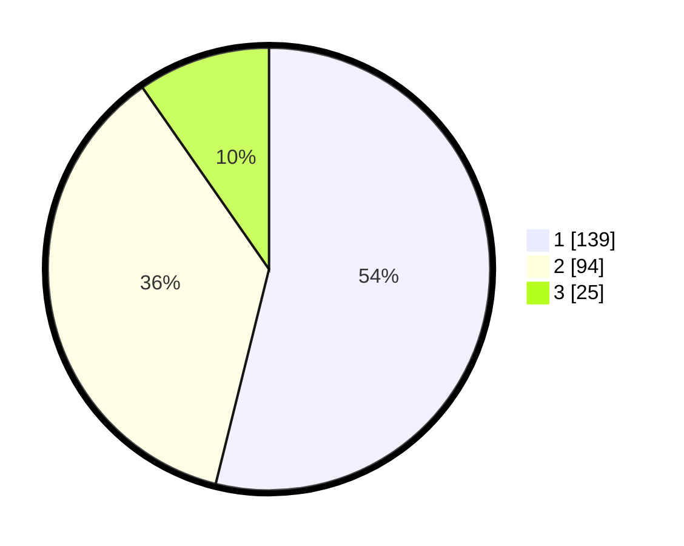

# Hasil

## Grafik

## Tabel

| No. | Nama Paslon    | Suara | Suara (raw) | Persentase |
|:--- |:-------------- | -----:| -----------:| ----------:|
| 1   | ANIES MUHAIMIN | 139   | [139][p-1]  | 53,88      |
| 2   | PRABOWO GIBRAN | 94    | [94][p-2]   | 36,43      |
| 3   | GANJAR MAHFUD  | 25    | [25][p-3]   | 9,69       |

[p-1]: https://github.com/gigit-pemilu/pemilu-2024-35-jawa-timur/blob/main/pilpres/hitung-suara/sub/35-jawa-timur/sub/09-jember/sub/09-bangsalsari/sub/2004-tugusari/sub/021-tps/sub/paslon-1.txt
[p-2]: https://github.com/gigit-pemilu/pemilu-2024-35-jawa-timur/blob/main/pilpres/hitung-suara/sub/35-jawa-timur/sub/09-jember/sub/09-bangsalsari/sub/2004-tugusari/sub/021-tps/sub/paslon-2.txt
[p-3]: https://github.com/gigit-pemilu/pemilu-2024-35-jawa-timur/blob/main/pilpres/hitung-suara/sub/35-jawa-timur/sub/09-jember/sub/09-bangsalsari/sub/2004-tugusari/sub/021-tps/sub/paslon-3.txt

## Foto C Plano

https://sirekap-obj-formc.kpu.go.id/fe98/pemilu/ppwp/35/09/09/20/04/3509092004021-20240215-051704--3bf8d641-da7a-4177-a588-73b34a971a6b.jpg

https://sirekap-obj-formc.kpu.go.id/fe98/pemilu/ppwp/35/09/09/20/04/3509092004021-20240215-051832--23966c10-d985-4499-93fc-c238b2b13b5a.jpg

https://sirekap-obj-formc.kpu.go.id/fe98/pemilu/ppwp/35/09/09/20/04/3509092004021-20240215-051954--71f21dd4-7ae5-4f79-8de1-1548a4f84045.jpg

## Metadata

| Key        | Value               |
| ---------- | ------------------- |
| Time Stamp | 2024-02-15 21:30:27 |

