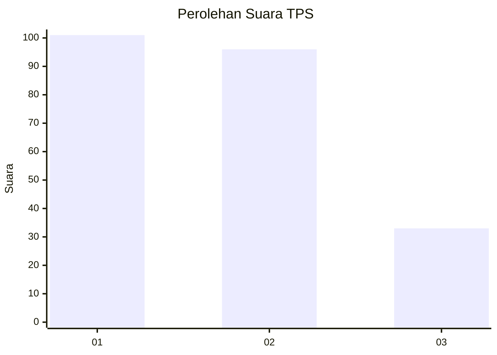
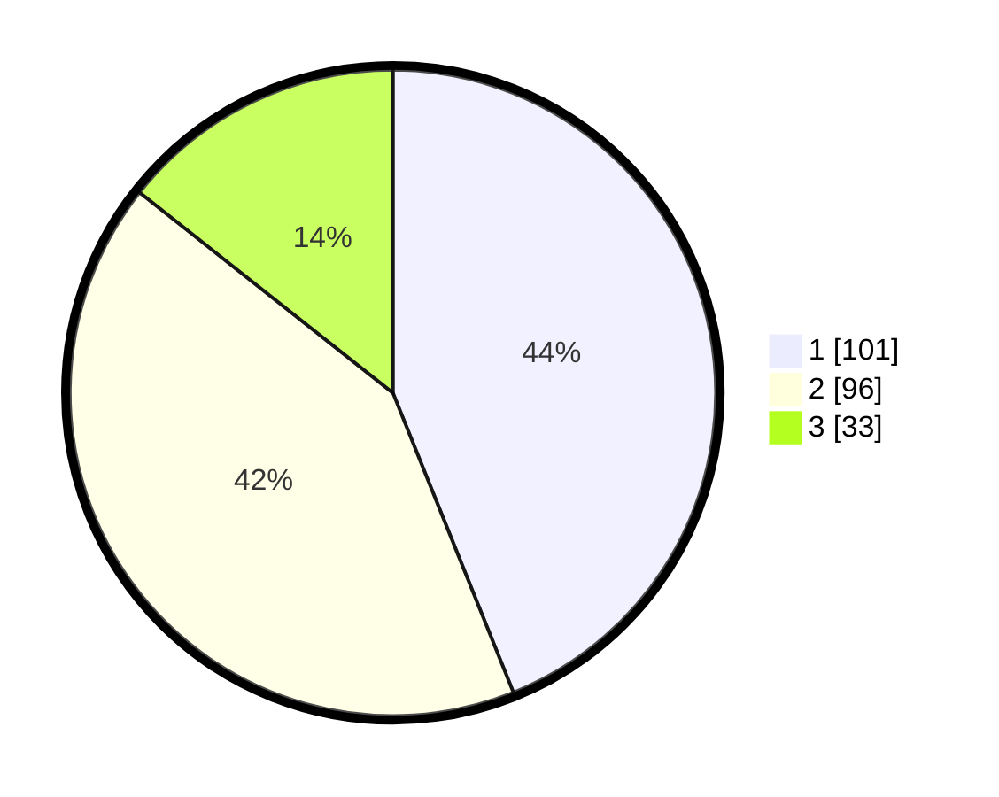

# Hasil

## Grafik

## Tabel

| No. | Nama Paslon    | Suara | Suara (raw) | Persentase |
|:--- |:-------------- | -----:| -----------:| ----------:|
| 1   | ANIES MUHAIMIN | 101   | [101][p-1]  | 43,91      |
| 2   | PRABOWO GIBRAN | 96    | [96][p-2]   | 41,74      |
| 3   | GANJAR MAHFUD  | 33    | [33][p-3]   | 14,35      |

[p-1]: https://github.com/gigit-pemilu/pemilu-2024/blob/main/pilpres/hitung-suara/sub/35-jawa-timur/sub/09-jember/sub/09-bangsalsari/sub/2004-tugusari/sub/022-tps/sub/paslon-1.txt
[p-2]: https://github.com/gigit-pemilu/pemilu-2024/blob/main/pilpres/hitung-suara/sub/35-jawa-timur/sub/09-jember/sub/09-bangsalsari/sub/2004-tugusari/sub/022-tps/sub/paslon-2.txt
[p-3]: https://github.com/gigit-pemilu/pemilu-2024/blob/main/pilpres/hitung-suara/sub/35-jawa-timur/sub/09-jember/sub/09-bangsalsari/sub/2004-tugusari/sub/022-tps/sub/paslon-3.txt

## Foto C Plano

https://sirekap-obj-formc.kpu.go.id/1d25/pemilu/ppwp/35/09/09/20/04/3509092004022-20240216-194401--da573fc6-180f-4c43-8d9d-0b1c59d82ecc.jpg

https://sirekap-obj-formc.kpu.go.id/1d25/pemilu/ppwp/35/09/09/20/04/3509092004022-20240216-193737--173c624c-431a-45f3-95a6-c6220a3484a1.jpg

https://sirekap-obj-formc.kpu.go.id/1d25/pemilu/ppwp/35/09/09/20/04/3509092004022-20240216-194239--952ab13d-ed90-4274-89e0-75317d328df1.jpg

## Metadata

| Key        | Value               |
| ---------- | ------------------- |
| Time Stamp | 2024-02-25 12:00:00 |

