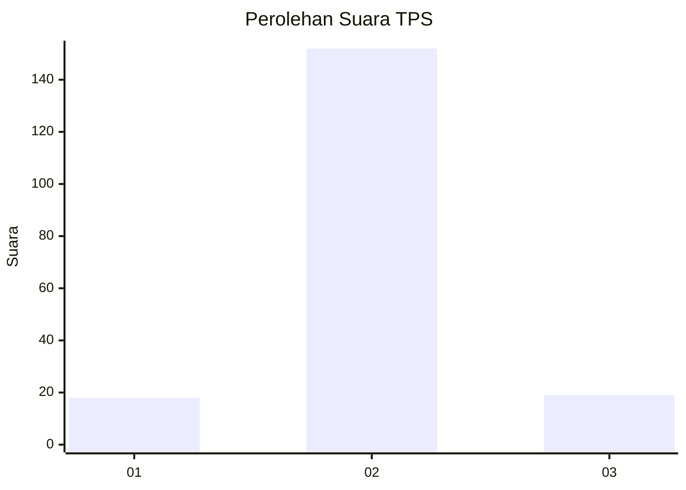
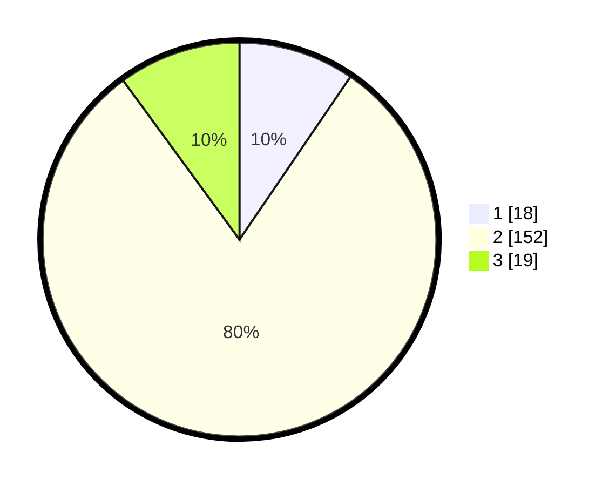

# Hasil

## Grafik

## Tabel

| No. | Nama Paslon    | Suara | Suara (raw) | Persentase |
|:--- |:-------------- | -----:| -----------:| ----------:|
| 1   | ANIES MUHAIMIN | 18    | [18][p-1]   | 9,52       |
| 2   | PRABOWO GIBRAN | 152   | [152][p-2]  | 80,42      |
| 3   | GANJAR MAHFUD  | 19    | [19][p-3]   | 10,05      |

[p-1]: https://github.com/gigit-pemilu/pemilu-2024-35-jawa-timur/blob/main/pilpres/hitung-suara/sub/35-jawa-timur/sub/09-jember/sub/09-bangsalsari/sub/2004-tugusari/sub/023-tps/sub/paslon-1.txt
[p-2]: https://github.com/gigit-pemilu/pemilu-2024-35-jawa-timur/blob/main/pilpres/hitung-suara/sub/35-jawa-timur/sub/09-jember/sub/09-bangsalsari/sub/2004-tugusari/sub/023-tps/sub/paslon-2.txt
[p-3]: https://github.com/gigit-pemilu/pemilu-2024-35-jawa-timur/blob/main/pilpres/hitung-suara/sub/35-jawa-timur/sub/09-jember/sub/09-bangsalsari/sub/2004-tugusari/sub/023-tps/sub/paslon-3.txt

## Foto C Plano

https://sirekap-obj-formc.kpu.go.id/d599/pemilu/ppwp/35/09/09/20/04/3509092004023-20240214-221333--aea43e48-65a0-4b42-bf08-8db9f4d423c3.jpg

https://sirekap-obj-formc.kpu.go.id/d599/pemilu/ppwp/35/09/09/20/04/3509092004023-20240214-221400--759629a3-ee64-46de-8d56-5243600357e5.jpg

https://sirekap-obj-formc.kpu.go.id/d599/pemilu/ppwp/35/09/09/20/04/3509092004023-20240214-221425--c16d6834-b80e-4879-9c7e-72c53b72fac3.jpg

## Metadata

| Key        | Value               |
| ---------- | ------------------- |
| Time Stamp | 2024-02-15 12:00:28 |

