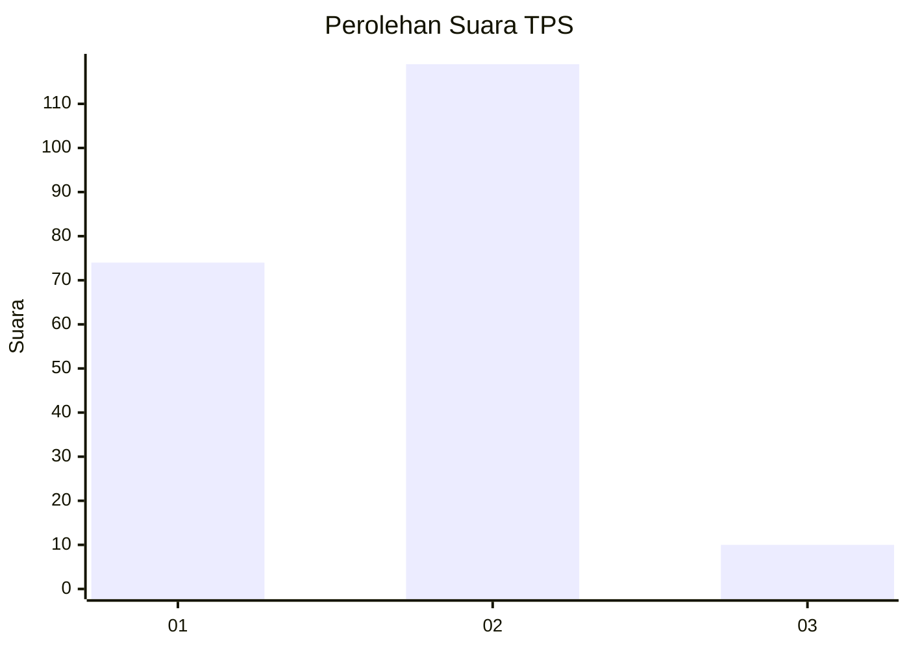
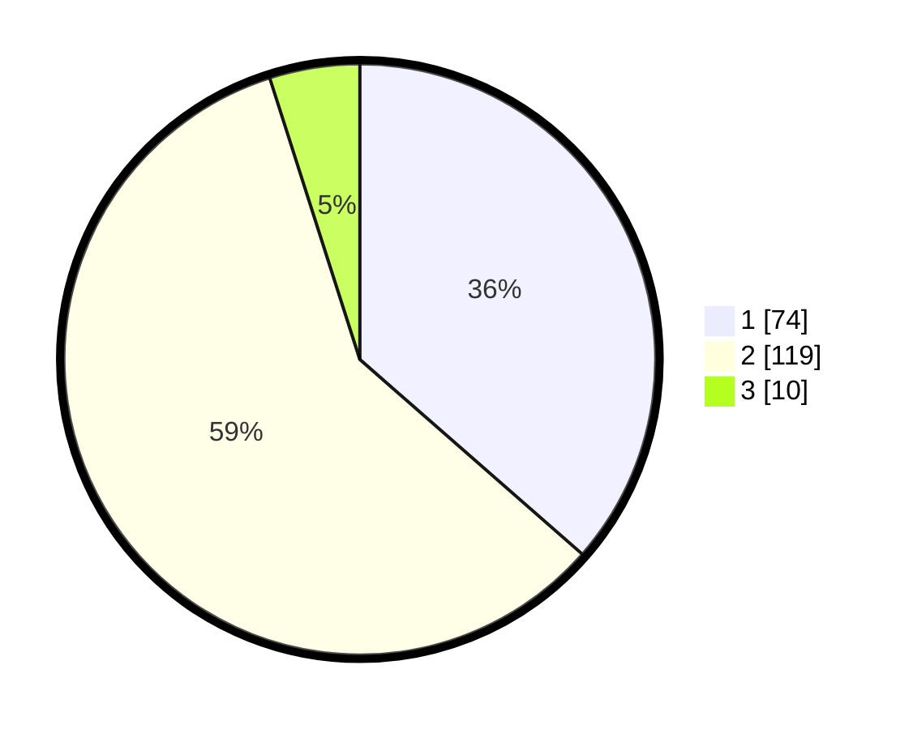

# Hasil

## Grafik

## Tabel

| No. | Nama Paslon    | Suara | Suara (raw) | Persentase |
|:--- |:-------------- | -----:| -----------:| ----------:|
| 1   | ANIES MUHAIMIN | 74    | [74][p-1]   | 36,45      |
| 2   | PRABOWO GIBRAN | 119   | [119][p-2]  | 58,62      |
| 3   | GANJAR MAHFUD  | 10    | [10][p-3]   | 4,93       |

[p-1]: https://github.com/gigit-pemilu/pemilu-2024/blob/main/pilpres/hitung-suara/sub/35-jawa-timur/sub/09-jember/sub/09-bangsalsari/sub/2004-tugusari/sub/025-tps/sub/paslon-1.txt
[p-2]: https://github.com/gigit-pemilu/pemilu-2024/blob/main/pilpres/hitung-suara/sub/35-jawa-timur/sub/09-jember/sub/09-bangsalsari/sub/2004-tugusari/sub/025-tps/sub/paslon-2.txt
[p-3]: https://github.com/gigit-pemilu/pemilu-2024/blob/main/pilpres/hitung-suara/sub/35-jawa-timur/sub/09-jember/sub/09-bangsalsari/sub/2004-tugusari/sub/025-tps/sub/paslon-3.txt

## Foto C Plano

https://sirekap-obj-formc.kpu.go.id/608e/pemilu/ppwp/35/09/09/20/04/3509092004025-20240214-235240--600cad61-9d28-4d1f-9df1-04c75fb69c08.jpg

https://sirekap-obj-formc.kpu.go.id/608e/pemilu/ppwp/35/09/09/20/04/3509092004025-20240214-235905--95d6ea9b-4156-460b-a9ab-92336e767f68.jpg

https://sirekap-obj-formc.kpu.go.id/608e/pemilu/ppwp/35/09/09/20/04/3509092004025-20240214-235858--8d56ce9b-92c5-48ae-a5c7-b4cf633c6288.jpg

## Metadata

| Key        | Value               |
| ---------- | ------------------- |
| Time Stamp | 2024-02-15 12:00:28 |

