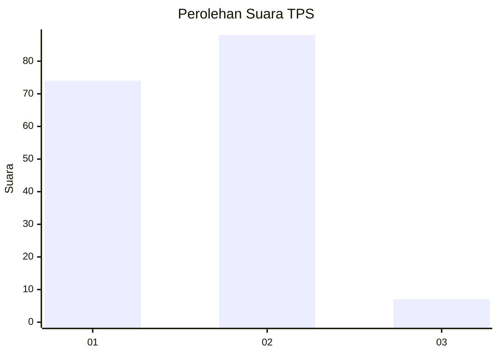
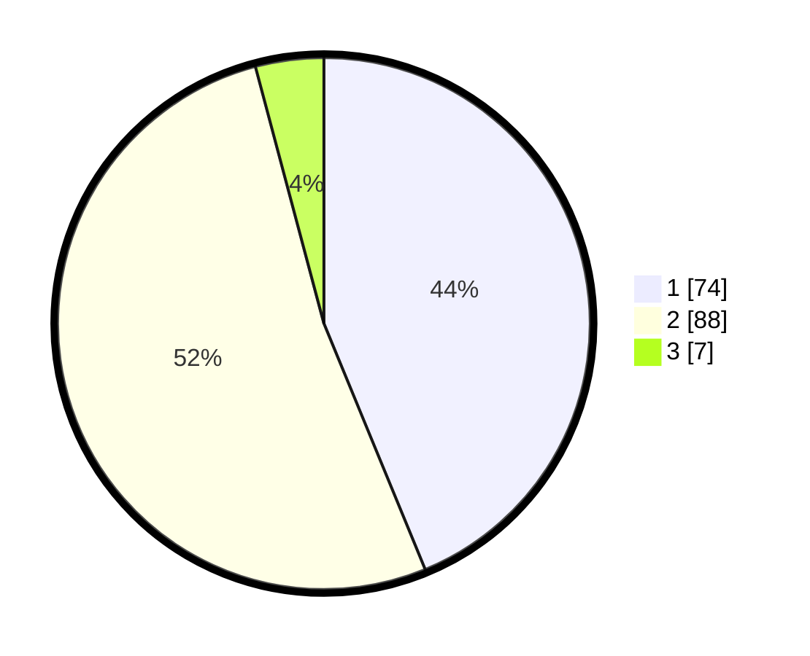

# Hasil

## Grafik

## Tabel

| No. | Nama Paslon    | Suara | Suara (raw) | Persentase |
|:--- |:-------------- | -----:| -----------:| ----------:|
| 1   | ANIES MUHAIMIN | 74    | [74][p-1]   | 43,79      |
| 2   | PRABOWO GIBRAN | 88    | [88][p-2]   | 52,07      |
| 3   | GANJAR MAHFUD  | 7     | [7][p-3]    | 4,14       |

[p-1]: https://github.com/gigit-pemilu/pemilu-2024/blob/main/pilpres/hitung-suara/sub/35-jawa-timur/sub/09-jember/sub/09-bangsalsari/sub/2004-tugusari/sub/028-tps/sub/paslon-1.txt
[p-2]: https://github.com/gigit-pemilu/pemilu-2024/blob/main/pilpres/hitung-suara/sub/35-jawa-timur/sub/09-jember/sub/09-bangsalsari/sub/2004-tugusari/sub/028-tps/sub/paslon-2.txt
[p-3]: https://github.com/gigit-pemilu/pemilu-2024/blob/main/pilpres/hitung-suara/sub/35-jawa-timur/sub/09-jember/sub/09-bangsalsari/sub/2004-tugusari/sub/028-tps/sub/paslon-3.txt

## Foto C Plano

https://sirekap-obj-formc.kpu.go.id/0e34/pemilu/ppwp/35/09/09/20/04/3509092004028-20240217-105609--292c9174-9f70-4e7a-8446-ac7050f80efe.jpg

https://sirekap-obj-formc.kpu.go.id/0e34/pemilu/ppwp/35/09/09/20/04/3509092004028-20240217-105610--4074228f-b6f8-4f43-91b7-2f4e180be677.jpg

https://sirekap-obj-formc.kpu.go.id/0e34/pemilu/ppwp/35/09/09/20/04/3509092004028-20240217-105610--20c2e632-267c-4bbc-81e2-e16b0bf42dd2.jpg

## Metadata

| Key        | Value               |
| ---------- | ------------------- |
| Time Stamp | 2024-02-22 21:00:00 |

## DATA PEMILIH TETAP

Jumlah pemilih dalam DPT: **235**.
 * L: **122**.
 * P: **113**.

## DATA PENGGUNA HAK PILIH

Jumlah pengguna hak pilih dalam DPT: **185**.
 * L: **96**.
 * P: **89**.

Jumlah pengguna hak pilih dalam DPTb: **185**.
 * L: **96**.
 * P: **89**.

Jumlah pengguna hak pilih dalam DPK: **185**.
 * L: **96**.
 * P: **89**.

Jumlah pengguna hak pilih: **185**.
 * L: **96**.
 * P: **89**.

## JUMLAH SUARA SAH DAN TIDAK SAH

JUMLAH SELURUH SUARA SAH: **169**.

JUMLAH SUARA TIDAK SAH: **16**.

JUMLAH SELURUH SUARA SAH DAN SUARA TIDAK SAH: **185**.

