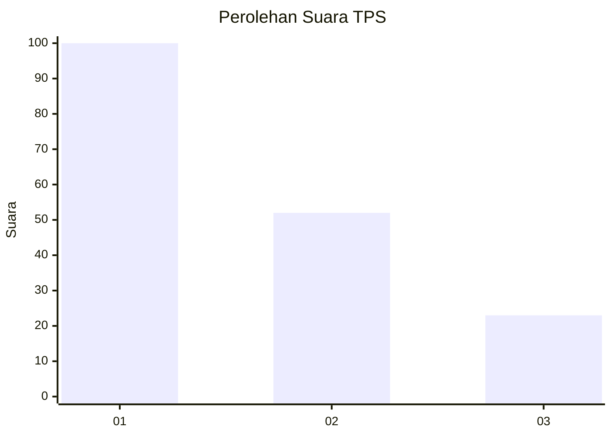
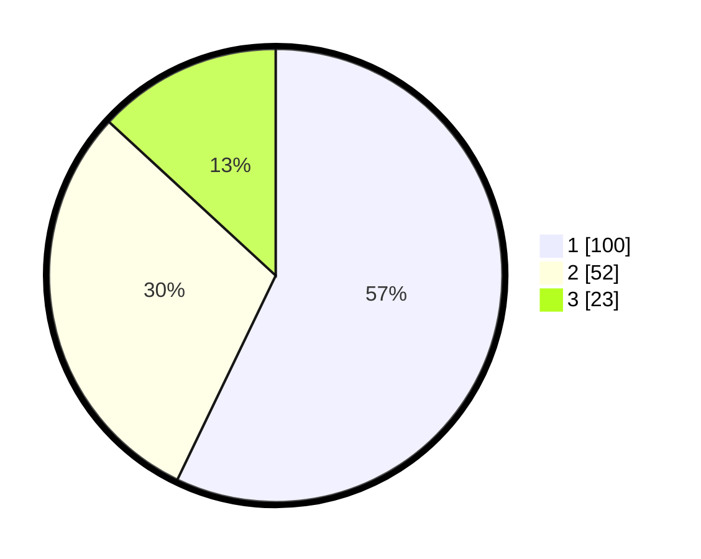

# Hasil

## Grafik

## Tabel

| No. | Nama Paslon    | Suara | Suara (raw) | Persentase |
|:--- |:-------------- | -----:| -----------:| ----------:|
| 1   | ANIES MUHAIMIN | 100   | [100][p-1]  | 57,14      |
| 2   | PRABOWO GIBRAN | 52    | [52][p-2]   | 29,71      |
| 3   | GANJAR MAHFUD  | 23    | [23][p-3]   | 13,14      |

[p-1]: https://github.com/gigit-pemilu/pemilu-2024/blob/main/pilpres/hitung-suara/sub/35-jawa-timur/sub/09-jember/sub/09-bangsalsari/sub/2004-tugusari/sub/029-tps/sub/paslon-1.txt
[p-2]: https://github.com/gigit-pemilu/pemilu-2024/blob/main/pilpres/hitung-suara/sub/35-jawa-timur/sub/09-jember/sub/09-bangsalsari/sub/2004-tugusari/sub/029-tps/sub/paslon-2.txt
[p-3]: https://github.com/gigit-pemilu/pemilu-2024/blob/main/pilpres/hitung-suara/sub/35-jawa-timur/sub/09-jember/sub/09-bangsalsari/sub/2004-tugusari/sub/029-tps/sub/paslon-3.txt

## Foto C Plano

https://sirekap-obj-formc.kpu.go.id/1bac/pemilu/ppwp/35/09/09/20/04/3509092004029-20240214-224646--a4f93f1d-997e-4d2c-bcbf-cc27f45cb20f.jpg

https://sirekap-obj-formc.kpu.go.id/1bac/pemilu/ppwp/35/09/09/20/04/3509092004029-20240214-224347--e3f2ca19-0600-42a0-b8f5-ab79621f0211.jpg

https://sirekap-obj-formc.kpu.go.id/1bac/pemilu/ppwp/35/09/09/20/04/3509092004029-20240214-224415--031f03a0-c3c7-4d56-ba19-2b3c02832749.jpg

## Metadata

| Key        | Value               |
| ---------- | ------------------- |
| Time Stamp | 2024-02-15 12:00:28 |

