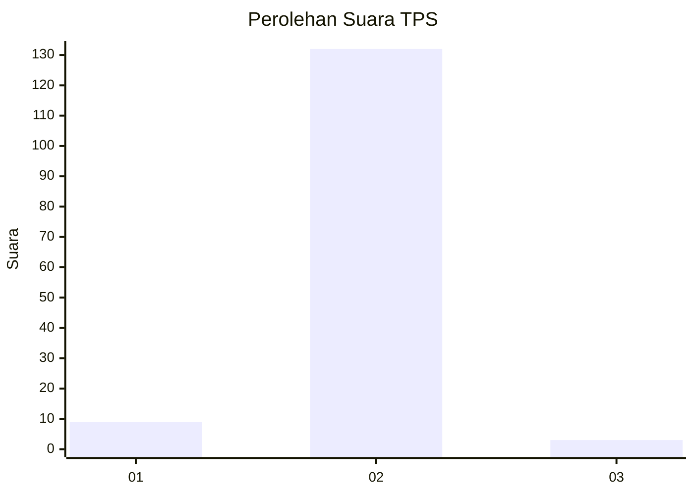
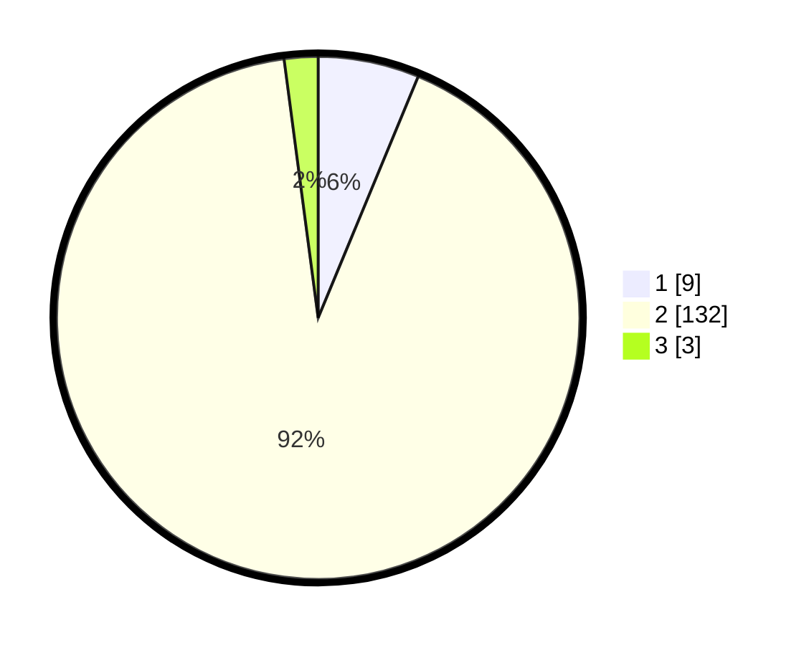

# Hasil

## Grafik

## Tabel

| No. | Nama Paslon    | Suara | Suara (raw) | Persentase |
|:--- |:-------------- | -----:| -----------:| ----------:|
| 1   | ANIES MUHAIMIN | 9     | [9][p-1]    | 6,25       |
| 2   | PRABOWO GIBRAN | 132   | [132][p-2]  | 91,67      |
| 3   | GANJAR MAHFUD  | 3     | [3][p-3]    | 2,08       |

[p-1]: https://github.com/gigit-pemilu/pemilu-2024/blob/main/pilpres/hitung-suara/sub/35-jawa-timur/sub/09-jember/sub/09-bangsalsari/sub/2004-tugusari/sub/031-tps/sub/paslon-1.txt
[p-2]: https://github.com/gigit-pemilu/pemilu-2024/blob/main/pilpres/hitung-suara/sub/35-jawa-timur/sub/09-jember/sub/09-bangsalsari/sub/2004-tugusari/sub/031-tps/sub/paslon-2.txt
[p-3]: https://github.com/gigit-pemilu/pemilu-2024/blob/main/pilpres/hitung-suara/sub/35-jawa-timur/sub/09-jember/sub/09-bangsalsari/sub/2004-tugusari/sub/031-tps/sub/paslon-3.txt

## Foto C Plano

https://sirekap-obj-formc.kpu.go.id/63df/pemilu/ppwp/35/09/09/20/04/3509092004031-20240215-034611--36169fe1-bfa6-4e76-a0d8-e2aa20eefc17.jpg

https://sirekap-obj-formc.kpu.go.id/63df/pemilu/ppwp/35/09/09/20/04/3509092004031-20240215-095153--7396a1a6-cbab-4223-94ca-157125ff6640.jpg

https://sirekap-obj-formc.kpu.go.id/63df/pemilu/ppwp/35/09/09/20/04/3509092004031-20240215-095310--bc9789bf-dd62-42bc-9abb-cf073420367e.jpg

## Metadata

| Key        | Value               |
| ---------- | ------------------- |
| Time Stamp | 2024-02-16 16:25:10 |

