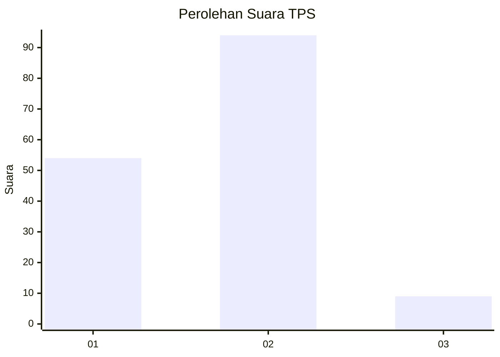
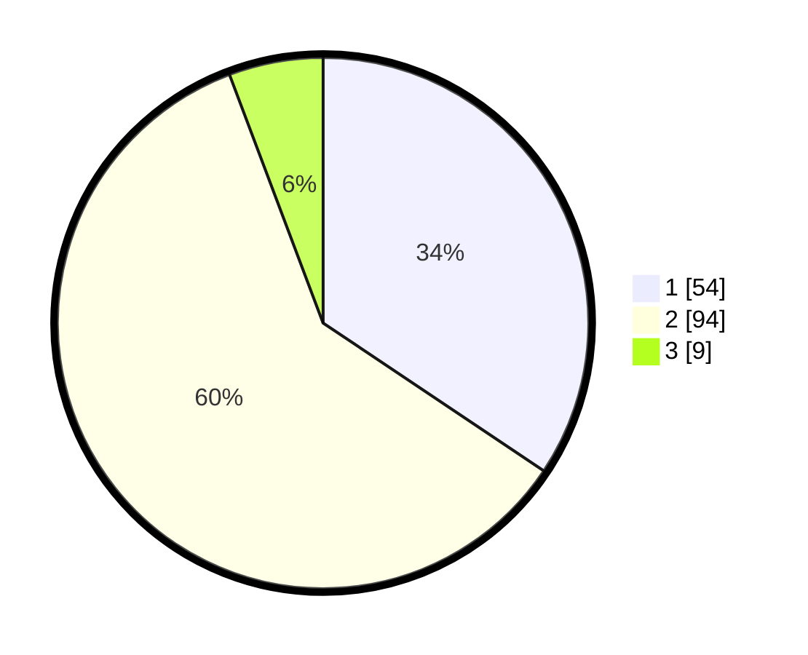

# Hasil

## Grafik

## Tabel

| No. | Nama Paslon    | Suara | Suara (raw) | Persentase |
|:--- |:-------------- | -----:| -----------:| ----------:|
| 1   | ANIES MUHAIMIN | 54    | [54][p-1]   | 34,39      |
| 2   | PRABOWO GIBRAN | 94    | [94][p-2]   | 59,87      |
| 3   | GANJAR MAHFUD  | 9     | [9][p-3]    | 5,73       |

[p-1]: https://github.com/gigit-pemilu/pemilu-2024-35-jawa-timur/blob/main/pilpres/hitung-suara/sub/35-jawa-timur/sub/09-jember/sub/09-bangsalsari/sub/2004-tugusari/sub/032-tps/sub/paslon-1.txt
[p-2]: https://github.com/gigit-pemilu/pemilu-2024-35-jawa-timur/blob/main/pilpres/hitung-suara/sub/35-jawa-timur/sub/09-jember/sub/09-bangsalsari/sub/2004-tugusari/sub/032-tps/sub/paslon-2.txt
[p-3]: https://github.com/gigit-pemilu/pemilu-2024-35-jawa-timur/blob/main/pilpres/hitung-suara/sub/35-jawa-timur/sub/09-jember/sub/09-bangsalsari/sub/2004-tugusari/sub/032-tps/sub/paslon-3.txt

## Foto C Plano

https://sirekap-obj-formc.kpu.go.id/ddd9/pemilu/ppwp/35/09/09/20/04/3509092004032-20240215-002528--0a2e8d84-f2d5-43e0-8ba5-530fdd2d368a.jpg

https://sirekap-obj-formc.kpu.go.id/ddd9/pemilu/ppwp/35/09/09/20/04/3509092004032-20240215-002632--f90581bf-2d0b-434f-8225-59c2ea1bc06f.jpg

https://sirekap-obj-formc.kpu.go.id/ddd9/pemilu/ppwp/35/09/09/20/04/3509092004032-20240215-002745--9f3522b2-74e5-40a6-accf-f4cb66765e5b.jpg

## Metadata

| Key        | Value               |
| ---------- | ------------------- |
| Time Stamp | 2024-02-15 12:00:28 |

