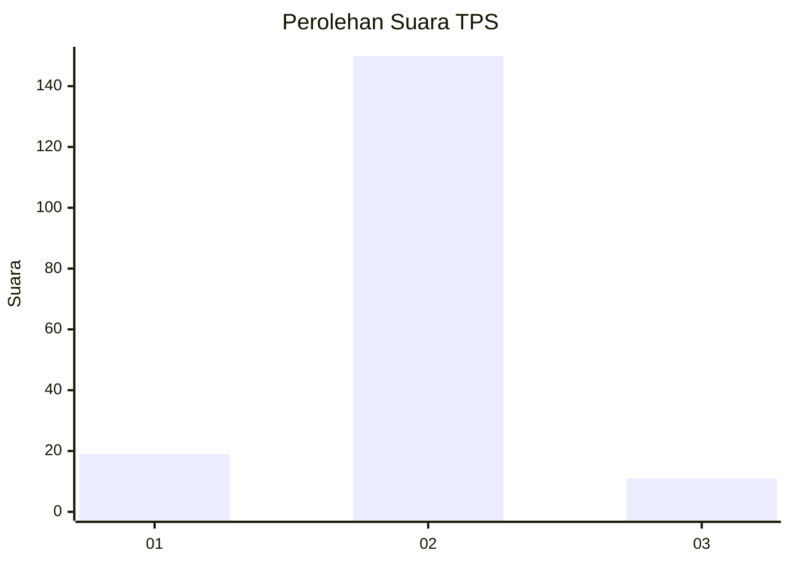
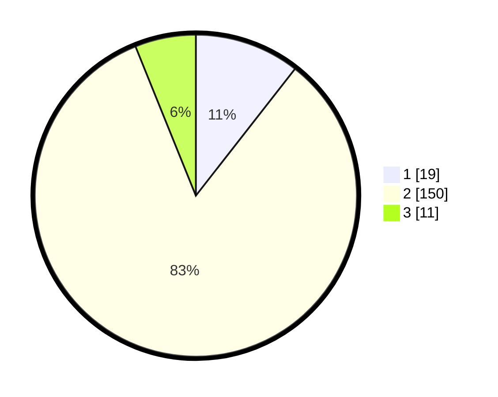

# Hasil

## Grafik

## Tabel

| No. | Nama Paslon    | Suara | Suara (raw) | Persentase |
|:--- |:-------------- | -----:| -----------:| ----------:|
| 1   | ANIES MUHAIMIN | 19    | [19][p-1]   | 10,56      |
| 2   | PRABOWO GIBRAN | 150   | [150][p-2]  | 83,33      |
| 3   | GANJAR MAHFUD  | 11    | [11][p-3]   | 6,11       |

[p-1]: https://github.com/gigit-pemilu/pemilu-2024-35-jawa-timur/blob/main/pilpres/hitung-suara/sub/35-jawa-timur/sub/09-jember/sub/09-bangsalsari/sub/2004-tugusari/sub/038-tps/sub/paslon-1.txt
[p-2]: https://github.com/gigit-pemilu/pemilu-2024-35-jawa-timur/blob/main/pilpres/hitung-suara/sub/35-jawa-timur/sub/09-jember/sub/09-bangsalsari/sub/2004-tugusari/sub/038-tps/sub/paslon-2.txt
[p-3]: https://github.com/gigit-pemilu/pemilu-2024-35-jawa-timur/blob/main/pilpres/hitung-suara/sub/35-jawa-timur/sub/09-jember/sub/09-bangsalsari/sub/2004-tugusari/sub/038-tps/sub/paslon-3.txt

## Foto C Plano

https://sirekap-obj-formc.kpu.go.id/e0e1/pemilu/ppwp/35/09/09/20/04/3509092004038-20240214-233702--51b66429-c27d-4663-875a-1053c7f37ae9.jpg

https://sirekap-obj-formc.kpu.go.id/e0e1/pemilu/ppwp/35/09/09/20/04/3509092004038-20240214-233758--8dd53c89-99c6-4291-b6ce-009dc7324778.jpg

https://sirekap-obj-formc.kpu.go.id/e0e1/pemilu/ppwp/35/09/09/20/04/3509092004038-20240214-233841--ea91ea62-a8e2-4d5a-8573-c7f0d73f6554.jpg

## Metadata

| Key        | Value               |
| ---------- | ------------------- |
| Time Stamp | 2024-02-15 12:00:28 |

