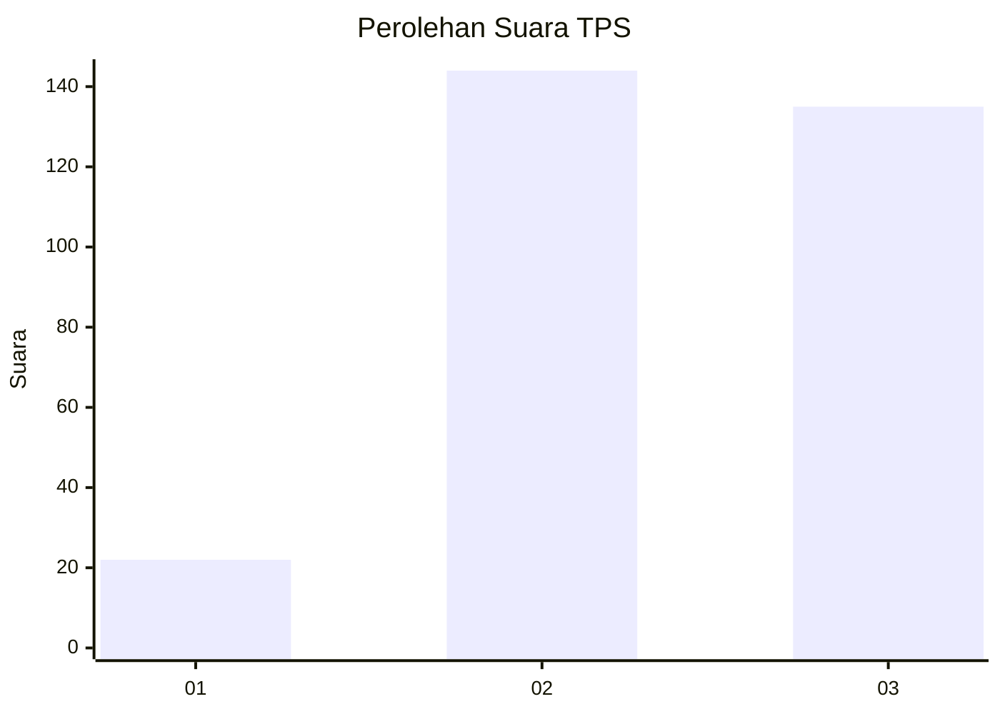
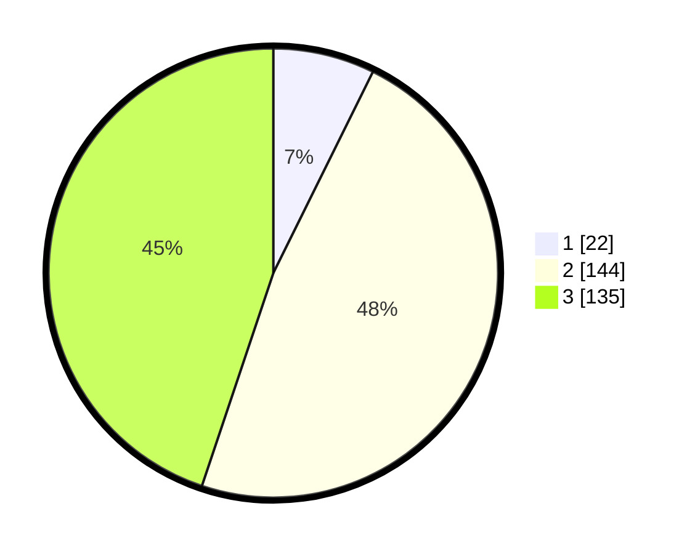

# Hasil

## Grafik

## Tabel

| No. | Nama Paslon    | Suara | Suara (raw) | Persentase |
|:--- |:-------------- | -----:| -----------:| ----------:|
| 1   | ANIES MUHAIMIN | 22    | [22][p-1]   | 7,31       |
| 2   | PRABOWO GIBRAN | 144   | [144][p-2]  | 47,84      |
| 3   | GANJAR MAHFUD  | 135   | [135][p-3]  | 44,85      |

[p-1]: https://github.com/gigit-pemilu/pemilu-2024-35-jawa-timur/blob/main/pilpres/hitung-suara/sub/35-jawa-timur/sub/09-jember/sub/09-bangsalsari/sub/2004-tugusari/sub/039-tps/sub/paslon-1.txt
[p-2]: https://github.com/gigit-pemilu/pemilu-2024-35-jawa-timur/blob/main/pilpres/hitung-suara/sub/35-jawa-timur/sub/09-jember/sub/09-bangsalsari/sub/2004-tugusari/sub/039-tps/sub/paslon-2.txt
[p-3]: https://github.com/gigit-pemilu/pemilu-2024-35-jawa-timur/blob/main/pilpres/hitung-suara/sub/35-jawa-timur/sub/09-jember/sub/09-bangsalsari/sub/2004-tugusari/sub/039-tps/sub/paslon-3.txt

## Foto C Plano

https://sirekap-obj-formc.kpu.go.id/add9/pemilu/ppwp/35/09/09/20/04/3509092004039-20240214-204302--c1e55166-7ddd-47ae-9ad3-404f0179cebe.jpg

https://sirekap-obj-formc.kpu.go.id/add9/pemilu/ppwp/35/09/09/20/04/3509092004039-20240214-204448--98fc426f-d44b-4ea2-ba26-a1bc3a821225.jpg

https://sirekap-obj-formc.kpu.go.id/add9/pemilu/ppwp/35/09/09/20/04/3509092004039-20240214-204525--8d177889-68cd-4549-849c-b9ba6259f817.jpg

## Metadata

| Key        | Value               |
| ---------- | ------------------- |
| Time Stamp | 2024-02-16 23:30:00 |

