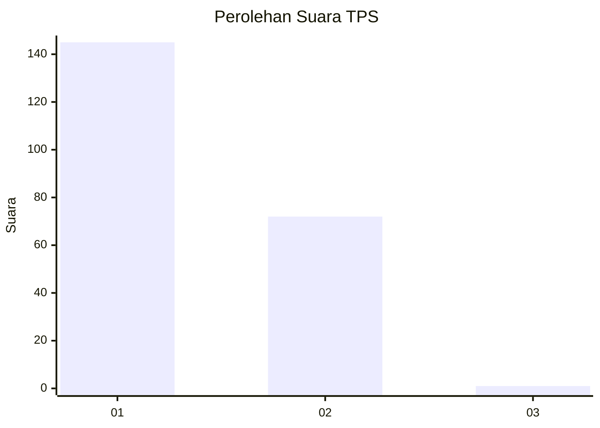
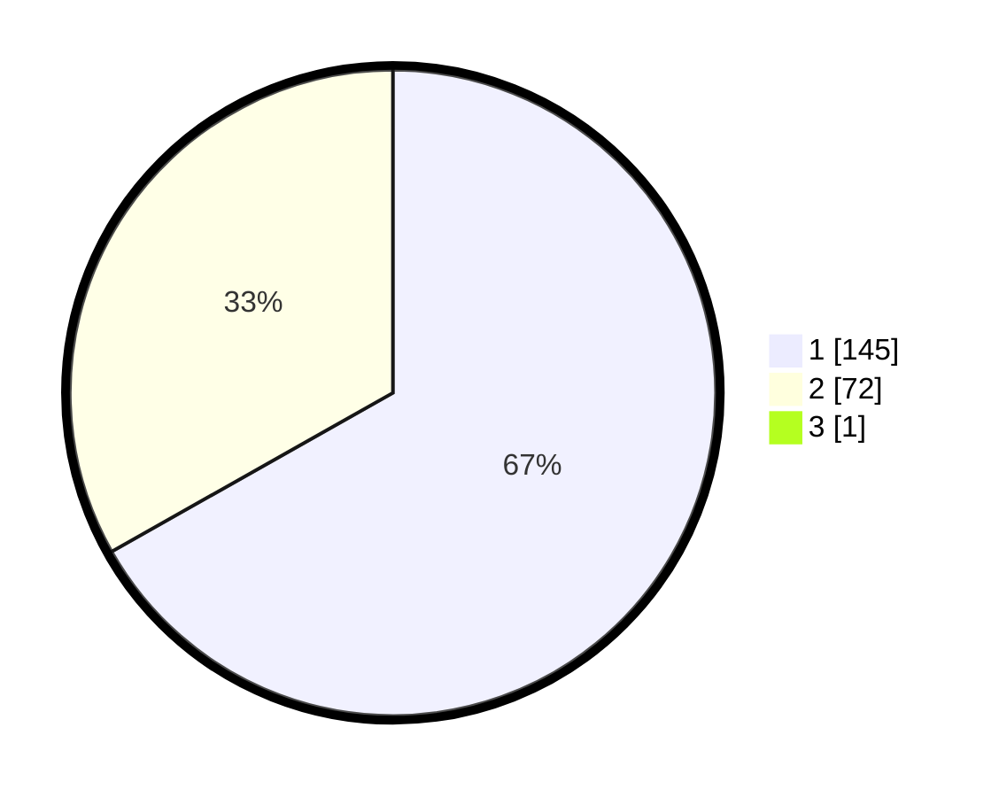

# Hasil

## Grafik

## Tabel

| No. | Nama Paslon    | Suara | Suara (raw) | Persentase |
|:--- |:-------------- | -----:| -----------:| ----------:|
| 1   | ANIES MUHAIMIN | 145   | [145][p-1]  | 66,51      |
| 2   | PRABOWO GIBRAN | 72    | [72][p-2]   | 33,03      |
| 3   | GANJAR MAHFUD  | 1     | [1][p-3]    | 0,46       |

[p-1]: https://github.com/gigit-pemilu/pemilu-2024-35-jawa-timur/blob/main/pilpres/hitung-suara/sub/35-jawa-timur/sub/09-jember/sub/09-bangsalsari/sub/2004-tugusari/sub/042-tps/sub/paslon-1.txt
[p-2]: https://github.com/gigit-pemilu/pemilu-2024-35-jawa-timur/blob/main/pilpres/hitung-suara/sub/35-jawa-timur/sub/09-jember/sub/09-bangsalsari/sub/2004-tugusari/sub/042-tps/sub/paslon-2.txt
[p-3]: https://github.com/gigit-pemilu/pemilu-2024-35-jawa-timur/blob/main/pilpres/hitung-suara/sub/35-jawa-timur/sub/09-jember/sub/09-bangsalsari/sub/2004-tugusari/sub/042-tps/sub/paslon-3.txt

## Foto C Plano

https://sirekap-obj-formc.kpu.go.id/eaed/pemilu/ppwp/35/09/09/20/04/3509092004042-20240215-010639--78f716d3-16d8-4be0-82e2-373b6fa6d221.jpg

https://sirekap-obj-formc.kpu.go.id/eaed/pemilu/ppwp/35/09/09/20/04/3509092004042-20240215-010749--ffd83fef-4cf2-45ac-9e1c-f9a281289e92.jpg

https://sirekap-obj-formc.kpu.go.id/eaed/pemilu/ppwp/35/09/09/20/04/3509092004042-20240214-225807--5371aec5-929f-442b-8657-a472bde23c52.jpg

## Metadata

| Key        | Value               |
| ---------- | ------------------- |
| Time Stamp | 2024-02-16 16:25:10 |

