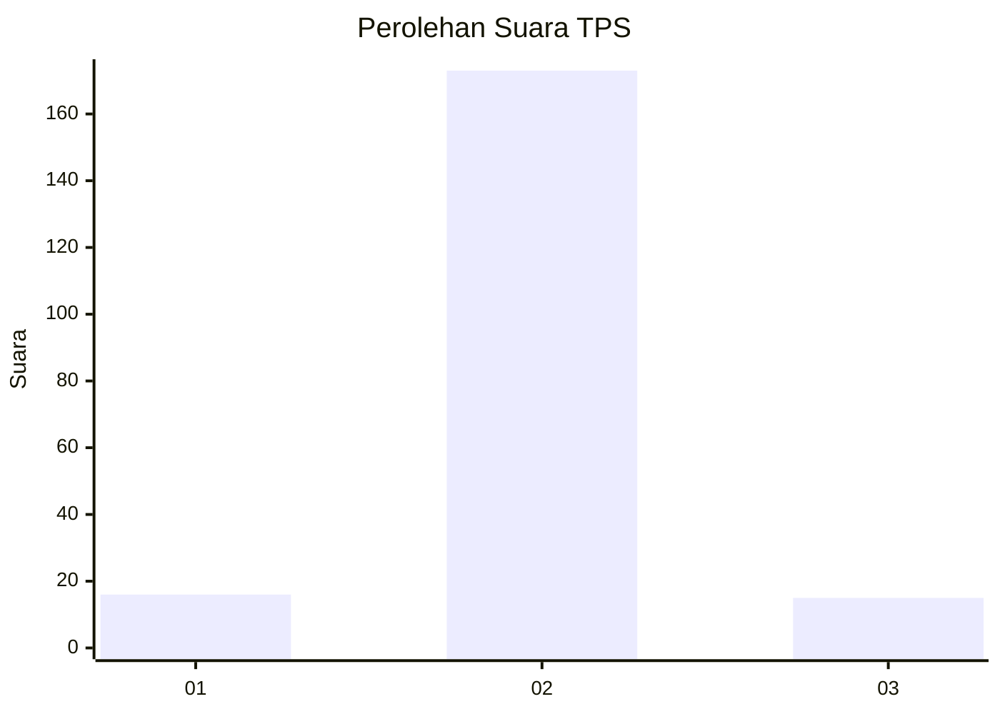
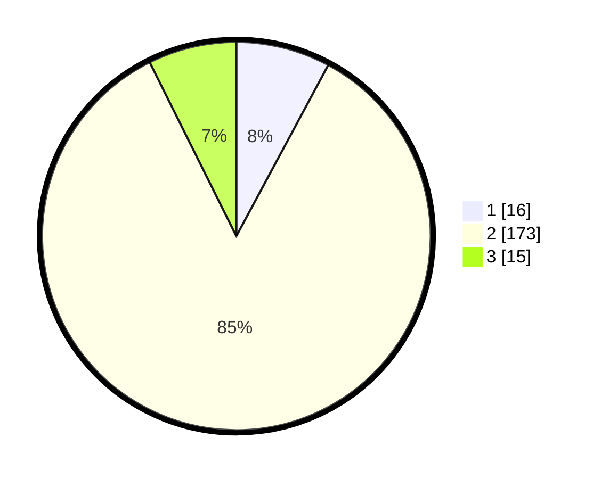

# Hasil

## Grafik

## Tabel

| No. | Nama Paslon    | Suara | Suara (raw) | Persentase |
|:--- |:-------------- | -----:| -----------:| ----------:|
| 1   | ANIES MUHAIMIN | 16    | [16][p-1]   | 7,84       |
| 2   | PRABOWO GIBRAN | 173   | [173][p-2]  | 84,80      |
| 3   | GANJAR MAHFUD  | 15    | [15][p-3]   | 7,35       |

[p-1]: https://github.com/gigit-pemilu/pemilu-2024-35-jawa-timur/blob/main/pilpres/hitung-suara/sub/35-jawa-timur/sub/09-jember/sub/09-bangsalsari/sub/2004-tugusari/sub/045-tps/sub/paslon-1.txt
[p-2]: https://github.com/gigit-pemilu/pemilu-2024-35-jawa-timur/blob/main/pilpres/hitung-suara/sub/35-jawa-timur/sub/09-jember/sub/09-bangsalsari/sub/2004-tugusari/sub/045-tps/sub/paslon-2.txt
[p-3]: https://github.com/gigit-pemilu/pemilu-2024-35-jawa-timur/blob/main/pilpres/hitung-suara/sub/35-jawa-timur/sub/09-jember/sub/09-bangsalsari/sub/2004-tugusari/sub/045-tps/sub/paslon-3.txt

## Foto C Plano

https://sirekap-obj-formc.kpu.go.id/b8df/pemilu/ppwp/35/09/09/20/04/3509092004045-20240215-082250--3aec3777-222c-4c9f-b27c-0ea2a7a4bf61.jpg

https://sirekap-obj-formc.kpu.go.id/b8df/pemilu/ppwp/35/09/09/20/04/3509092004045-20240215-015836--47579e0a-94f4-46f5-9bee-eb16be8ada95.jpg

https://sirekap-obj-formc.kpu.go.id/b8df/pemilu/ppwp/35/09/09/20/04/3509092004045-20240215-020014--17939f7c-4dc9-463a-aebb-9aeebebb5666.jpg

## Metadata

| Key        | Value               |
| ---------- | ------------------- |
| Time Stamp | 2024-02-16 16:25:10 |

