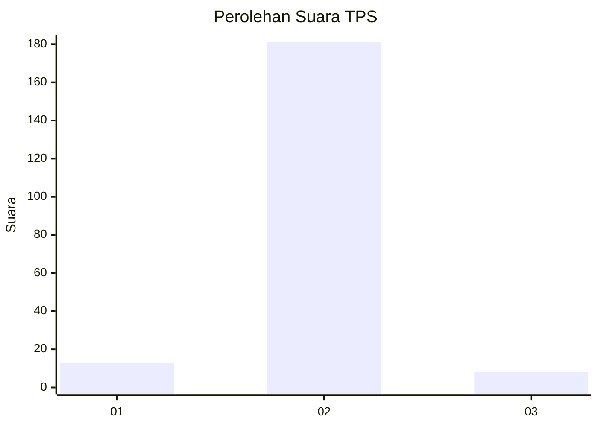
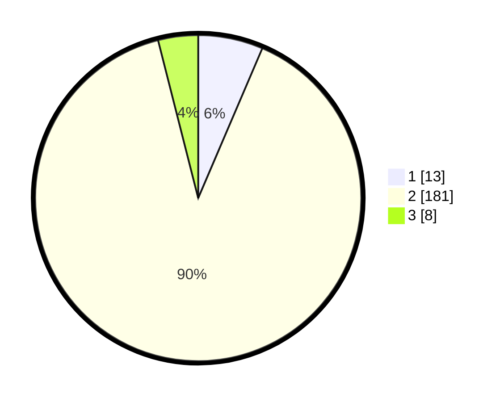

# Hasil

## Grafik

## Tabel

| No. | Nama Paslon    | Suara | Suara (raw) | Persentase |
|:--- |:-------------- | -----:| -----------:| ----------:|
| 1   | ANIES MUHAIMIN | 13    | [13][p-1]   | 6,44       |
| 2   | PRABOWO GIBRAN | 181   | [181][p-2]  | 89,60      |
| 3   | GANJAR MAHFUD  | 8     | [8][p-3]    | 3,96       |

[p-1]: https://github.com/gigit-pemilu/pemilu-2024-35-jawa-timur/blob/main/pilpres/hitung-suara/sub/35-jawa-timur/sub/09-jember/sub/09-bangsalsari/sub/2004-tugusari/sub/046-tps/sub/paslon-1.txt
[p-2]: https://github.com/gigit-pemilu/pemilu-2024-35-jawa-timur/blob/main/pilpres/hitung-suara/sub/35-jawa-timur/sub/09-jember/sub/09-bangsalsari/sub/2004-tugusari/sub/046-tps/sub/paslon-2.txt
[p-3]: https://github.com/gigit-pemilu/pemilu-2024-35-jawa-timur/blob/main/pilpres/hitung-suara/sub/35-jawa-timur/sub/09-jember/sub/09-bangsalsari/sub/2004-tugusari/sub/046-tps/sub/paslon-3.txt

## Foto C Plano

https://sirekap-obj-formc.kpu.go.id/dff3/pemilu/ppwp/35/09/09/20/04/3509092004046-20240214-232252--0625f755-c645-46e2-a9a3-e3c28b10b861.jpg

https://sirekap-obj-formc.kpu.go.id/dff3/pemilu/ppwp/35/09/09/20/04/3509092004046-20240214-233607--2dd997c5-5030-4e3f-bcd4-7966fded648c.jpg

https://sirekap-obj-formc.kpu.go.id/dff3/pemilu/ppwp/35/09/09/20/04/3509092004046-20240214-233908--3eec7241-b6a8-4d6e-ab62-0b429f9453e6.jpg

## Metadata

| Key        | Value               |
| ---------- | ------------------- |
| Time Stamp | 2024-02-16 16:25:10 |

