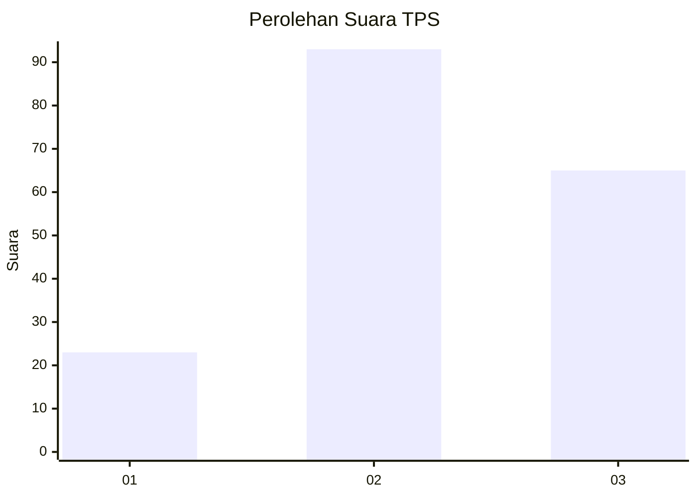
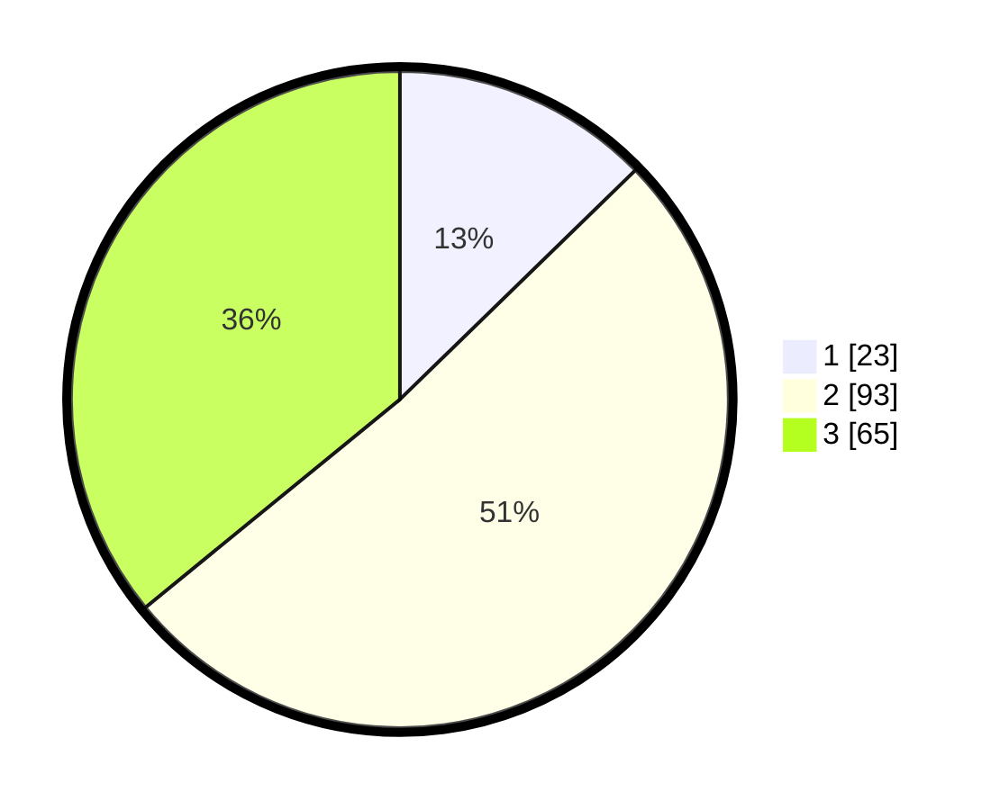

# Hasil

## Grafik

## Tabel

| No. | Nama Paslon    | Suara | Suara (raw) | Persentase |
|:--- |:-------------- | -----:| -----------:| ----------:|
| 1   | ANIES MUHAIMIN | 23    | [23][p-1]   | 12,71      |
| 2   | PRABOWO GIBRAN | 93    | [93][p-2]   | 51,38      |
| 3   | GANJAR MAHFUD  | 65    | [65][p-3]   | 35,91      |

[p-1]: https://github.com/gigit-pemilu/pemilu-2024-35-jawa-timur/blob/main/pilpres/hitung-suara/sub/35-jawa-timur/sub/09-jember/sub/09-bangsalsari/sub/2005-karangsono/sub/001-tps/sub/paslon-1.txt
[p-2]: https://github.com/gigit-pemilu/pemilu-2024-35-jawa-timur/blob/main/pilpres/hitung-suara/sub/35-jawa-timur/sub/09-jember/sub/09-bangsalsari/sub/2005-karangsono/sub/001-tps/sub/paslon-2.txt
[p-3]: https://github.com/gigit-pemilu/pemilu-2024-35-jawa-timur/blob/main/pilpres/hitung-suara/sub/35-jawa-timur/sub/09-jember/sub/09-bangsalsari/sub/2005-karangsono/sub/001-tps/sub/paslon-3.txt

## Foto C Plano

https://sirekap-obj-formc.kpu.go.id/6966/pemilu/ppwp/35/09/09/20/05/3509092005001-20240214-212036--cde84809-64c8-4ef4-933c-bb806fc0e5e5.jpg

https://sirekap-obj-formc.kpu.go.id/6966/pemilu/ppwp/35/09/09/20/05/3509092005001-20240214-210948--52a3152c-ff57-46dc-98a9-954304ad107d.jpg

https://sirekap-obj-formc.kpu.go.id/6966/pemilu/ppwp/35/09/09/20/05/3509092005001-20240214-204304--b2628072-0e51-4adc-ad84-c2f671999e28.jpg

## Metadata

| Key        | Value               |
| ---------- | ------------------- |
| Time Stamp | 2024-02-15 00:41:44 |

