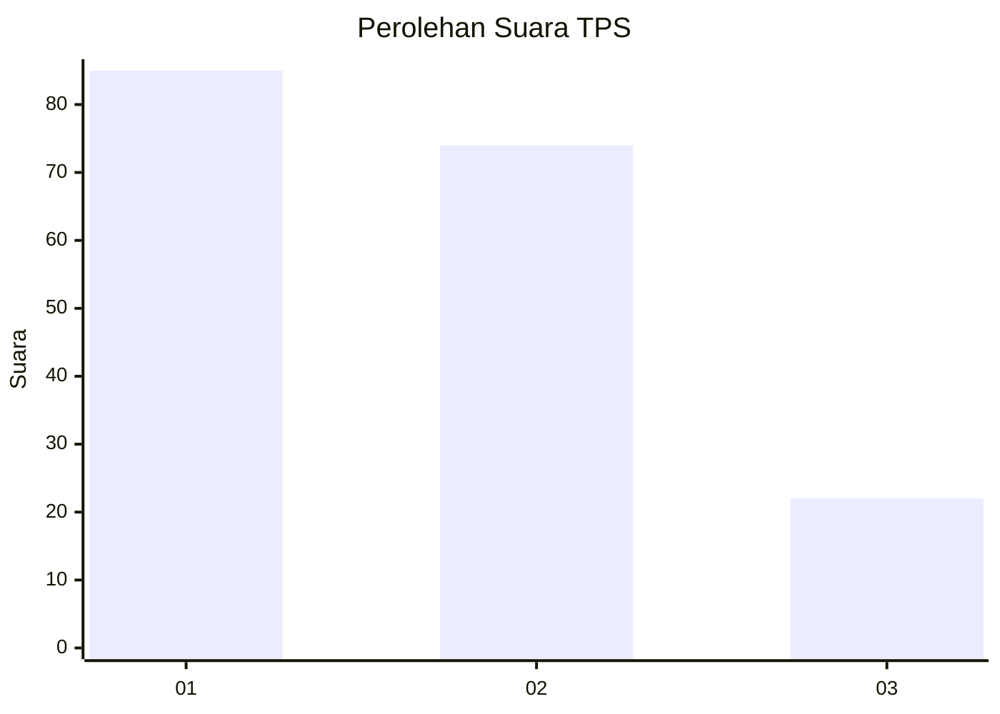
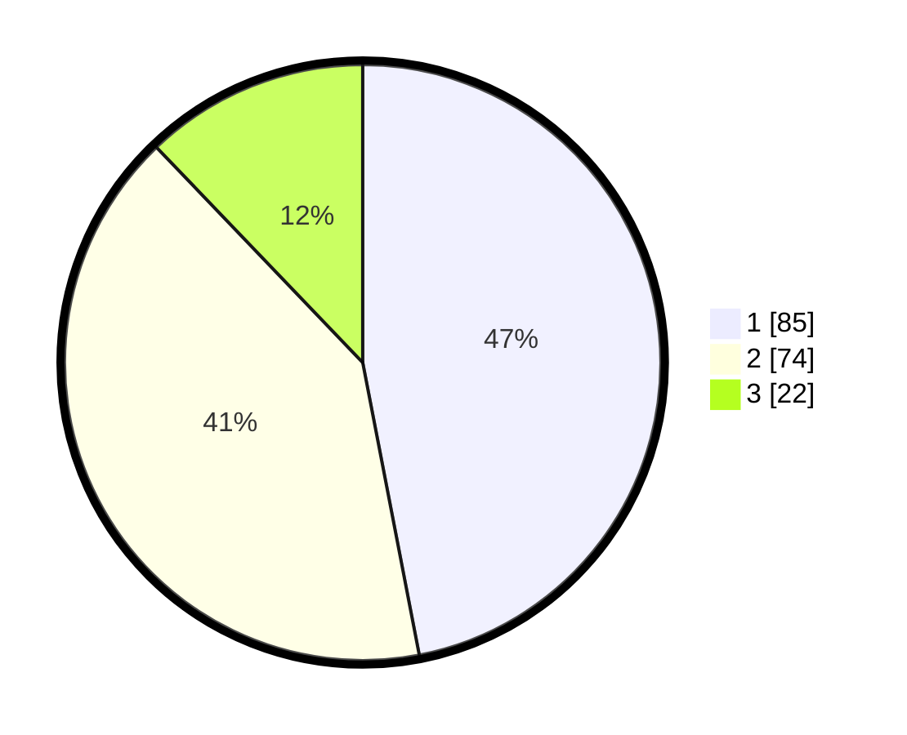

# Hasil

## Grafik

## Tabel

| No. | Nama Paslon    | Suara | Suara (raw) | Persentase |
|:--- |:-------------- | -----:| -----------:| ----------:|
| 1   | ANIES MUHAIMIN | 85    | [85][p-1]   | 46,96      |
| 2   | PRABOWO GIBRAN | 74    | [74][p-2]   | 40,88      |
| 3   | GANJAR MAHFUD  | 22    | [22][p-3]   | 12,15      |

[p-1]: https://github.com/gigit-pemilu/pemilu-2024/blob/main/pilpres/hitung-suara/sub/35-jawa-timur/sub/09-jember/sub/09-bangsalsari/sub/2005-karangsono/sub/022-tps/sub/paslon-1.txt
[p-2]: https://github.com/gigit-pemilu/pemilu-2024/blob/main/pilpres/hitung-suara/sub/35-jawa-timur/sub/09-jember/sub/09-bangsalsari/sub/2005-karangsono/sub/022-tps/sub/paslon-2.txt
[p-3]: https://github.com/gigit-pemilu/pemilu-2024/blob/main/pilpres/hitung-suara/sub/35-jawa-timur/sub/09-jember/sub/09-bangsalsari/sub/2005-karangsono/sub/022-tps/sub/paslon-3.txt

## Foto C Plano

https://sirekap-obj-formc.kpu.go.id/eeef/pemilu/ppwp/35/09/09/20/05/3509092005022-20240214-221234--0951a117-b757-4b9d-a6f5-0179e8483c45.jpg

https://sirekap-obj-formc.kpu.go.id/eeef/pemilu/ppwp/35/09/09/20/05/3509092005022-20240214-213000--cf62c40d-309b-4e07-b142-5b42381d37a0.jpg

https://sirekap-obj-formc.kpu.go.id/eeef/pemilu/ppwp/35/09/09/20/05/3509092005022-20240214-211808--391321c4-9f32-4545-a308-509fb0a0525a.jpg

## Metadata

| Key        | Value               |
| ---------- | ------------------- |
| Time Stamp | 2024-02-25 20:00:00 |

