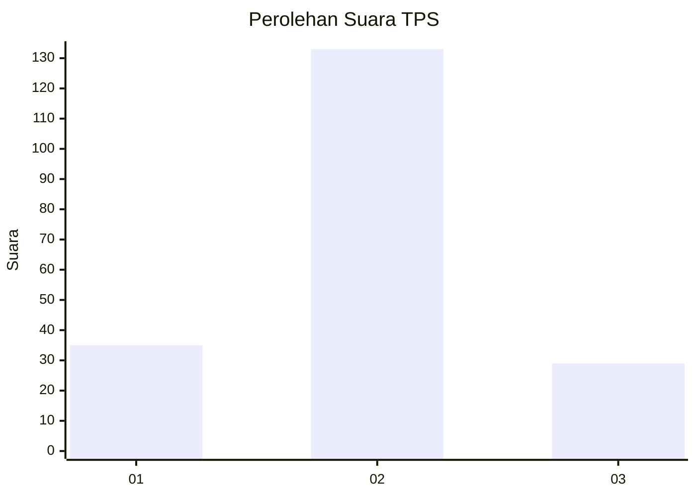
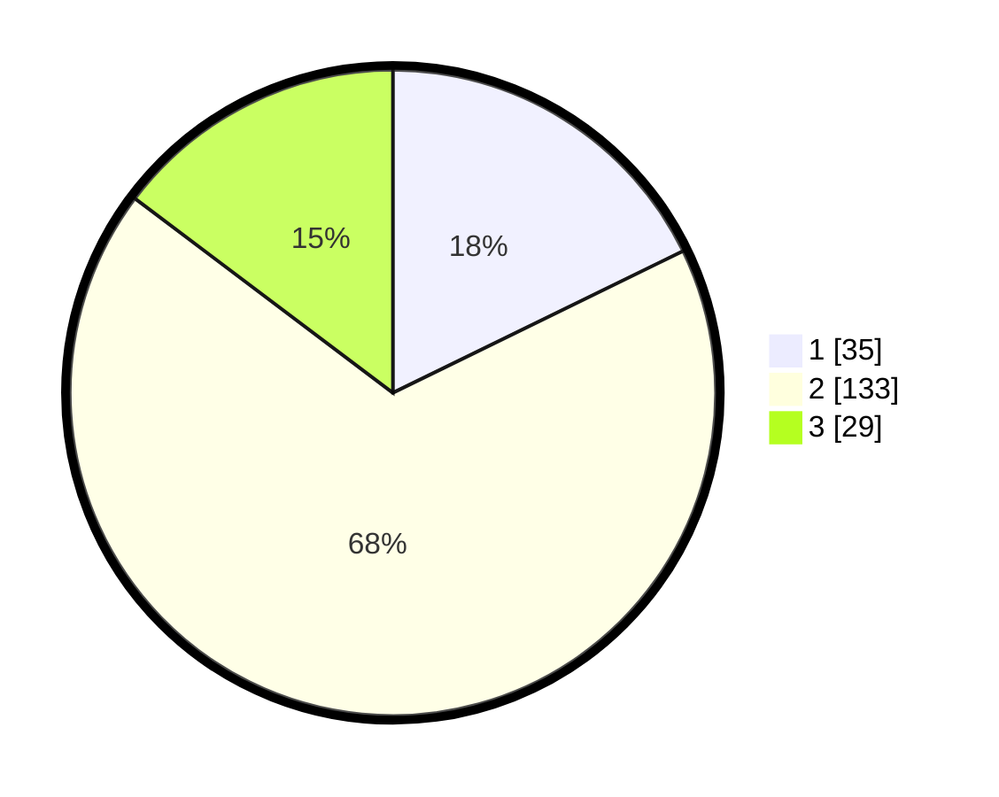

# Hasil

## Grafik

## Tabel

| No. | Nama Paslon    | Suara | Suara (raw) | Persentase |
|:--- |:-------------- | -----:| -----------:| ----------:|
| 1   | ANIES MUHAIMIN | 35    | [35][p-1]   | 17,77      |
| 2   | PRABOWO GIBRAN | 133   | [133][p-2]  | 67,51      |
| 3   | GANJAR MAHFUD  | 29    | [29][p-3]   | 14,72      |

[p-1]: https://github.com/gigit-pemilu/pemilu-2024-35-jawa-timur/blob/main/pilpres/hitung-suara/sub/35-jawa-timur/sub/09-jember/sub/09-bangsalsari/sub/2006-sukorejo/sub/009-tps/sub/paslon-1.txt
[p-2]: https://github.com/gigit-pemilu/pemilu-2024-35-jawa-timur/blob/main/pilpres/hitung-suara/sub/35-jawa-timur/sub/09-jember/sub/09-bangsalsari/sub/2006-sukorejo/sub/009-tps/sub/paslon-2.txt
[p-3]: https://github.com/gigit-pemilu/pemilu-2024-35-jawa-timur/blob/main/pilpres/hitung-suara/sub/35-jawa-timur/sub/09-jember/sub/09-bangsalsari/sub/2006-sukorejo/sub/009-tps/sub/paslon-3.txt

## Foto C Plano

https://sirekap-obj-formc.kpu.go.id/55f5/pemilu/ppwp/35/09/09/20/06/3509092006009-20240215-064349--8518ae54-f1e1-4766-b72f-6689c37063d4.jpg

https://sirekap-obj-formc.kpu.go.id/55f5/pemilu/ppwp/35/09/09/20/06/3509092006009-20240215-064416--d4efec32-1f58-4d23-81d0-51dcf76d29ae.jpg

https://sirekap-obj-formc.kpu.go.id/55f5/pemilu/ppwp/35/09/09/20/06/3509092006009-20240215-064443--94d2bd53-e6a3-4eb9-9084-f91ecf60240e.jpg

## Metadata

| Key        | Value               |
| ---------- | ------------------- |
| Time Stamp | 2024-02-16 16:25:10 |

