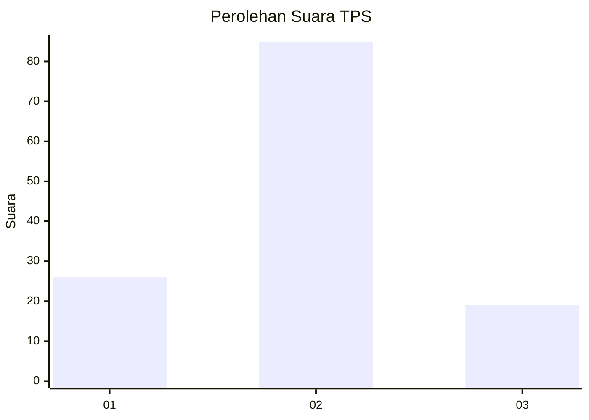
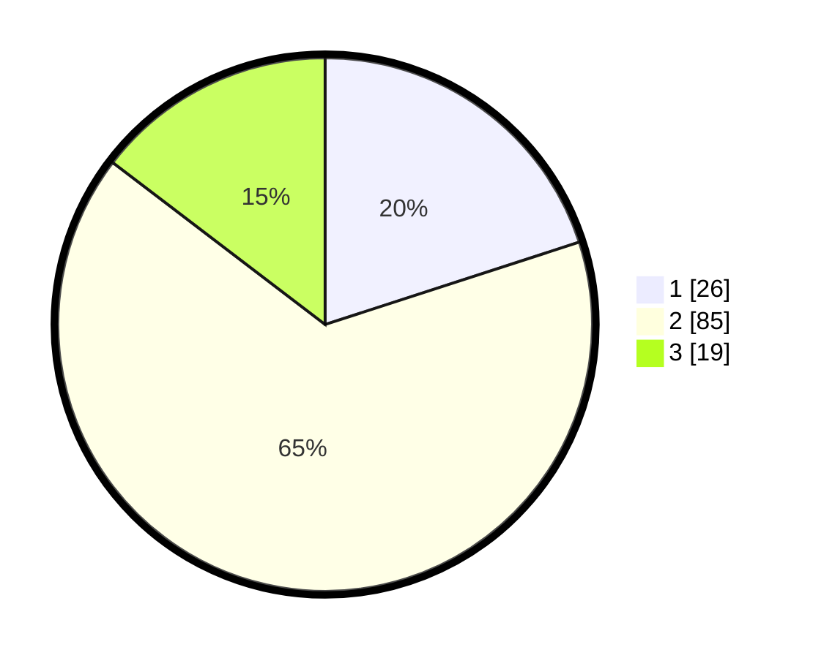

# Hasil

## Grafik

## Tabel

| No. | Nama Paslon    | Suara | Suara (raw) | Persentase |
|:--- |:-------------- | -----:| -----------:| ----------:|
| 1   | ANIES MUHAIMIN | 26    | [26][p-1]   | 20,00      |
| 2   | PRABOWO GIBRAN | 85    | [85][p-2]   | 65,38      |
| 3   | GANJAR MAHFUD  | 19    | [19][p-3]   | 14,62      |

[p-1]: https://github.com/gigit-pemilu/pemilu-2024/blob/main/pilpres/hitung-suara/sub/35-jawa-timur/sub/09-jember/sub/09-bangsalsari/sub/2006-sukorejo/sub/012-tps/sub/paslon-1.txt
[p-2]: https://github.com/gigit-pemilu/pemilu-2024/blob/main/pilpres/hitung-suara/sub/35-jawa-timur/sub/09-jember/sub/09-bangsalsari/sub/2006-sukorejo/sub/012-tps/sub/paslon-2.txt
[p-3]: https://github.com/gigit-pemilu/pemilu-2024/blob/main/pilpres/hitung-suara/sub/35-jawa-timur/sub/09-jember/sub/09-bangsalsari/sub/2006-sukorejo/sub/012-tps/sub/paslon-3.txt

## Foto C Plano

https://sirekap-obj-formc.kpu.go.id/9d5c/pemilu/ppwp/35/09/09/20/06/3509092006012-20240214-200420--4aaaf60a-c19c-4598-acb9-816d02e837c1.jpg

https://sirekap-obj-formc.kpu.go.id/9d5c/pemilu/ppwp/35/09/09/20/06/3509092006012-20240214-200554--ac2c7196-96d2-454c-912e-0870b8187774.jpg

https://sirekap-obj-formc.kpu.go.id/9d5c/pemilu/ppwp/35/09/09/20/06/3509092006012-20240214-200730--914ebd58-3856-4376-be3e-7b97a12f359b.jpg

## Metadata

| Key        | Value               |
| ---------- | ------------------- |
| Time Stamp | 2024-02-16 16:25:10 |

