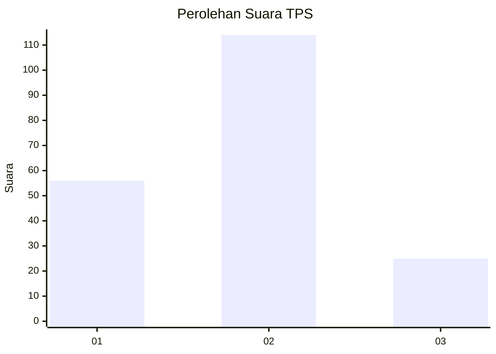
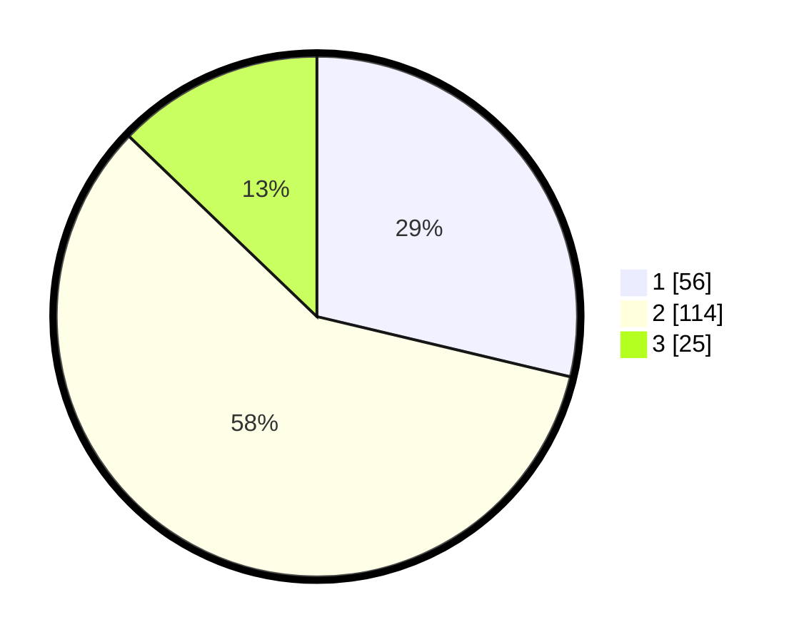

# Hasil

## Grafik

## Tabel

| No. | Nama Paslon    | Suara | Suara (raw) | Persentase |
|:--- |:-------------- | -----:| -----------:| ----------:|
| 1   | ANIES MUHAIMIN | 56    | [56][p-1]   | 28,72      |
| 2   | PRABOWO GIBRAN | 114   | [114][p-2]  | 58,46      |
| 3   | GANJAR MAHFUD  | 25    | [25][p-3]   | 12,82      |

[p-1]: https://github.com/gigit-pemilu/pemilu-2024-35-jawa-timur/blob/main/pilpres/hitung-suara/sub/35-jawa-timur/sub/09-jember/sub/09-bangsalsari/sub/2006-sukorejo/sub/016-tps/sub/paslon-1.txt
[p-2]: https://github.com/gigit-pemilu/pemilu-2024-35-jawa-timur/blob/main/pilpres/hitung-suara/sub/35-jawa-timur/sub/09-jember/sub/09-bangsalsari/sub/2006-sukorejo/sub/016-tps/sub/paslon-2.txt
[p-3]: https://github.com/gigit-pemilu/pemilu-2024-35-jawa-timur/blob/main/pilpres/hitung-suara/sub/35-jawa-timur/sub/09-jember/sub/09-bangsalsari/sub/2006-sukorejo/sub/016-tps/sub/paslon-3.txt

## Foto C Plano

https://sirekap-obj-formc.kpu.go.id/fd53/pemilu/ppwp/35/09/09/20/06/3509092006016-20240215-060140--06879bd7-a44d-4efe-b6cc-edc433333d55.jpg

https://sirekap-obj-formc.kpu.go.id/fd53/pemilu/ppwp/35/09/09/20/06/3509092006016-20240214-213010--3170b23e-2dcd-4a7d-a4a5-0d476f7e6847.jpg

https://sirekap-obj-formc.kpu.go.id/fd53/pemilu/ppwp/35/09/09/20/06/3509092006016-20240214-213124--63ae09cf-0498-4ff5-b37c-f9327d0fd05b.jpg

## Metadata

| Key        | Value               |
| ---------- | ------------------- |
| Time Stamp | 2024-02-16 16:25:10 |

