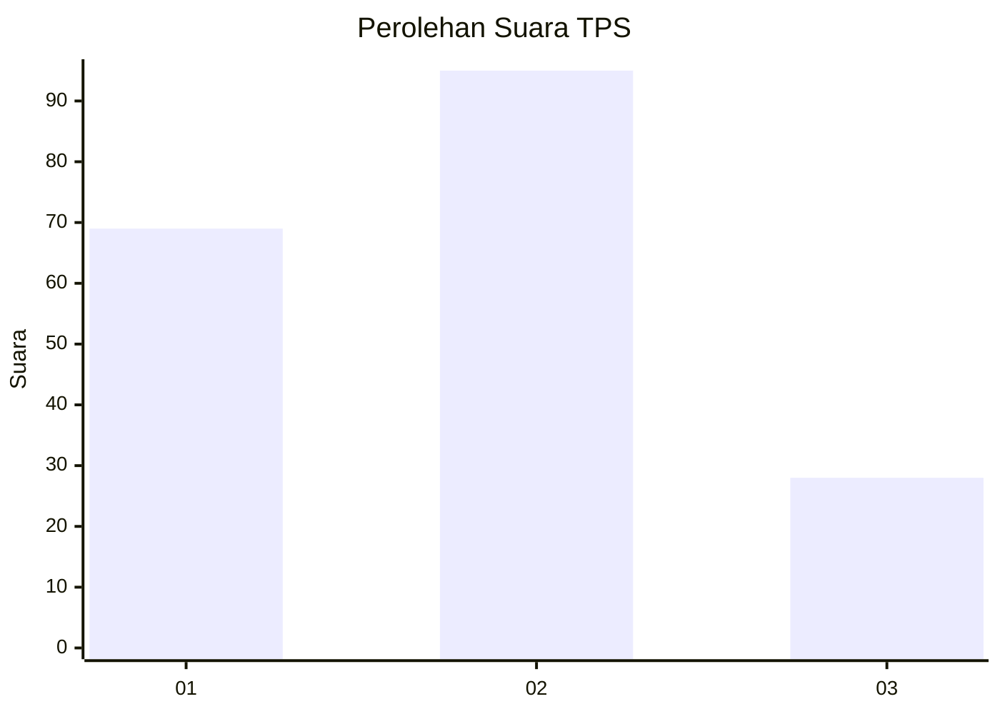
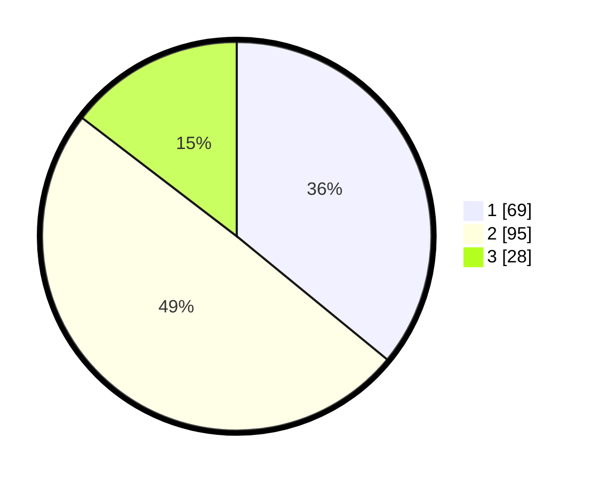

# Hasil

## Grafik

## Tabel

| No. | Nama Paslon    | Suara | Suara (raw) | Persentase |
|:--- |:-------------- | -----:| -----------:| ----------:|
| 1   | ANIES MUHAIMIN | 69    | [69][p-1]   | 35,94      |
| 2   | PRABOWO GIBRAN | 95    | [95][p-2]   | 49,48      |
| 3   | GANJAR MAHFUD  | 28    | [28][p-3]   | 14,58      |

[p-1]: https://github.com/gigit-pemilu/pemilu-2024-35-jawa-timur/blob/main/pilpres/hitung-suara/sub/35-jawa-timur/sub/09-jember/sub/09-bangsalsari/sub/2006-sukorejo/sub/017-tps/sub/paslon-1.txt
[p-2]: https://github.com/gigit-pemilu/pemilu-2024-35-jawa-timur/blob/main/pilpres/hitung-suara/sub/35-jawa-timur/sub/09-jember/sub/09-bangsalsari/sub/2006-sukorejo/sub/017-tps/sub/paslon-2.txt
[p-3]: https://github.com/gigit-pemilu/pemilu-2024-35-jawa-timur/blob/main/pilpres/hitung-suara/sub/35-jawa-timur/sub/09-jember/sub/09-bangsalsari/sub/2006-sukorejo/sub/017-tps/sub/paslon-3.txt

## Foto C Plano

https://sirekap-obj-formc.kpu.go.id/4722/pemilu/ppwp/35/09/09/20/06/3509092006017-20240215-033629--8635c1ae-19a7-4fa2-9e4e-851339bf1dd6.jpg

https://sirekap-obj-formc.kpu.go.id/4722/pemilu/ppwp/35/09/09/20/06/3509092006017-20240215-033708--2af45ef1-ffef-476b-9d21-add41aceaa44.jpg

https://sirekap-obj-formc.kpu.go.id/4722/pemilu/ppwp/35/09/09/20/06/3509092006017-20240215-033754--be7dba4a-3368-4f11-bbe5-7ced02ad5347.jpg

## Metadata

| Key        | Value               |
| ---------- | ------------------- |
| Time Stamp | 2024-02-16 16:25:10 |

