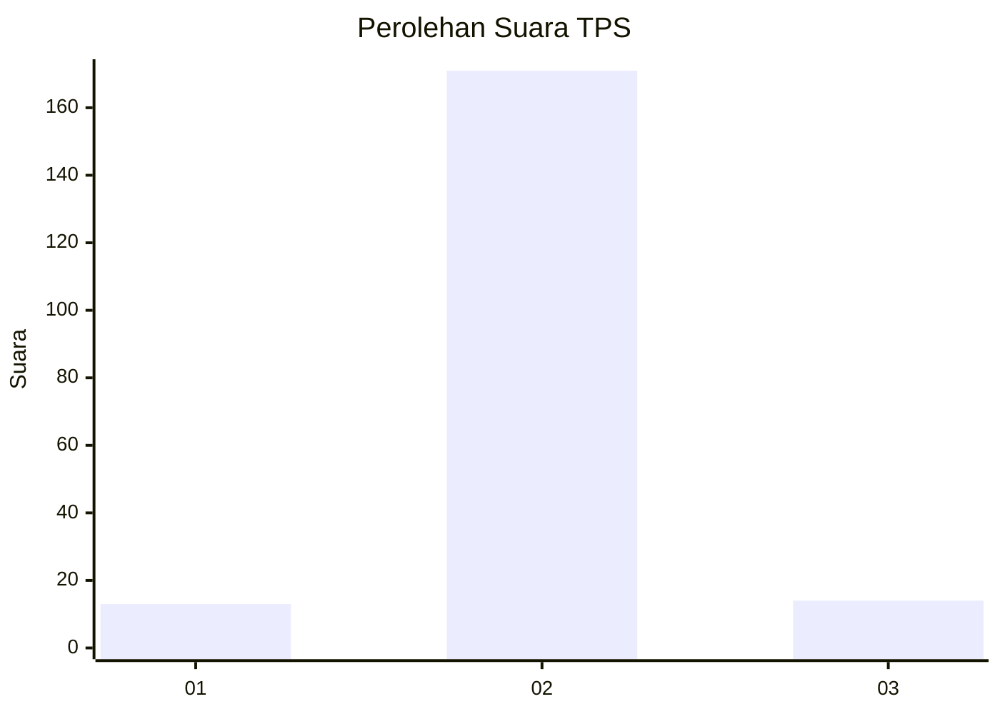
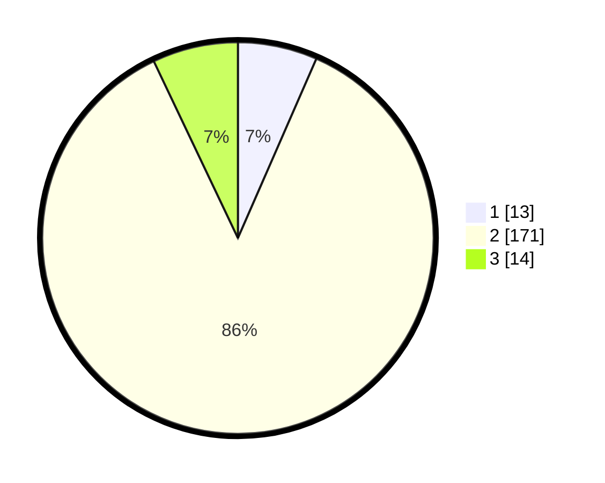

# Hasil

## Grafik

## Tabel

| No. | Nama Paslon    | Suara | Suara (raw) | Persentase |
|:--- |:-------------- | -----:| -----------:| ----------:|
| 1   | ANIES MUHAIMIN | 13    | [13][p-1]   | 6,57       |
| 2   | PRABOWO GIBRAN | 171   | [171][p-2]  | 86,36      |
| 3   | GANJAR MAHFUD  | 14    | [14][p-3]   | 7,07       |

[p-1]: https://github.com/gigit-pemilu/pemilu-2024/blob/main/pilpres/hitung-suara/sub/35-jawa-timur/sub/09-jember/sub/09-bangsalsari/sub/2006-sukorejo/sub/022-tps/sub/paslon-1.txt
[p-2]: https://github.com/gigit-pemilu/pemilu-2024/blob/main/pilpres/hitung-suara/sub/35-jawa-timur/sub/09-jember/sub/09-bangsalsari/sub/2006-sukorejo/sub/022-tps/sub/paslon-2.txt
[p-3]: https://github.com/gigit-pemilu/pemilu-2024/blob/main/pilpres/hitung-suara/sub/35-jawa-timur/sub/09-jember/sub/09-bangsalsari/sub/2006-sukorejo/sub/022-tps/sub/paslon-3.txt

## Foto C Plano

https://sirekap-obj-formc.kpu.go.id/e260/pemilu/ppwp/35/09/09/20/06/3509092006022-20240215-002727--75d7cd71-431e-4c81-af47-caaac9c87fc2.jpg

https://sirekap-obj-formc.kpu.go.id/e260/pemilu/ppwp/35/09/09/20/06/3509092006022-20240215-002920--28582689-fd9f-45c0-8dde-d6e386396713.jpg

https://sirekap-obj-formc.kpu.go.id/e260/pemilu/ppwp/35/09/09/20/06/3509092006022-20240215-003059--85760f24-87c5-4320-97bb-eab7426a1549.jpg

## Metadata

| Key        | Value               |
| ---------- | ------------------- |
| Time Stamp | 2024-02-15 15:00:29 |

