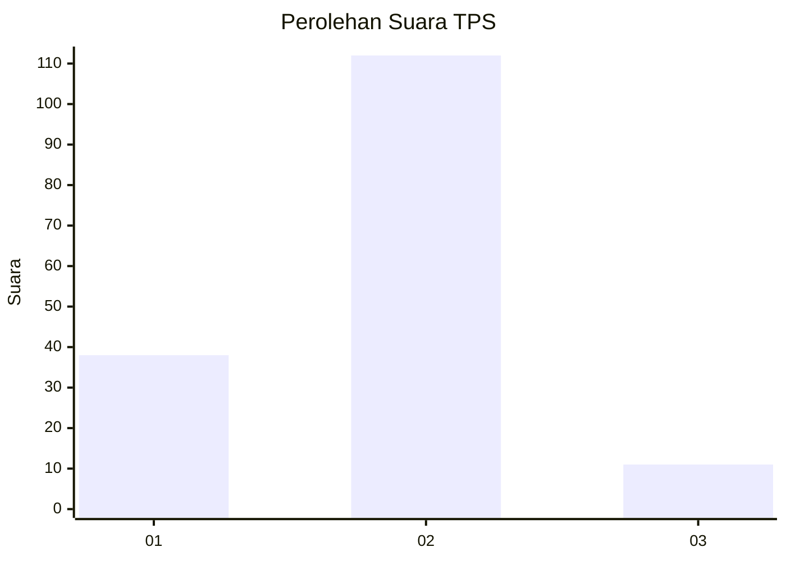
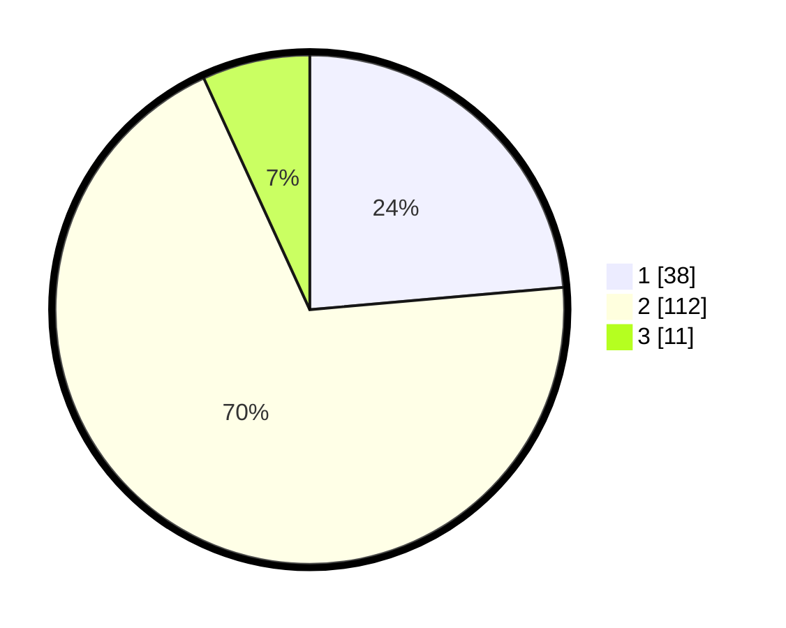

# Hasil

## Grafik

## Tabel

| No. | Nama Paslon    | Suara | Suara (raw) | Persentase |
|:--- |:-------------- | -----:| -----------:| ----------:|
| 1   | ANIES MUHAIMIN | 38    | [38][p-1]   | 23,60      |
| 2   | PRABOWO GIBRAN | 112   | [112][p-2]  | 69,57      |
| 3   | GANJAR MAHFUD  | 11    | [11][p-3]   | 6,83       |

[p-1]: https://github.com/gigit-pemilu/pemilu-2024-35-jawa-timur/blob/main/pilpres/hitung-suara/sub/35-jawa-timur/sub/09-jember/sub/09-bangsalsari/sub/2007-langkap/sub/006-tps/sub/paslon-1.txt
[p-2]: https://github.com/gigit-pemilu/pemilu-2024-35-jawa-timur/blob/main/pilpres/hitung-suara/sub/35-jawa-timur/sub/09-jember/sub/09-bangsalsari/sub/2007-langkap/sub/006-tps/sub/paslon-2.txt
[p-3]: https://github.com/gigit-pemilu/pemilu-2024-35-jawa-timur/blob/main/pilpres/hitung-suara/sub/35-jawa-timur/sub/09-jember/sub/09-bangsalsari/sub/2007-langkap/sub/006-tps/sub/paslon-3.txt

## Foto C Plano

https://sirekap-obj-formc.kpu.go.id/b0c1/pemilu/ppwp/35/09/09/20/07/3509092007006-20240215-010941--af36fee5-bd81-4407-8833-2522d0387f3c.jpg

https://sirekap-obj-formc.kpu.go.id/b0c1/pemilu/ppwp/35/09/09/20/07/3509092007006-20240215-011332--0aa10bad-b34d-4fa3-bdc3-55106aed9b08.jpg

https://sirekap-obj-formc.kpu.go.id/b0c1/pemilu/ppwp/35/09/09/20/07/3509092007006-20240215-011523--2f1edc07-df72-4c41-9df6-ff891508aa36.jpg

## Metadata

| Key        | Value               |
| ---------- | ------------------- |
| Time Stamp | 2024-02-16 16:25:10 |

